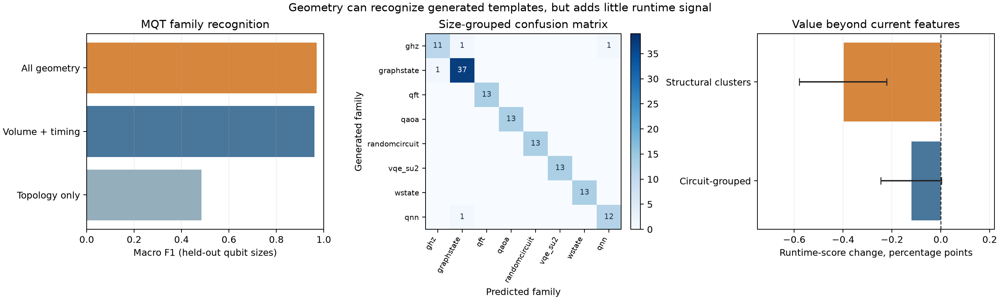

# Can circuit geometry identify an algorithm and add independent runtime signal?

**Result:** Geometry and interaction timing classify eight *generated MQT Bench families* well, but transferring that classification to the mixed Quantum Rings challenge does **not** give a meaningful, robust runtime improvement beyond the current feature set. The current submission model and artifact remain unchanged.



## Experiment

The [MQT Bench package](https://github.com/munich-quantum-toolkit/bench) supplied independent family names for 182 algorithm-level reference circuits: GHZ, graph state, QFT, QAOA, random circuit, VQE SU2, W state, and QNN. We generated 13 qubit sizes from 4 to 64, with three variants at each size for the graph state, QAOA, and random families. QAOA and random variants sometimes had identical interaction geometry, so we deduplicated them to **129 unique reference geometries** and balanced the classifier's class weights. We decomposed each circuit to gates before applying the same interaction statistics used by the challenge parser. These labels came from the generator API, not the scrambled challenge filenames, runtime outcomes, or our previous motif scores.

The recognizer is an ExtraTrees classifier trained **only** on normalized interaction geometry and timing: qubit count, connectivity, components, degree, edge reuse, cutwidth and span under original/RCM order, two-qubit interaction volume/depth, and cut-pressure timing. It receives no gate names, rotation angles, comments, filenames, or runtime labels. Five-fold validation holds out whole qubit sizes, so variants of a given size remain together.

| Reference feature view | Size-grouped accuracy | Macro F1 |
|---|---:|---:|
| Full geometry + interaction timing | **96.90%** | **0.971** |
| Topology alone, without interaction volume/timing | 63.57% | 0.484 |
| Interaction volume/timing, without most pure topology fields | **96.12%** | **0.961** |

The high full score mostly recognizes **generator templates** from pair reuse, two-qubit depth per qubit, and related timing/volume statistics. Those quantities already enter the runtime model as ordinary numeric features. Pure graph shape is much less discriminative. The eight families were deliberately selected from the [MQT catalog](https://mqt.readthedocs.io/projects/bench/en/v2.3.0/parameter.html); this is not an accuracy estimate for all possible quantum algorithms. Geometry alone cannot uniquely identify an algorithm, since distinct programs may share an interaction graph and one program may be compiled into different graphs.

We then trained the recognizer on **all deduplicated external references** and generated eight family probabilities plus confidence for each of the 532 scrambled challenge circuits. The unverified per-circuit guesses and an out-of-reference-distance flag are inspectable in [`algorithm_geometry_guesses.csv`](algorithm_geometry_guesses.csv). These probabilities were appended to the **existing fitted model's 231 columns** in an otherwise identical ExtraTrees regressor. The baseline and augmented regressors were compared on the same five circuit-grouped folds and the same five structural-cluster folds, across all 1,497 labeled circuit/threshold rows. The family recognizer used no challenge runtime labels.

| Runtime validation | Current features | + Geometry-inferred family | Change | Paired circuit-bootstrap 95% interval |
|---|---:|---:|---:|---:|
| Circuit-grouped | 0.89702 | 0.89581 | −0.00121 | [−0.00245, +0.00003] |
| Structural-cluster holdout | 0.70705 | 0.70307 | **−0.00398** | [−0.00580, −0.00222] |

The ordinary-fold interval narrowly includes zero; the harder structural holdout worsens. Even among the **124** challenge circuits with classifier confidence at least 0.7, the structural score change is negative (−0.01015 on their labeled rows). No improvement is hidden in the high-confidence subset.

## Why transfer is uncertain

The generated reference circuits cover only eight MQT families and at most 64 qubits; **102** challenge circuits are wider. Median maximum predicted family probability on the challenge is **0.560**, and only **124/532** exceed 0.7. In standardized geometry space, **443/532** challenge circuits lie farther from the reference set than the 95th-percentile nearest-reference distance observed when reference examples are matched across different sizes. This distance check is heuristic, but it shows that a high score on the generated catalog does not imply calibrated identification of the challenge circuits. The closed-set classifier calls **314/532** circuits QAOA-like; that is a forced nearest-family guess, not an estimate of actual QAOA prevalence. The MQT `randomcircuit` generator is also not a validated stand-in for the challenge's Google Sycamore circuits.

The classifier probabilities are deterministic functions of geometry fields already present in the runtime model. They cannot contain new information beyond those fields in an information-theoretic sense; they could only provide a useful inductive bias for a finite regressor. This paired test finds no robust benefit from that bias. The earlier **gate-aware soft pattern scores** remain in the submission model because their separate ablation improved grouped validation. The present result does not prove that *true* algorithm identity would be useless—only that this geometry-inferred identity, trained on these external templates, does not add dependable runtime signal here. A larger, independently labeled corpus closer to the challenge's mixed sources would be needed for a stronger claim. [Prior Quantum Rings family-aware study](https://arxiv.org/html/2606.11620v1) reported benefits on a different, much smaller benchmark, so its gain cannot be assumed to transfer.

## Reproduce

From the official challenge repository root:

```sh
uv run --with 'mqt-bench==2.3.0' python research/algorithm_geometry_probe.py --generate
uv run --locked python research/algorithm_geometry_probe.py --evaluate
uv run --locked --extra report python research/plot_algorithm_geometry_probe.py
```

The 182 generated examples and geometry fields are in `algorithm_geometry_reference.json`; the evaluator retains 129 unique geometries. Challenge family probabilities and provisional top guesses are in `algorithm_geometry_predictions.json` and `algorithm_geometry_guesses.csv`. The machine-readable metrics, paired out-of-fold predictions, and saved research-only classifier are `algorithm_geometry_probe.json`, `algorithm_geometry_oof.csv`, and `algorithm_geometry_classifier.joblib`. The classifier artifact is **not** loaded by the submission harness.
