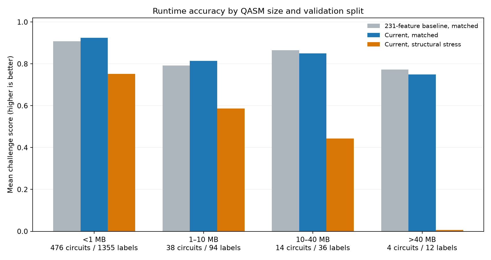
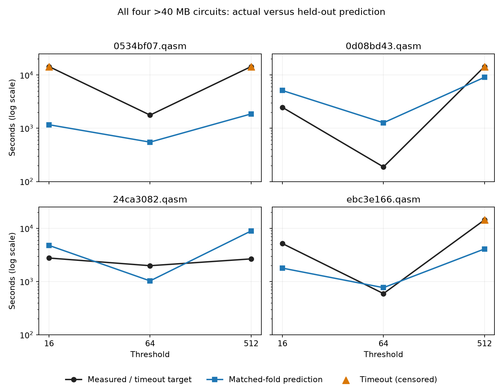

# What happens when a circuit is too large?

The parser switches to a bounded **fast path when decoded QASM text exceeds 40 million characters**. In this training library, that affects **four circuits and 12 labeled runs**. Their distribution-matched, circuit-held-out mean challenge score is **0.7500**, with **one 10× miss in 12 rows (8.3%)** and a median multiplicative error of **3.05×**. For comparison, the 14 circuits between 10 and 40 million characters score **0.8506** with **one 10× miss in 36 rows (2.8%)**. This is descriptive: only four circuits cross the cutoff, and circuit size, timeout prevalence, and structural family differ across groups.

The fast path protects the parser budget. On the full harness run it took **0.66–3.19 seconds** for each of the four large QASM strings; the largest full-parser circuit below the cutoff took **12.81 seconds**, still under the 15-second cap. It retains register width, semicolon-based work, and selected whole-text gate counts, but omits detailed interaction topology, temporal χ pressure, algorithm fingerprints, angle diversity, and the χ walk. The missing walk is marked by `chi_walk_available=0`, while `huge_fast_path=1` distinguishes this representation. The cutoff uses Python string length after decompression; the “MB” bins below approximate millions of characters because these QASM files are essentially ASCII. They are **not compressed-file sizes**.

## Error by decoded QASM size

The primary numbers are from the current model's **distribution-matched, circuit-grouped out-of-fold predictions**. All thresholds of a circuit stay in one fold. The structural column uses a separate stress test that withholds entire QASM-structure clusters; it is not the requested similar-distribution estimate. A “>10× error” is an error factor strictly greater than ten after applying the official 14,400-second cap to predictions on timeout rows.

| Decoded text size | Circuits | Labeled rows | Timeouts | Matched score ↑ | Median factor error ↓ | >10× misses | Structural stress score ↑ | Median / max parser time |
|---|---:|---:|---:|---:|---:|---:|---:|---:|
| <1 million | 476 | 1,355 | 7 | **0.9247** | 1.07× | 33 (2.4%) | 0.7516 | 0.027 / 3.19 s |
| 1–10 million | 38 | 94 | 13 | 0.8141 | 1.50× | 10 (10.6%) | 0.5872 | 0.83 / 4.39 s |
| 10–40 million | 14 | 36 | 9 | 0.8506 | 1.71× | 1 (2.8%) | 0.4439 | 6.75 / 12.81 s |
| **>40 million: fast path** | **4** | **12** | **4** | **0.7500** | **3.05×** | **1 (8.3%)** | **0.0062** | **1.37 / 3.19 s** |



Size is **not** a monotone predictor of error in these bins: 1–10 million characters has a higher >10× miss rate than 10–40 million. The four fast-path circuits are rare and unusually timeout-heavy. Their score by threshold is **0.7367 at 16, 0.7834 at 64, and 0.7300 at 512**, with four rows at each threshold. The 231-column baseline, before adding the χ walk, scores **0.7723** on these same 12 matched-fold rows; the current model scores **0.7500**. No walk feature can help these four directly because all walk values are unavailable. The small difference between models can also reflect retraining and tree feature selection, so it does not isolate a causal effect of the cutoff.

## Each fast-path prediction

Timeout targets are shown as `14,400*`; the actual runtime is censored and could be longer. Factors use the official scoring target. The names identify examples and are never model features.

| Circuit | Text size | Threshold | Target seconds | Matched OOF prediction | Error factor |
|---|---:|---:|---:|---:|---:|
| `0534bf07.qasm` | 51.67 M | 16 | 14,400* | 1,166 | **12.35× low** |
|  |  | 64 | 1,768 | 550 | 3.22× low |
|  |  | 512 | 14,400* | 1,861 | 7.74× low |
| `0d08bd43.qasm` | 47.98 M | 16 | 2,469 | 5,116 | 2.07× high |
|  |  | 64 | 188 | 1,268 | **6.74× high** |
|  |  | 512 | 14,400* | 9,056 | 1.59× low |
| `24ca3082.qasm` | 218.36 M | 16 | 2,771 | 4,780 | 1.72× high |
|  |  | 64 | 1,989 | 1,031 | 1.93× low |
|  |  | 512 | 2,669 | 8,931 | 3.35× high |
| `ebc3e166.qasm` | 149.20 M | 16 | 5,179 | 1,790 | 2.89× low |
|  |  | 64 | 595 | 770 | 1.29× high |
|  |  | 512 | 14,400* | 4,102 | 3.51× low |



All **four timeout rows are underpredicted**; their mean row score is **0.6591**, compared with **0.7955** on the eight successful fast-path rows. The 10× miss is `0534bf07.qasm` at threshold 16. The largest file, at 218 million characters, is not the worst-predicted; its three-row mean is 0.8255, while the 51.67-million-character circuit averages 0.5854. All four show a faster threshold-64 target than threshold 16 (including timeout lower bounds), which the model predicts qualitatively, but the magnitudes remain difficult.

## Failure under unfamiliar large structures

In the structural-cluster stress test, the four fast-path circuits come from two withheld clusters. The model predicts roughly **2.4–4.3 seconds** for runs whose scoring targets are **188–14,400 seconds**. All **12/12** predictions miss by more than 10×, **11/12** by more than 100×, yielding a mean score of **0.0062**. The nearby 10–40-million-character group also falls to **0.4439** on this stress split. This is evidence that extrapolation to unfamiliar large circuit structures is a serious limitation. It is not an estimate of error on a similar-distribution holdout, and the four-circuit sample cannot separate the fallback's information loss from the lack of analogous training examples.

There is a second size-related fallback before 40 million characters: the χ walk stops after its **3-second budget** and extrapolates gate-count tables for the remainder. Ten circuits (25 labeled rows) used this partial walk, including seven of the 14 circuits in the 10–40-million group. Their matched score is **0.8644**, with **one >10× miss among 25 rows**. They retain base QASM features and a partial walk, so they should not be pooled with the four full fast-path circuits.

The same-circuit fitted harness score for the four fast-path circuits is **0.9220**, much higher than their **0.7500 held-out score**. It verifies that the saved artifact runs on these files; it does not demonstrate generalization. The operational result is that all four produce valid positive predictions under the parsing limit, while their accuracy—especially on timeout rows and novel structural clusters—remains a model weakness. A future improvement should test cheap, bounded interaction/angle summaries on these files and compare them on the **same fixed folds**, while preserving the 15-second parser headroom.

## Reproduce

From the repository root:

```sh
uv run --locked --extra report python research/evaluate_big_circuits.py
```

The script reads the saved [feature cache](features.json), [walk cache](chi_walk_angle_cache.json), [out-of-fold predictions](rotation_filter_oof.csv), and [harness timings](training_submission_rotation_filter.csv). It writes [machine-readable metrics and all 12 fast-path rows](big_circuit_evaluation.json) plus the two figures above. It does not retrain the model or use the in-sample predictions for the accuracy table.
