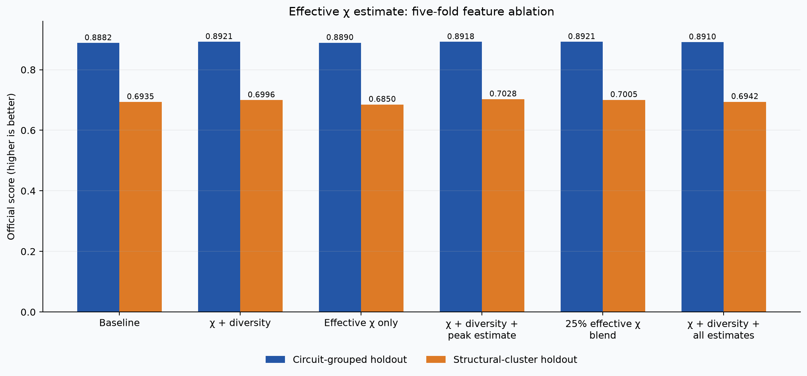
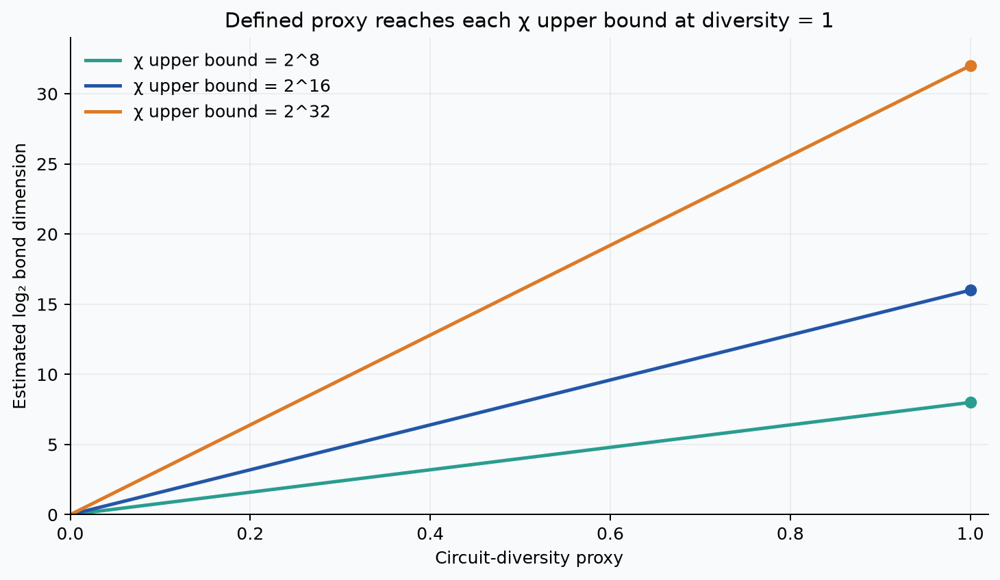
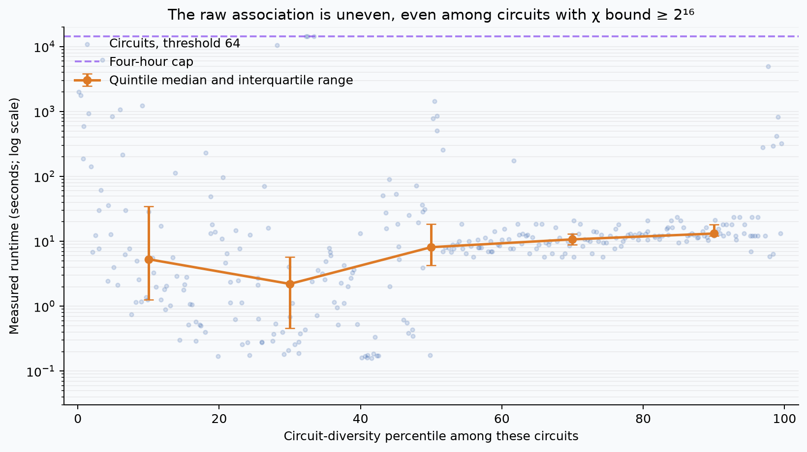

# χ upper bound and circuit diversity: evaluation

This records the earlier χ/diversity model. The selected submission model now
includes geometry and algorithm-pattern features; see the
[current evaluation](GEOMETRY_FAMILY_EVALUATION.md).

The monotone relationship applies to the **estimated entanglement**, not to
runtime. We now define an effective bond-dimension proxy that approaches the
cut's χ upper bound as circuit diversity increases. A 25% blend of the
effective-χ model with the original χ + diversity model scored **0.8921** on
circuit-grouped folds and **0.7005** on structural-cluster holdouts. The
unblended χ + diversity model scored **0.8921** and **0.6996**. This is a small
exploratory tradeoff, not evidence that actual entanglement has been measured.



## What was measured

For each cut after qubit `k` in QASM register order, the parser computes

`log2(χ_upper(k)) = min(k, n-k, Σ_g log2(r_g))`,

where the sum covers gates whose operands cross the cut and `r_g` bounds the
gate's operator-Schmidt rank across that cut. A controlled two-qubit gate or
Pauli-pair rotation contributes at most one bit; a general two-qubit gate at
most two bits. Wider and custom gates receive conservative bounds. This starts
from a product state and ignores cancellation, so it is an **upper bound on
possible Schmidt rank**, not a measurement of actual entanglement. The
dimension cap is `χ ≤ 2^min(k,n-k)`. The feature set records the peak and
middle-cut log bounds, mean log bound, mean fraction of dimension capacity,
fraction of unsaturated cuts, and uncapped middle-cut budget.

The 0–1 circuit-diversity proxy combines normalized Shannon evenness of gate
names (22%), adjacent gate-name pairs (22%), angle bins (18%), interacting
qubit pairs (23%), and coarse circuit windows (15%). These are reproducible
structural statistics, not a quantum-randomness test. For a cut with upper
bound `χ_upper(k)` and diversity `r`, the corrected estimate is

`log2(χ_est(k)) = r × log2(χ_upper(k))`, hence `χ_est(k) = χ_upper(k)^r`.

At `r=0`, the proxy is rank 1; at `r=1`, it reaches the upper bound. For a
fixed bound it increases monotonically with `r`, while never exceeding the
bound. We retain it in log form to avoid enormous rank values. It is a
heuristic estimate, not another rigorous bound or a simulated Schmidt rank.
The model uses peak and normalized-capacity summaries of this estimate.



The physical motivation is that MPS simulation cost can grow strongly with
Schmidt rank, while sufficiently scrambling circuits can generate substantial
entanglement. See [Vidal's simulation result](https://arxiv.org/abs/quant-ph/0301063)
and [Preskill's derivation of the cut-crossing gate bound](https://www.preskill.caltech.edu/ph219/chap6_20_6A_2022.pdf#page=51).
Neither implies that Quantum Rings runtime must increase monotonically with
our proxy: the simulator's internal algorithm and truncation behavior are
unknown, and a rank upper bound can be very loose.

## Held-out results

The same 1,497 labeled circuit/threshold rows and five folds were used for
every variant. Circuit-grouped folds keep all thresholds and identical
baseline feature profiles together. The structural test withholds coarse
clusters of circuit size, gate mix, and custom-gate use. The metric is the
challenge's duration score; higher is better.

| Features added to existing model | Circuit-grouped | Structural holdout | Timeout rows, grouped |
|---|---:|---:|---:|
| None | 0.8882 | 0.6935 | 0.6925 |
| χ only | 0.8900 | 0.6942 | 0.6883 |
| Diversity only | 0.8897 | 0.6927 | 0.6944 |
| χ + diversity | 0.89214 | 0.69961 | 0.69704 |
| Effective χ alone | 0.88896 | 0.68504 | 0.67821 |
| χ + diversity + peak effective χ | 0.89181 | 0.70280 | 0.68255 |
| χ + diversity + all four effective-χ summaries | 0.89097 | 0.69419 | 0.67964 |
| **75% χ + diversity + 25% peak effective χ** | **0.89210** | **0.70050** | **0.69339** |
| Earlier peak/capacity interactions | 0.89131 | 0.71315 | 0.68295 |

The earlier interaction features were mathematically equivalent to the
new peak and normalized-capacity effective-χ features, but were absent from
the previously fitted submission model. Their differing tree scores reflect
feature ordering under the estimator's random feature selection, not a
different physical formula. Including every effective-χ summary
reduced validation accuracy. The fitted model at this stage used a **25% blend of
the peak effective-χ variant**, averaging the two models' log-duration
predictions before converting back to seconds. Its grouped score is 0.00004 below the
unblended model and its structural score is 0.00089 higher; these differences
are small. A paired circuit bootstrap for blend minus unblended gives
**[-0.00035, 0.00027]** on grouped folds and **[0.00023, 0.00158]** on
structural folds. The variants and blend weight were chosen on these data,
so the intervals do not account for selection. The earlier 0.8911 baseline in
`IMPLEMENTATION.md` came from a prior feature cache; this experiment uses one
regenerated cache for all compared variants. Three custom-gate circuits had
different pre-ablation feature values in that earlier cache.

## Does estimated χ approach its maximum as randomness increases?

Yes, by definition of `χ_est`; the endpoint and monotonicity checks are in
`test_model.py`. This is a property of the feature construction. It does not
show that the real circuit state approaches maximal entanglement. Runtime
itself has no forced monotone constraint.

### Observed runtime trend

Not reliably in these data. Among the 310 circuits at threshold 64 with a
peak bound of at least `2^16`, diversity and log runtime have a positive raw
Spearman correlation (ρ = 0.318, p < 0.000001). The quintile medians are
uneven rather than monotone. After subtracting the baseline out-of-fold
prediction, the diversity–residual correlation is only ρ = 0.091
(p = 0.108). This does not justify forcing a monotone increase toward the
four-hour cap.



The bound itself is often uninformative: **447 of 532** circuits have every
cut at its dimension cap under this accounting. Four exceptionally large
circuits use a timed fast path with only the trivial dimension cap, since
full topology extraction would exceed the harness budget. Their diversity
proxy is zero because those details are unavailable, so their effective-χ
estimate is not informative. Register order also
affects the bound, and actual bond dimensions may be far lower because of
state preparation, gate cancellation, measurement, or approximation.

## Reproduction and checks

From the repository root:

```sh
uv sync --locked
uv run --locked python research/train_runtime.py --extract-only
uv run --locked python research/evaluate_chi_randomness.py
uv run --locked python research/fit_chi_randomness.py
uv run --locked --extra report python research/plot_chi_randomness.py
uv run --locked python -m unittest research/test_model.py
uv run --locked python quantathon-harness/run.py --team "Your Team" --circuits training_circuits --out research/training_submission_chi_randomness.csv
uv run --locked python quantathon-harness/score.py --pred research/training_submission_chi_randomness.csv --labels runtime-data.csv
```

The complete harness run produced **1,596** positive finite predictions,
including all **1,497** labeled combinations. Maximum measured parsing and
prediction times were **9.2343 s** and **0.1409 s**, below their 15-second
limits. The same-circuit score was **97.77%**; it only checks the fitted
pipeline and is not a generalization estimate. The unit tests passed (9/9).
The machine-readable ablation, out-of-fold predictions, and chart generator
are `chi_randomness_ablation.json`, `chi_randomness_oof.csv`, and
`plot_chi_randomness.py` in this directory.
