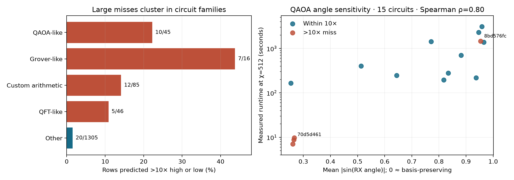

# What the χ-walk model misses

This analysis uses only the distribution-matched **out-of-fold** predictions in `chi_walk_oof.csv`. A “large miss” means predicted runtime is more than 10× above or below the labeled runtime; timeout rows are evaluated at the challenge's 14,400-second cap. The selected model has **54 large misses across 38 circuits** out of 1,497 labeled rows (3.6%), down from 71 for the previous model. Nine of the 54 are off by more than 100×. Of the large misses, 34 are underpredictions, 20 overpredictions, and seven are timeout rows. Only one lacks walk features; none uses an extrapolated walk, so these failures are not primarily a parser-budget issue.



| Heuristic structural family | Labeled rows | >10× misses | Miss rate | Main pattern |
|---|---:|---:|---:|---|
| QAOA-like | 45 | 10 | 22.2% | Large errors in both directions, mostly at χ=64 or 512 |
| Grover-like | 16 | 7 | 43.8% | All seven are underpredictions; many resets and multi-controlled gates |
| Custom arithmetic / phase | 85 | 12 | 14.1% | Several large χ=512 underpredictions |
| QFT-like | 46 | 5 | 10.9% | Similar geometry with different measured runtimes |
| Other | 1,305 | 20 | 1.5% | Scattered errors |

The first four categories contain **34 of 54** large misses while representing only **192 of 1,497** labeled rows. Family labels are feature-based fingerprints, not verified source-algorithm identities. Circuit size alone is not the explanation: the median missed circuit has 56 qubits versus 43 overall, but the worst Grover-like miss has only 18 qubits.

The strongest specific pattern is **rotation angle magnitude in QAOA-like circuits**. `70d5d461.qasm` and `8bd576fc.qasm` have the same 56-qubit gate-and-operand skeleton and exactly the same χ-walk tables and priced costs. Their `RX` and `RZZ` angles differ. At χ=512 their measured runtimes are **8.85 s** and **1,464.93 s**, respectively, while the out-of-fold model predicts **1,488.12 s** and **9.06 s**—the two regimes reversed. Across all 15 QAOA-like circuits, mean `|sin(RX angle)|` correlates with log runtime at χ=512 (Spearman ρ=0.80) and χ=64 (ρ=0.60), but scarcely at χ=16 (ρ=0.12). This descriptive association comes from a small, selected group and does not prove that angles alone cause the timing difference.

A plausible physical explanation is that `RX` angles near multiples of π nearly preserve computational-basis states; subsequent diagonal `RZZ` gates may then produce much less realized entanglement than the walk's binary classical/quantum flag assumes. The original walk marks every nonzero `RX` as quantum and gives the paired QAOA circuits the same χ upper trajectory. The [near-0/π rotation-filter experiment](ROTATION_FILTER_EVALUATION.md) tests and fits an angle-aware version on the same circuit-grouped, distribution-matched folds.

The Grover-like misses have a different signature. Their QASM contains repeated `CCX` and `CX` gates and many resets; the 18-qubit example `5a741dbe.qasm` takes **1,607 s** at χ=16 but is predicted at **0.79 s**. The χ-walk cost proxy and broad family fingerprint do not adequately price this operation pattern. Arithmetic-like circuits with custom multi-qubit gates also show substantial underpredictions at higher χ; for example, `834596bc.qasm` times out at χ=512 while its out-of-fold prediction is **119 s**. These cases suggest separate modeling of reset/multi-control overhead and custom-gate expansion, rather than a single correction based on circuit size.

The full reproducible plot command is:

```sh
uv run --locked --extra report python research/plot_chi_walk_errors.py
```
