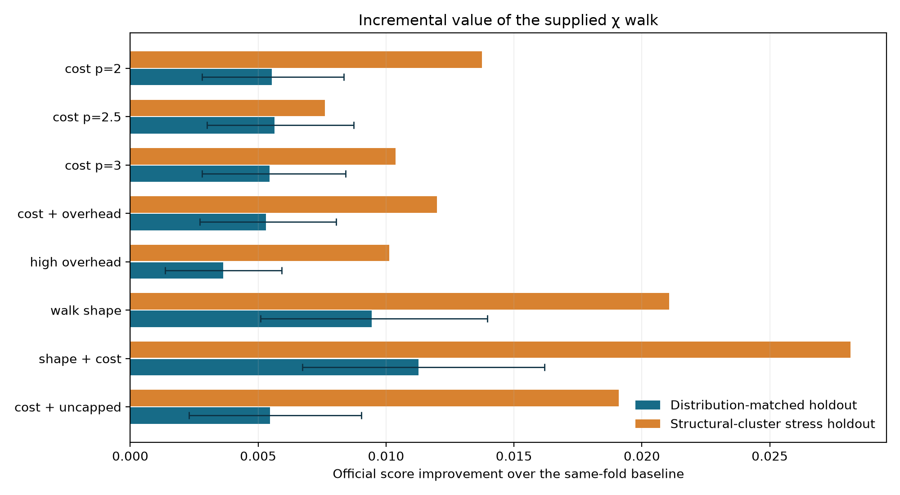
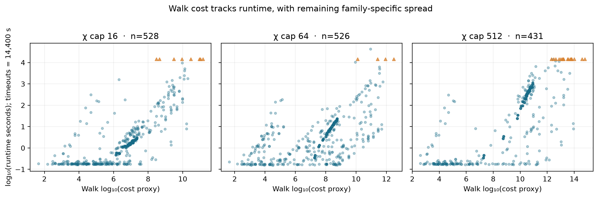

# Evaluation of the supplied χ walk

The supplied `chi_walk.py` provides useful information beyond the existing geometry, diversity, and circuit-family features. Its selected **shape + cost** view raises the official validation score from **0.89921 to 0.91047** on a distribution-matched, circuit-grouped five-fold holdout (+0.01127; circuit bootstrap 95% interval +0.00673 to +0.01619). This was the fitted view at this stage; the [current artifact](ROTATION_FILTER_EVALUATION.md) also uses the near-0/π rotation filter and explicit angle features.

The primary holdout is **not grouped by χ threshold**. Each of the five folds contains examples from thresholds 16, 64, and 512. We stratify by twelve clusters made solely from QASM-derived size and structure features so each fold resembles the training distribution, and group by circuit signature so different threshold rows of the same circuit cannot leak across train and test. Fold sizes are 297–301 labeled rows and 105–107 circuits. Each fold has 87 labeled χ=512 examples; χ=16 and 64 each contribute about 105–107. All 1,497 labeled rows from 532 circuits receive an out-of-fold prediction.



| Added χ-walk view | Matched score | Gain over baseline | Structural stress gain |
|---|---:|---:|---:|
| Cost only, p=2 | 0.90474 | +0.00554 | +0.01375 |
| Cost only, p=2.5 | 0.90485 | +0.00565 | +0.00761 |
| Cost only, p=3 | 0.90466 | +0.00545 | +0.01038 |
| Cost with gate overhead | 0.90452 | +0.00531 | +0.01199 |
| Cost with high overhead | 0.90284 | +0.00364 | +0.01013 |
| Walk shape only | 0.90864 | +0.00943 | +0.02107 |
| **Walk shape + cost** | **0.91047** | **+0.01127** | **+0.02816** |
| Cost + uncapped cost | 0.90467 | +0.00546 | +0.01910 |

The baseline is the current 231-column ExtraTrees model refit on precisely the same folds. Each ablation appends its own features to those 231 columns and uses the same estimator settings. The official scoring formula from the supplied `score.py` is applied to every out-of-fold row. The selected view adds eight columns: cost with `c1=10`, `c2=100`, `p=2.5`; fraction of two-qubit gates that may entangle; peak `log2(χ)`; fraction of two-qubit gates at the χ cap; fraction of the walk before first saturation; fraction of links at cap; extrapolated fraction; and an availability indicator. Threshold-specific walk statistics are selected for each row at its requested χ cap.

The confidence interval resamples whole circuits but does not adjust for choosing the best of eight tested views on these folds. A fresh hidden holdout remains the decisive test.

The matched-score gains by threshold are χ=16: **0.91706→0.92169**, χ=64: **0.90701→0.91089**, and χ=512: **0.86787→0.89626**. The secondary stress split holds out entire coarse structural clusters and rises **0.70705→0.73520** overall. That improvement is uneven: its χ=16 subset falls 0.69688→0.67371, while χ=64 and χ=512 improve. The stress split asks a different question from the distribution-matched primary split; it estimates behavior on circuit structures absent from training, not the expected same-distribution holdout.

The [out-of-fold error analysis](CHI_WALK_ERROR_ANALYSIS.md) shows that the remaining >10× misses concentrate in algorithm-like circuit families. QAOA-like circuits with identical geometry and χ-walk paths can have very different runtimes when their rotation angles differ.



The walk's cost proxy follows runtime broadly, but it is not a simulator runtime formula. Across available labeled rows, Spearman rank correlation with log runtime is 0.801 at χ=16, 0.614 at χ=64, and 0.773 at χ=512; log gate count alone gives 0.763, 0.727, and 0.783. The learned model is therefore needed to interpret the walk together with circuit family and geometry. The chart also shows a wide range of runtimes at similar cost, especially at higher χ.

The walker processed 528 of 532 training circuits within its 3-second budget; four QASM files over 40 MB use the existing large-file fast path and zero walk features with `available=0`. Nine walks extrapolated their remaining gates after reaching the budget. This is a structural χ upper-bound heuristic with conservative classical-state tracking, not a calculation of exact Schmidt ranks; its predicted saturation can exceed the simulator's realized entanglement. The validation result measures prediction utility rather than physical exactness.

The unmodified submission harness completed all **532 circuits × 3 thresholds = 1,596 predictions**, including **all 1,497 labeled combinations**. Every prediction was positive and finite; there were no parse or inference failures and no 15-second cap violations. Maximum parser time was **13.249 s** and maximum prediction time was **0.0758 s**. The official scorer returned **98.07%** on these same training circuits, which checks the full submission path but is not a holdout estimate. To retain headroom on unfamiliar slow circuits, the parser now shortens or skips the optional walk when the baseline QASM scan has already used most of its 14-second working budget.

## Reproduce

From the repository root, using `uv`:

```sh
uv sync --locked --extra report
uv run --locked python research/chi_walk_probe.py --extract
uv run --locked python research/chi_walk_probe.py --evaluate
uv run --locked python research/fit_chi_walk.py
uv run --locked --extra report python research/plot_chi_walk.py
uv run --locked python -m unittest discover -s research -p 'test_*.py'
uv run --locked python quantathon-harness/run.py --team 'Quantum Rings Research' --circuits training_circuits --out research/training_submission_chi_walk.csv
uv run --locked python quantathon-harness/score.py --pred research/training_submission_chi_walk.csv --labels runtime-data.csv
```

The raw walk cache, detailed scores, fold balance, and out-of-fold predictions are in `chi_walk_cache.json`, `chi_walk_probe.json`, and `chi_walk_oof.csv`. The full training harness score is a pipeline check on circuits seen in fitting; the paired out-of-fold score above is the generalization estimate.
