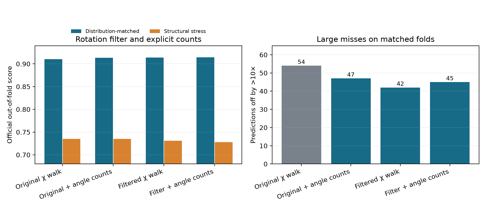
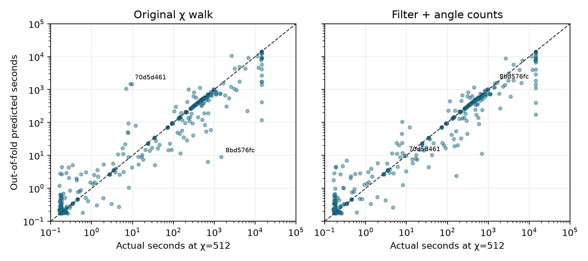

# Quantum Rings runtime predictor: comparison handoff

This document describes the **current fitted implementation** in this workspace, its evidence, and a fair protocol for comparing another agent's implementation. It is a local training-data result, **not** a hidden-holdout score. The official challenge repository is [Quantum-Rings/quantumrings-challenge-quantathonv3](https://github.com/Quantum-Rings/quantumrings-challenge-quantathonv3). The code, trained artifact, caches, and reports named below are in this repository's working tree; several are currently uncommitted, so a fresh clone of upstream does not contain them.

## Evaluation contract

The input is a QASM circuit and χ threshold. The harness calls `RuntimeModel.featurize(qasm_text)` once per circuit and `RuntimeModel.predict(features, threshold)` for each requested threshold. Its prediction is **seconds**, with no separate timeout flag. Training has **532 circuits** and **1,497 labeled `(filename, threshold)` rows**: 532 at χ=16, 530 at χ=64, and 435 at χ=512. The full 532 × 3 harness run has 1,596 requested predictions. There are 33 timeout labels. A timeout's scoring target is 14,400 seconds; a successful run above that duration retains its measured duration.

The supplied official per-row score is

```text
actual = 14,400 s for timeout; otherwise measured duration_s
effective_pred = min(pred, 14,400 s) for timeout; otherwise pred
score = max(0, 1 - abs(log10(effective_pred / actual)) / 2)
```

The formula in `score.py` is authoritative: a 10× error earns **0.5**, and a 100× error earns zero. Its prose comment and the README incorrectly say a 10× error earns zero. The 99 unlabeled circuit/threshold combinations are not timeout labels. One successful χ=64 label is 42,993.98 s, above the four-hour timeout target; the scorer uses that measured success duration without clipping it. The model must stay within the harness's **15-second feature-parsing and inference caps per circuit**. Predictions must be positive and finite. No circuit ID, filename, or benchmark-origin metadata is used as a feature.

## Current implementation

The entry point is [`quantathon-harness/model.py`](../quantathon-harness/model.py). It uses the supplied, extended [`quantathon-harness/chi_walk.py`](../quantathon-harness/chi_walk.py) and loads [`quantathon-harness/artifacts/runtime_model.joblib`](../quantathon-harness/artifacts/runtime_model.joblib). Training is with [`research/fit_rotation_filter.py`](fit_rotation_filter.py). The fitted estimator is `ExtraTreesRegressor(n_estimators=240, min_samples_leaf=2, max_features=0.9, n_jobs=-1, random_state=17)` on `log10(runtime seconds)`, fitted on all 1,497 available labels **after** choosing the feature view by out-of-fold validation. Inference adds raw threshold and `log2(threshold)` and exponentiates the predicted log duration. The fitted artifact has **243 input columns**: 117 base QASM-derived columns, 112 `log1p(max(0, value))` transforms, two threshold columns, and 12 χ-walk columns. The exact ordered schema is [`current_feature_columns.json`](current_feature_columns.json).

The base QASM features include:

| Group | Active examples and meaning |
|---|---|
| Size and operation mix | Qubits, active qubits, QASM bytes, one/two/multi-qubit operations, 19 named gate counts, depth, Clifford/non-Clifford and diagonal mix, custom-gate calls/definitions, measurements, resets, conditionals. |
| Simplified work | Zero and small angles, adjacent cancellation pairs, rotation folds, and an effective-operation count. These approximate local simplification; they are not a compiler trace. |
| Interaction geometry | Distinct qubit pairs, pair reuse, span, degree, components, density, graph cutwidth in register and reverse Cuthill–McKee order, and a min-degree width proxy on the interaction graph. These are not exact tensor-network contraction widths. |
| Time structure and liveness | Eight QASM-position windows of two-qubit activity and cut pressure, onset of middle-cut saturation, live-qubit spans, early measurement/reset fractions, and diagonal runs. |
| Entanglement and diversity | Cut-based χ upper-bound peak/middle/mean and saturation features; Shannon-evenness of gate, gate-bigram, angle-bin, qubit-pair, and window distributions; a weighted structural diversity proxy. These are not measured Schmidt ranks or quantum randomness. |
| Algorithm-like patterns | Soft QFT, QAOA, Grover, arithmetic, variational, GHZ, graph-state, random-grid, and dyadic-phase fingerprints. They are **heuristic scores, not a trained categorical algorithm recognizer**. There is no active discrete Shor label. |
| Dense-regime references | Log₂ bytes for a hypothetical dense complex64 vector of the full register or largest interacting component and 128-GB indicators. These are regime references, not claimed simulator allocations. |

The **12 added χ-walk columns** are `chi_walk_cost_overhead`, `chi_walk_entangling_frac`, `chi_walk_max_logchi`, `chi_walk_sat_frac`, `chi_walk_sat_start`, `chi_walk_links_at_cap`, `chi_walk_extrapolated`, `chi_walk_available`, `chi_walk_rot_near_zero`, `chi_walk_rot_near_pi`, `chi_walk_rot_near_frac`, and `chi_walk_rot_mixing_mean`. The cost, peak, and saturation statistics are selected for the requested χ threshold. The walk streams the gates and tracks a conservative per-cut upper path in `log2(χ)`. Its priced cost is `log10(1 + Σ_k t1[k](10 + 4^k) + Σ_k t2[k](100 + 2^(2.5k)))`, where `t1` counts one-qubit gates at local χ level `2^k` and `t2` accumulates the crossed-link distance of multi-qubit gates at that level. This is a learned runtime proxy, not Quantum Rings' internal cost function. The challenge does not establish that its threshold literally equals a simulator bond-dimension cap; treating it as one in this walk is an empirical feature design.

The walk's basis-state flag stays classical for numeric `RX`, `RY`, `U`, and `U3` rotations whose first angle lies within **0.3 radians of an integer multiple of π**. The gate still contributes to the one-qubit cost. The model separately receives the number near 0 (even multiple), number near π (odd multiple), their fraction among parsed rotations, and mean `|sin(angle)|`. Unparsed/symbolic angles remain conservative. Previously quantum qubits are not reset to classical by this rule. The tolerance is a heuristic, not a rigorous bound on realized entanglement.

The detailed parser has a **3-second walk budget**, reduced when the preceding base QASM scan has used most of a 14-second working budget. Inputs above **40 MB** use a bounded fast path without detailed topology or walk features (`chi_walk_available=0`). In the training library, 528 circuits had walk features, four used that large-file path, and ten angle-aware walks extrapolated their unprocessed remainder after the time budget.

The earlier `χ_est = χ_upper ^ randomness_proxy` features are computed by the parser but **not present in the fitted 243-column artifact**. Similarly, exploratory QAOA/Shor sequence-motif features are not active in the default parser path or trained artifact. Compare the artifact columns, not every quantity the research scripts can compute.

## Earlier experiments and ideas not in the fitted model

These reports explain the route to the current feature view. Their numeric results use earlier feature caches or different grouped splits; **do not compare their raw scores by subtraction with the paired table below**.

| Experiment | Finding and current disposition |
|---|---|
| [χ upper bound and randomness interpolation](CHI_RANDOMNESS_EVALUATION.md) | Cut-rank upper bounds and gate/angle/pair diversity helped the early model. The constructed `χ_est = χ_upper^r` approaches χ as diversity `r` approaches 1 by definition, but observed runtime did not support a forced monotone rise. Effective-χ summary columns lost accuracy when added to the later geometry model, so they are excluded. |
| [Temporal geometry and soft algorithm fingerprints](GEOMETRY_FAMILY_EVALUATION.md) | Cut-pressure timing, interaction-graph ordering, liveness, dense-vector regime references, and soft family scores raised the then-current grouped score from 0.89210 to 0.89702. These feature groups form the 231-column baseline used in the paired ablation below. |
| [External geometry-only classifier](ALGORITHM_GEOMETRY_PROBE.md) | MQT-generated family templates were identifiable, but inferred family probabilities reduced challenge runtime scores by 0.00121 on circuit-grouped and 0.00398 on structural holdouts. It is not loaded by the artifact. |
| [QPE/arithmetic and Shor-family geometry](SHOR_FAMILY_PROBE.md) | QPE/arithmetic template probabilities changed grouped runtime score by only +0.00011, with an interval spanning zero. Two generated factoring circuits were out of the reference distribution; there is no validated Shor label in the fitted model. |
| [Optional ordered QAOA/Shor motifs](SEQUENCE_MOTIF_PROBE.md) | QAOA and Shor generator motifs were recognized in controlled examples. Challenge transfer was uncertain: full motifs gave +0.00196 on the older grouped split and −0.00140 on structural clusters. The default parser does not emit these optional fields. |

The original research rationale and literature, including the **11 September 2026 transpilation-aware runtime paper**, are in [the proposed approach](PROPOSED_APPROACH.md) and [the geometry/complexity review](FEATURE_RESEARCH_GEOMETRY_FAMILIES.md). Those papers motivate feature candidates; the local ablations, not paper results on other simulators, determine the fitted feature set.

## Validation design: use these folds for a fair comparison

The primary estimate is five-fold **distribution-matched, circuit-grouped** out-of-fold validation. The 12 strata are KMeans clusters built from seven label-free structural features: `n_qubits`, `ops`, `two_q_ratio`, `nonclifford_ratio`, `conditional`, `custom_definitions`, and `qasm_bytes` after `log1p` and standardization. `StratifiedGroupKFold(n_splits=5, shuffle=True, random_state=17)` stratifies by cluster and groups by a label-free QASM-feature signature. All threshold rows of a circuit remain together. The folds are **not separated by threshold**: each contains 297–301 labeled rows, 105–107 circuits, and 87 χ=512 rows. The exact per-circuit primary and secondary fold IDs are in [`comparison_folds.csv`](comparison_folds.csv), generated by [`export_comparison_folds.py`](export_comparison_folds.py).

The secondary stress test is `GroupKFold(n_splits=5)` over the **entire structural clusters**, asking how the model extrapolates to a different structural profile. It is intentionally harder and less representative of the requested similar-distribution holdout. Another agent can compare both, but should use the **primary matched-fold score for model selection** and report the stress score as a caveat. If an alternative estimator is tuned on these same folds, its score is still a model-selection estimate; a fresh hidden set is the decisive test. Circuit-bootstrap intervals below resample whole circuits but do not adjust for selecting among ablations.

## Paired results on identical folds

Every row in this table uses the same 1,497 labels, folds, target, challenge score, and ExtraTrees settings; each stage appends or changes only the specified features. Higher score is better.

| View | Matched-fold score | Structural stress score | >10× matched misses |
|---|---:|---:|---:|
| 231-column geometry/family baseline, refit on matched folds | 0.899206 | 0.707046 | 71 |
| Original χ-walk shape + cost (8 features) | 0.910475 | **0.735202** | 54 |
| Original walk + four rotation-count/mixing features | 0.913644 | 0.735092 | 47 |
| Near-0/π filtered walk, without explicit rotation features | 0.913977 | 0.731241 | **42** |
| **Current: filtered walk + four rotation features** | **0.914590** | 0.727866 | 45 |

The current-minus-original-walk matched gain is **+0.004115**, with paired circuit-bootstrap 95% interval **[+0.000718, +0.007831]**; versus the 231-column matched baseline it is **+0.015383**. The current model's matched scores by threshold are **0.920501 (χ=16), 0.914989 (χ=64), and 0.906874 (χ=512)**. The near-0/π change improves the requested matched distribution but **reduces structural-cluster stress score by 0.007336** relative to the original walk. The original geometry/family evaluation's 0.89702 was on a *different*, circuit-grouped split, so it should not be subtracted directly from 0.91459. [`rotation_filter_probe.json`](rotation_filter_probe.json) has full ablations and [`rotation_filter_oof.csv`](rotation_filter_oof.csv) has every row's paired OOF predictions. The [rotation-filter report](ROTATION_FILTER_EVALUATION.md) includes graphs.



For the current matched OOF predictions, the median multiplicative error is **1.108×**, the 95th-percentile factor error is **5.91×**, and **45 rows on 37 circuits** exceed 10× error (26 underpredicted, 19 overpredicted). Eight of the 33 timeout rows are >10× misses. The mean timeout-row score is **0.72842**. These are more informative for generalization than the same-circuit fitted score.

## Operational test and known failure modes

The unmodified harness produced **1,596/1,596 positive finite predictions**, covering all **1,497/1,497 labeled pairs**. It reported no parsing or inference failures and no 15-second cap violations. Maximum measured feature-parsing time was **12.8083 s** and maximum per-row inference time **0.0648 s**. All **21 unit tests** passed. The official scorer returned **98.19% on the same circuits used to fit the final artifact**; that is a pipeline check and must **not** be presented as a held-out score. Timings may shift on a different machine.

The rotation filter addresses one conspicuous QAOA-like pair with the same 56-qubit gate/operand skeleton but different angles. At χ=512, `70d5d461.qasm` measured **8.85 s** and changes from **1,488 s** original-walk OOF prediction to **9.81 s** current OOF prediction. `8bd576fc.qasm` measured **1,465 s** and changes from **9.06 s** to **1,574 s**. The filter does **not** solve the fast member at χ=64, which remains about 19× overpredicted. The pair suggests angle-sensitive realized entanglement, but does not establish the simulator's mechanism.



Remaining >10× matched misses are concentrated in structural families, not primarily in missing walk data. Using heuristic fingerprints: **6/45 QAOA-like**, **7/16 Grover-like**, **11/85 custom arithmetic/phase**, **5/46 QFT-like**, and **16/1,305 other** labeled rows miss by >10×. Grover-like misses are all underpredictions and often include repeated multi-controlled gates and resets: the 18-qubit `5a741dbe.qasm` takes **1,607 s** at χ=16 but is predicted at **0.55 s**. Large custom-arithmetic cases also remain underpriced: `834596bc.qasm` times out at χ=512 while the current OOF prediction is **174 s**. A filename is used only to identify examples here, never as a model input. More analysis is in [the original-walk error report](CHI_WALK_ERROR_ANALYSIS.md).

The χ walk is an upper-path heuristic, not an exact Schmidt-rank simulation. It does not model every symbolic/parameterized custom-gate angle, detailed reset cost, or the simulator's compilation and representation choices. The soft algorithm fingerprints do not claim to identify ground-truth source algorithms. Four huge files lack detailed geometry/walk features. The artifact's feature selection, 0.3-radian rule, and cost settings were chosen on these training labels; the hidden holdout may differ.

The [large-circuit evaluation](BIG_CIRCUITS_EVALUATION.md) isolates those four fast-path files: 12 matched-fold rows score 0.7500 with one >10× miss, while their structural-cluster stress score is 0.0062 with 12/12 >10× misses. It also reports parser timing, size bins, partial-walk behavior, and each fast-path prediction. The small sample and different circuit structures prevent a causal estimate of the cutoff's effect.

## Files and reproduction

| File | Purpose |
|---|---|
| [`quantathon-harness/model.py`](../quantathon-harness/model.py), [`chi_walk.py`](../quantathon-harness/chi_walk.py) | Inference parser and physics-informed walk. |
| [`quantathon-harness/artifacts/runtime_model.joblib`](../quantathon-harness/artifacts/runtime_model.joblib) | Current fitted ExtraTrees artifact; previous artifact backed up as [`runtime_model_before_rotation_filter.joblib`](runtime_model_before_rotation_filter.joblib). |
| [`current_feature_columns.json`](current_feature_columns.json) | Exact 243-column ordered model input schema. |
| [`features.json`](features.json), [`chi_walk_angle_cache.json`](chi_walk_angle_cache.json) | Cached base and angle-aware walk features used in training. |
| [`comparison_folds.csv`](comparison_folds.csv) | Fixed circuit-to-fold mapping for matched and structural-stress comparisons. |
| [`rotation_filter_probe.json`](rotation_filter_probe.json), [`rotation_filter_oof.csv`](rotation_filter_oof.csv) | Detailed paired scores and all out-of-fold predictions. |
| [`training_submission_rotation_filter.csv`](training_submission_rotation_filter.csv) | Full same-circuit harness run, **not** OOF. |
| [`ROTATION_FILTER_EVALUATION.md`](ROTATION_FILTER_EVALUATION.md), [`rotation_filter_ablation.png`](rotation_filter_ablation.png), [`rotation_filter_predictions.png`](rotation_filter_predictions.png) | Narrative and figures. |
| [`BIG_CIRCUITS_EVALUATION.md`](BIG_CIRCUITS_EVALUATION.md), [`big_circuit_evaluation.json`](big_circuit_evaluation.json) | Size-stratified error analysis and per-fast-path run details. |

From the repository root:

```sh
uv sync --locked --extra report
uv run --locked python research/export_comparison_folds.py
uv run --locked python research/evaluate_rotation_filter.py --evaluate
uv run --locked python -m unittest discover -s research -p 'test_*.py'
uv run --locked python quantathon-harness/run.py --team 'Quantum Rings Research' --circuits training_circuits --out research/training_submission_rotation_filter.csv
uv run --locked python quantathon-harness/score.py --pred research/training_submission_rotation_filter.csv --labels runtime-data.csv
```

To compare another implementation, train and predict **out of fold** using `comparison_folds.csv`. Export one CSV row per labeled key with `filename,threshold,pred_duration_s` (a different prediction-column name can be supplied with `--pred-column`). Then run:

```sh
uv run --locked python research/compare_oof.py other_agent_oof.csv
uv run --locked python research/compare_oof.py other_agent_stress_oof.csv --split structural
```

[`compare_oof.py`](compare_oof.py) checks coverage, duplicate keys, and finite positive predictions; it prints the challenge score, per-threshold and timeout scores, factor-error tails, >10× misses, and the paired bootstrap interval for **other minus current**. It resamples circuits for the matched split and the 12 held-out clusters for the structural split. A final comparison should also report maximum parser/inference times, full-harness coverage, and any additional dependencies. A high training-set harness score is not comparable to an OOF score. The script cannot detect leakage from how the other agent trained; adherence to the fixed fold mapping must be verified separately.

The current artifact's SHA-256 is `c8221172e863486940e204c0fa93d0e1af78df3fe3e570e8f97affaedefce5de`; the current OOF CSV's SHA-256 is `2ba5179f4c3d5827ec6feba1e31d3e80c88b953dc4ec8759d5aeffb5f7297572`; the fold CSV's SHA-256 is `ce36d9f2c60c29622f3260a43a7a7243bc6d2a22ed8693348f537a19e4d36ed7`. These identify the snapshot summarized here.
