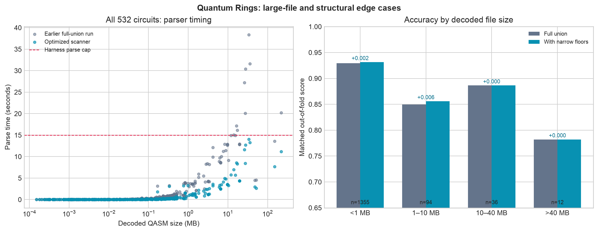

# Edge-case continuation: large files and reset-heavy search circuits

This update starts from the full-union handoff in `MERGED_AGENT_HANDOFF.md`.
The selected artifact is `full_union_threshold_experts_v3` and uses the same
480 learned columns, global/specialist blend, and timeout router. It adds two
narrow runtime floors after the learned prediction and speeds up the large-file
secondary scanner. No filename, benchmark source, or family label enters the
predictor.

## What changed

1. The coarse source scanner now counts gate prefixes in one longest-first regex
   pass instead of roughly 60 whole-text passes. All 236 cached extended
   features matched on all 24 coarse-mode training circuits. Controlled
   microbenchmarks reduced the scanner from 2.49 to 1.10 seconds on a 51.7 MB
   decoded file and from 10.88 to 3.47 seconds on a 218 MB file. The 532-circuit
   final 532-circuit harness run had 0 parser-cap violations, maximum 14.02
   seconds (median 0.096, p95 3.24). The earlier
   handoff run had 9 violations, maximum 38.32 seconds; those whole-run timings
   were collected under different machine conditions and are not a controlled
   A/B estimate.
2. Seven training circuits have at least 10 resets, at least 10 multi-qubit
   gates, and a Grover geometry fingerprint of at least 0.9. For this rare
   regime, the predictor takes the nearest same-threshold training analogue in
   log operation count, scales its capped observed runtime linearly by the
   operation ratio, caps the result at 14,400 seconds, and uses it only as a
   lower bound. Fixed-fold validation builds the reference bank from the
   *training folds only*. The fitted bank stores only threshold, operation
   count, and capped runtime, never circuit names.
3. A separate floor assigns at least 10 seconds when effective operations
   reach 500,000, and at least 100 seconds when they reach 1,000,000. The
   minimum observed labeled runtimes in these groups were 16.12 and 188.08
   seconds respectively. This catches severe extrapolation when a large-work
   structural cluster is held out. It also applies to compact QASM with large
   expanded custom gates, not just large source files.

## Fixed-fold evidence

Freshly refitted results in `full_union_model_validation.json` on the same
1,497 labeled rows and precommitted circuit-grouped folds:

| Predictor | Matched score | Structural stress score | Matched >10× misses |
|---|---:|---:|---:|
| Full union, before floors | 0.92218 | 0.74489 | 34 |
| Plus reset-family floor | 0.92400 | 0.74685 | 30 |
| Plus large-work floor | **0.92431** | **0.74996** | **29** |

The reset floor changed 4 matched rows and 5 structural rows. The large-work
floor changed 1 matched row and 14 structural rows. Each floor improved all of
its changed rows in these folds. The matched circuit-bootstrap 95% interval for
both floors versus the refitted full union is [+0.00031, +0.00470]; the
12-cluster structural-stress interval is [+0.00114, +0.01354]. These are
training-data model-selection estimates, not hidden
holdout results. The earlier handoff's 0.92266/0.74611 baseline came from its
saved run; this table uses a fresh, internally paired refit under the locked
environment and supersedes that baseline for evaluating these changes.

The remaining errors are structurally heterogeneous. A particularly revealing
pair has 36 qubits, 38,069 operations, and 13,074 two-qubit gates in both
circuits, but their threshold-64 runtimes are 25.19 and 0.56 seconds. Their
cached angle and randomness summaries differ only modestly. Aggregate geometry
alone cannot resolve every backend/runtime effect; a new hard family rule for
this pair would be unreliable.

## Operational check

`uv run --locked python -m unittest discover -s research -p 'test_*.py' -q`
passes 29 tests. The final full harness produced all 1,596 requested
predictions, all positive and finite, with maximum prediction time 0.116
seconds. Its fitted same-data score is 0.9912; that number verifies
serialization and execution, not generalization. See
`training_submission_final.csv` for its output and timings.

Rebuild the artifact with `uv run --locked python research/train_full_union_model.py`.
Generate this figure with `uv run --locked python research/plot_edge_case_update.py`.
