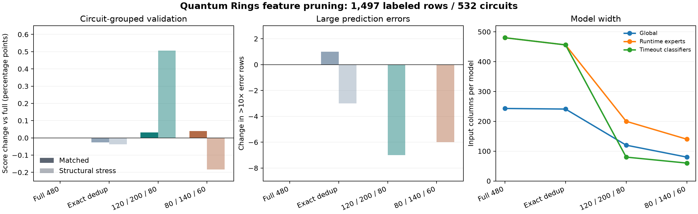

# Final feature extractor and runtime predictor

The selected submission is `pruned_union_threshold_experts_v7` in [`quantathon-harness/artifacts/runtime_model.joblib`](../quantathon-harness/artifacts/runtime_model.joblib), SHA-256 `3f0f8a04f99dfa03aadcc2179c62a1093fefb46e97198df89c8dd6ee1d183958`. It predicts positive wall-clock **seconds** from QASM text and a simulator threshold (16, 64, or 512). It never uses scrambled filenames, source collections, inferred external family labels, or training-error metadata at inference. The exact **325 fitted feature names**, in artifact order with flags showing which of the seven estimators uses each one, are in [the feature catalog](final_feature_catalog.csv). Regenerate that catalog directly from the artifact with [`write_final_feature_catalog.py`](write_final_feature_catalog.py).

## What the extractor measures

The harness makes **one `featurize` call per circuit**, then three `predict` calls. The primary bounded scanner in [`model.py`](../quantathon-harness/model.py) recognizes common QASM 2 and 3 declarations, operations, parameters, custom gate definitions and calls, measurements, resets, barriers, and conditionals. A second independent scanner in [`extended_features.py`](../quantathon-harness/extended_features.py) measures additional DAG, interaction, angle, and source-shape properties. The optional third pass is the angle-aware [`chi_walk.py`](../quantathon-harness/chi_walk.py). These are static source analyses, not full QASM execution or the simulator's actual compilation trace.

| Fitted feature view | Distinct selected columns | What is represented |
|---|---:|---|
| Primary QASM fields | 90 | Width and active qubits; gate/arity counts; depth and local simplification; Clifford/diagonal mix; interactions, reordered cuts, time windows, liveness, heuristic family fingerprints, χ bounds, diversity, and dense-vector reference sizes. |
| `log1p(max(0,x))` primary transforms | 95 | Compressed versions of selected counts and nonnegative structural quantities. Raw and transformed columns are both retained where selected by a model. |
| Simulator setting | 2 | Raw threshold and `log2(threshold)`. The three known thresholds also select a specialist and timeout classifier. |
| Angle-aware χ walk | 11 | Threshold-specific work proxy, potentially entangling fraction, peak bond-rank upper bound, saturation timing/fraction, capped links, extrapolation/availability, and numeric rotations near 0 or π. |
| Secondary QASM scanner | 127 | Angle distributions, custom-gate expansion proxies, source shape, gate mix, interaction-graph metrics, cut crossings, DAG/layer width, min-degree/min-fill graph-width proxies, and SupermarQ-style summaries. |
| **Union referenced by fitted models** | **325** | 120 columns feed the global regressor; each threshold expert uses 200 and each timeout classifier uses 80. Membership overlaps. |

The complete names are deliberately kept in the sortable [catalog CSV](final_feature_catalog.csv), rather than suggesting that every emitted parser field enters every fitted model. It includes all 90 raw primary names, 95 transformed names, both setting fields, all 11 selected χ-walk names, and all 127 selected `extended__` names. In particular, selected χ-walk columns are `chi_walk_cost_overhead`, `chi_walk_entangling_frac`, `chi_walk_max_logchi`, `chi_walk_sat_frac`, `chi_walk_sat_start`, `chi_walk_links_at_cap`, `chi_walk_extrapolated`, `chi_walk_available`, `chi_walk_rot_near_zero`, `chi_walk_rot_near_frac`, and `chi_walk_rot_mixing_mean`. The near-π count is still extracted, but no final tree selected it; the near-basis **fraction** remains an input and a special-rule guard.

The χ geometry uses, for cut `k`, a **potential rank bound** of the form `log2 χ_upper(k) = min(k, n−k, sum of crossing-gate log-rank allowances)`. It is not a measured Schmidt rank. A separate diversity proxy combines gate, adjacent-gate, angle, interacting-pair, and temporal-window entropies; its heuristic effective-rank feature approaches the upper bound as diversity approaches one. The χ walk tracks possible bond growth over the gate stream, with computational-basis-state filtering. A numeric `RX`, `RY`, `U`, or `U3` rotation within **0.3 radians of an integer multiple of π** preserves the walk's basis-state flag; the gate is still charged as work. The walk computes summaries under caps associated with 16, 64, and 512, but the challenge does **not** establish that its threshold equals the simulator's literal MPS bond dimension. See the [χ/randomness ablation](CHI_RANDOMNESS_EVALUATION.md), [walk ablation](CHI_WALK_EVALUATION.md), and [rotation experiment](ROTATION_FILTER_EVALUATION.md).

The selected `chi_walk_cost_overhead` is `log10(1 + Σ_j t1[j](10 + χ_j²) + Σ_j t2[j](100 + χ_j^2.5))`, where `χ_j=2^j`, `t1` counts single-qubit gates at that local rank level, and `t2` weights two-qubit gates by crossed-link distance. It is a learned-model input, **not** a runtime equation for Quantum Rings.

The primary graph fields compare register order with reverse Cuthill–McKee order; the secondary fields add weighted interactions, cut crossings, and approximate treewidth. These are **qubit interaction-graph proxies**, not exact tensor-network contraction width. Soft QFT, QAOA, arithmetic, Grover, GHZ, graph-state, random-grid, and variational fingerprints are numeric QASM pattern scores, not asserted algorithm identities. The dense complex64 state-vector byte estimates are reference scales, not claims about Quantum Rings allocation. The feature choices are motivated by entanglement-sensitive simulation [Vidal](https://arxiv.org/abs/quant-ph/0301063), contraction-width analysis [Markov and Shi](https://arxiv.org/abs/quant-ph/0511069), structural benchmark vectors [SupermarQ](https://arxiv.org/abs/2202.11045) and [QASMBench](https://arxiv.org/abs/2005.13018), and the distinction between source and transformed circuits in the [11 September 2026 runtime study](https://arxiv.org/abs/2609.12980). Their usefulness **here** comes from the linked local ablations, not from transferring those papers' scores.

The extractor uses a coarse fast path above **40 million decoded QASM characters**. It preserves width, source work, selected whole-text gate counts, and fast secondary-scanner fields; it marks unavailable detailed topology and χ-walk fields rather than pretending to have computed them. Four training circuits take that path. On ordinary inputs, the walk has a 3-second budget and is shortened if earlier parsing has consumed most of a 14-second working budget. This is a deliberate accuracy/speed tradeoff to stay within the harness's separate 15-second parse and prediction limits. The [large-circuit audit](BIG_CIRCUITS_EVALUATION.md) and [parser timing report](PARSER_OPTIMIZATION.md) describe what is lost.

## Chosen model

All 1,497 released labeled runs were used for the fitted artifact after circuit-grouped validation. The target is `log10(seconds)`; timeouts use the observed four-hour cap of 14,400 seconds as the target. The global regressor is an `ExtraTreesRegressor` with 240 trees, minimum leaf size 2, and `max_features=0.9`. Each known threshold has a 600-tree, leaf-size-1 runtime expert. The prediction before rules is the **equal-weight average of global and specialist log10 outputs**, equivalent to the geometric mean of their runtime estimates. The per-threshold `ExtraTreesClassifier` has 300 balanced trees, minimum leaf size 2, and `max_features=0.8`; probability at least **0.35** emits the timeout cap. For an unknown threshold, the global threshold-aware regressor remains usable without choosing an incorrect expert.

From 480 candidate columns, training removes two constants and 22 exact duplicates on the released circuits. Importance ranking then occurs **inside each training fold** for validation and separately for the global model, each runtime expert, and each timeout classifier. Final fits use 120, 200, and 80 columns respectively, yielding 325 distinct columns across components. We did not delete every highly correlated pair: coincident gate counts on training files can differ on new circuits, and raw/log forms can offer different tree splits. [The pruning report](FEATURE_PRUNING_REPORT.md) gives the paired ablation and limitations of impurity importance.

| Final fixed-fold stage | Distribution-matched score ↑ | Structural-cluster stress score ↑ |
|---|---:|---:|
| Global regressor only | 0.915347 | 0.739767 |
| Global + threshold experts + timeout router | 0.922546 | 0.749836 |
| Plus reset-heavy search floor | 0.924362 | 0.751791 |
| Plus very-large-work floor | 0.924668 | 0.755010 |
| Plus guarded count-signature analogue | 0.925473 | 0.755010 |
| Plus high-threshold near-basis calibration: **selected v7** | **0.926153** | **0.755369** |



These are out-of-fold results on released labels, **not hidden-holdout accuracy**. Matched folds group every threshold of a circuit and stratify label-free structural clusters; structural stress folds withhold whole clusters. The two scores ask different questions. The second scanner and threshold experts were retained because the merged model improved matched validation over the earlier single-parser global model. The separate [family-aware neural runtime experiment](PAPER_RUNTIME_REPLICATION.md) scored 0.900924 matched and 0.748393 structural and showed no stable family-conditioning gain across seeds, so it did not replace v7.

## Special prediction rules and reasons

| Rule | Exact trigger/action | Why retained, and limitation |
|---|---|---|
| Timeout routing | At a known threshold, classifier probability `≥0.35` returns **14,400 s** immediately. | The challenge scores timeouts at this cap; the threshold-specific router improved the merged predictor's timeout performance. Only 33 training labels are timeouts, so probability calibration is fragile. An attempted softening for classifier/regressor disagreement was rejected on alternate folds ([probe](TIMEOUT_DISAGREEMENT_EVALUATION.md)). |
| Reset-heavy search floor | `resets≥10`, `multi_q≥10`, and `fingerprint_grover≥0.9`: find the nearest same-threshold training reference in log operation count, scale its capped runtime by the operation ratio, cap at 14,400 s, and use this **only as a lower bound**. | Seven released circuits have this signature; earlier Grover-like underpredictions were extreme. Fixed-fold banks contain training folds only. This is a narrow observed-regime guard, not a proof of algorithm identity ([evaluation](EDGE_CASE_UPDATE.md)). |
| Very large work floor | `effective_ops≥500,000` ⇒ at least **10 s**; `≥1,000,000` ⇒ at least **100 s**. | The smallest observed runtimes in those regimes were 16.12 and 188.08 s. This prevents severe tree extrapolation without making QASM byte size the runtime target ([evaluation](EDGE_CASE_UPDATE.md)). |
| Exact count-signature analogue | For the same threshold and exact `(n_qubits, ops, two_q, multi_q)`, use no analogue with 0–1 references; with 2, take a 50/50 **log-space** blend; with ≥3, use the median training log-runtime directly. | Repeated structural templates are common. Single-reference copying failed; support-aware weighting improved four grouped assignments. The bank stores counts and runtimes, never filenames ([v7 test](TEMPLATE_WEIGHT_EVALUATION.md)). |
| Near-basis correction | At threshold **512**, if `χ_walk_rot_near_frac≥0.9`, `ops≥1,000`, and `1≤predicted_s<14,400`, multiply by **0.5**. | Corrected a small set of overpredicted near-0/π circuits; the analogous threshold-16 correction hurt. It is guarded to preserve subsecond and explicit timeout predictions ([probe](EDGE_CASE_UPDATE.md)). |
| Output domain | Continuous log prediction is bounded to **10⁻⁴–10⁷ s** before floors. Successful runs above 14,400 s are **not** globally clamped. | The scorer caps predictions only when the *actual* row timed out; one successful training run lasted 42,993.98 s. Threshold response is not forced monotone: 270 of 532 circuits show measured inversions across available settings, and isotonic projection reduced matched score ([headroom analysis](REMAINING_HEADROOM.md)). |

`predict_interval` also exposes an optional multiplicative risk band using a matched-fold absolute-log-residual radius of 0.48894 (about **3.08×** in either direction), with 89.98% empirical out-of-fold coverage for a nominal 90% band. It is an inspection aid, not an official submission field or a distribution-shift guarantee.

## Verification and use

The supplied harness produced **1,596/1,596** positive predictions on the training circuit directory, covering all **1,497 labeled pairs**, with no 15-second violations; parse and prediction maxima were **13.3033 s** and **0.0935 s** in the selected v7 run. The training-label score is intentionally excluded as a generalization claim. The selected artifact is unchanged by the later paper experiment and this documentation.

```bash
uv sync --locked
uv run --locked python research/write_final_feature_catalog.py
uv run --locked python quantathon-harness/run.py --team 'Your Team' \
  --circuits /path/to/holdout --out submission.csv
uv run --locked python research/validate_submission.py \
  --circuits /path/to/holdout --submission submission.csv
```

The [holdout guide](HOLDOUT_READINESS.md) covers plain/compressed QASM and the geometry/nearest-training-circuit inspector. Exact validation metrics and fold-local selections are in [the model validation JSON](full_union_model_validation.json); the per-row grouped predictions are in [the OOF CSV](full_union_model_oof.csv).
