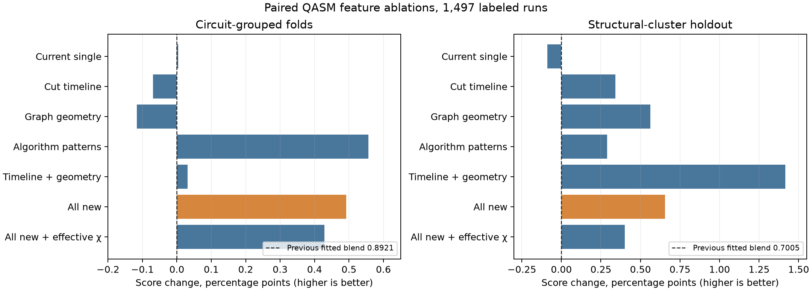
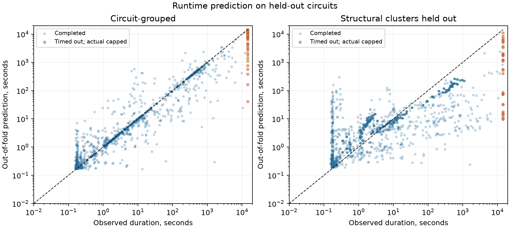

# Geometry, cut-timeline, and circuit-family features: implementation and test

The fitted submission model now includes the proposed QASM-derived cut timeline, interaction geometry, algorithm-pattern, liveness, and dense-vector-reference features. In paired held-out evaluation on the supplied labels, its challenge score increased from **0.89210 to 0.89702** when whole circuits were held out, and from **0.70050 to 0.70705** when coarse structural clusters were held out. These are training-data validation results, not a hidden-test score. The most useful standalone addition was algorithm-pattern scoring; timeline and geometry contributed most to the harder structural holdout.

A later [geometry-only algorithm recognizer probe](ALGORITHM_GEOMETRY_PROBE.md) found that externally trained family predictions did not add a dependable runtime gain beyond this model's existing features; the fitted submission artifact was left unchanged.



## What changed

`quantathon-harness/model.py` now computes:

- Eight QASM-position windows of cumulative cut-rank *upper-bound* pressure, including peak/midpoint area under the trajectory, first middle-cut half/90% saturation, and a proxy for entangling operations after full saturation. These windows use byte position as a fast surrogate for gate time; they are not equally sized gate-count windows or measured Schmidt ranks.
- Weighted interaction-graph cutwidth and span in register order and reverse Cuthill–McKee order, plus graph density, degree entropy, and a min-degree elimination width proxy for graphs up to 80 qubits. The elimination width is for the **qubit interaction graph**, not the exact gate-time tensor-network contraction width. The model is allowed to learn whether reordered geometry is useful; we do not assume the simulator uses this ordering.
- Soft fingerprints for QFT, random two-qubit circuits, QAOA-like layers, arithmetic, variational circuits, GHZ, graph states, and Grover-like blocks. They are heuristic continuous scores from gate composition and topology, not a trained algorithm classifier. No scrambled filename or benchmark-source ID enters the predictor.
- Coarse qubit liveness/measurement/reset timing, diagonal-run length, and reference dense complex64 vector size for the full register and largest interacting component. The dense size is a regime proxy, not claimed simulator allocation.

The unusually large QASM inputs retain the previous fast parser path; new topology-dependent fields default to zero there. The `huge_fast_path` indicator is already available to the regressor. The challenge's threshold is still an input to the model, with no assumption that 16, 64, and 512 are literal χ caps.

## Validation

All 1,497 labeled runs from 532 circuits were used for the paired feature ablation, with every threshold for a circuit kept in the same fold. We reproduced the previous single-model score exactly before comparing feature groups. The harder test groups circuits by coarse structural clusters using only permitted features. The selected `all_new` model is an ExtraTrees regressor on log runtime, fitted on all labels after the out-of-fold comparison.

| Added group | Circuit-grouped score | Structural-cluster score | Timeout score, grouped |
|---|---:|---:|---:|
| Previous fitted 75/25 blend | 0.89210 | 0.70050 | 0.69339 |
| Current single-model feature baseline | 0.89214 | 0.69961 | 0.69704 |
| Cut timeline | 0.89141 | 0.70391 | 0.69273 |
| Graph geometry | 0.89094 | 0.70613 | 0.67075 |
| Algorithm patterns | **0.89767** | 0.70339 | **0.73143** |
| Dense/liveness/diagonal features | 0.89220 | 0.69884 | 0.70591 |
| Timeline + geometry | 0.89241 | **0.71465** | 0.66834 |
| **All new features; selected** | **0.89702** | **0.70705** | 0.72339 |
| All new + effective-χ peak/capacity | 0.89638 | 0.70452 | 0.73290 |

For selected minus previous fitted blend, paired circuit-bootstrap 95% intervals for score change were **[+0.00182, +0.00802]** on circuit-grouped folds and **[+0.00117, +0.01203]** on structural clusters. These intervals condition on the chosen features and do **not** adjust for selection across the ablations. Algorithm patterns alone had the highest ordinary grouped score; the full set was selected because it improved both grouped and structural validation, with positive paired intervals in both. The earlier effective-χ estimate remains computed by the parser and monotone in the randomness proxy, but retaining its peak/capacity features in this new regressor lowered both held-out scores. It is therefore omitted from the fitted feature columns.



The selected model's grouped score by threshold was **0.91139** at 16, **0.90079** at 64, and **0.87483** at 512; improvements over the previous blend were +0.00099, +0.00248, and +0.01269. On the structural holdout, the changes were **−0.00330**, **+0.00405**, and **+0.02164** respectively. Structural timeout score fell slightly from 0.37878 to 0.37022 across 33 censored rows. The parity plot shows that prediction under novel structural clusters remains difficult despite the mean score improvement.

These outcomes are consistent with the earlier literature review: graph ordering and contraction width can affect tensor simulation cost ([Markov and Shi](https://arxiv.org/abs/quant-ph/0511069), [Ibrahim et al.](https://arxiv.org/abs/2209.02895)); a [June 2026 Quantum Rings study](https://arxiv.org/html/2606.11620v1) proposed graph reordering and algorithm fingerprints on a much smaller, different dataset. The [11 September 2026 runtime paper](https://arxiv.org/html/2609.12980v1) supports transformed structural features in a noisy Qiskit Aer setting; it is not direct evidence about this simulator. The present ablation is the direct evidence for using the additions here.

## Operational verification

`uv run --locked python -m unittest research/test_model.py` passed **12/12** checks, including early-versus-late cut growth, reordering a scrambled chain, QFT/GHZ fingerprint separation, and dense-vector size. Full feature extraction finished all **532** circuits in **118.8 s**; the slowest individual `featurize` call was **9.78 s**.

The unmodified harness subsequently produced **1,596 positive predictions** for 532 circuits × 3 thresholds. It covered all **1,497 labeled pairs**, with no missing or nonpositive predictions and no 15-second cap violations. Maximum measured parser time was **10.0625 s** and maximum model prediction time was **0.1150 s**. The official training-label scorer reported **97.84%** on the model fitted to these same labels. That score confirms the submission pipeline works; it is not a generalization estimate. The held-out results above are the appropriate accuracy evidence.

## Reproduce

From the official challenge repository root:

```sh
uv sync --locked --extra report
uv run --locked python research/train_runtime.py --extract-only
uv run --locked python research/evaluate_geometry_families.py
uv run --locked python research/fit_geometry_families.py
uv run --locked --extra report python research/plot_geometry_families.py
uv run --locked python -m unittest research/test_model.py
uv run --locked python quantathon-harness/run.py --team "Your Team" --circuits training_circuits --out research/training_submission_geometry.csv
uv run --locked python quantathon-harness/score.py --pred research/training_submission_geometry.csv --labels runtime-data.csv
```

The numerical ablation and every out-of-fold prediction are in `geometry_family_ablation.json` and `geometry_family_oof.csv`; the figures are also available as SVG. The complete feature set and labels are in `features.json` and `runtime-data.csv` respectively.
