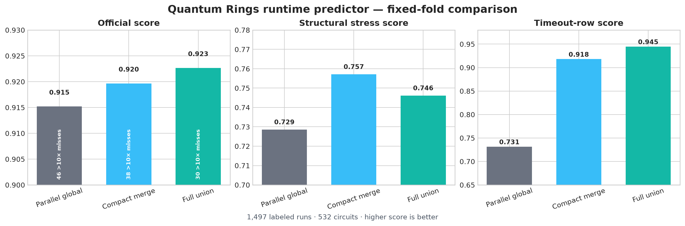

# Merged runtime predictor: comparison and validation

**Continuation update:** This document records the original v1 union selection.
The current v5 artifact adds narrow reset-family and large-work floors, a
guarded structural-template blend, a threshold-512 near-basis correction,
and a faster coarse scanner. See
[EDGE_CASE_UPDATE.md](EDGE_CASE_UPDATE.md) and the
fresh paired metrics in `full_union_model_validation.json` for the deployed
results.

This is the standalone submission selected after comparing two independently
developed pipelines on the Quantum Rings training set.  It uses only information
derived from QASM text plus the supplied threshold.  Circuit filenames, source
collections, and ground-truth algorithm labels are never model inputs.

## Executive result

The deployed model combines the parallel flow's bounded QASM2/3 structural
parser and angle-aware χ walk with the independent flow's structural/DAG/angle
extractor, threshold-specific regression, and timeout-risk routing.  In the
repository's locked environment (scikit-learn 1.9.1), fixed five-fold
out-of-fold performance is:

| Model | Matched score | Structural stress score | Timeout-row score (matched) | >10× misses (matched) |
|---|---:|---:|---:|---:|
| Parallel global ExtraTrees, reproduced | 0.91520 | 0.72854 | 0.73148 | 46 |
| Compact modeling merge (243 features) | 0.91967 | **0.75712** | 0.91799 | 38 |
| **Full-union standalone model (480 features)** | **0.92266** | 0.74611 | **0.94468** | **30** |
| Full union minus global | **+0.00746** | +0.01756 | +0.21320 | −16 |

For the matched split, a paired bootstrap that resamples whole circuits gives a
95% interval of **[+0.00402, +0.01109]** for full union minus global.  The
structural stress interval, resampling the 12 entire clusters, is
**[−0.00273, +0.02727]**; its positive point estimate is not conclusive with so
few independent clusters.  The compact merge remains available through
`train_merged_model.py` if robustness to a large structural shift is preferred.
These are model-selection estimates on the provided training data, not hidden
holdout scores.



The checked-in handoff reports 0.91459 matched and 0.72787 structural for the
previous artifact.  Our locked-stack reproduction is 0.91520 and 0.72854.  The
small difference is consistent with refitting randomized trees under an exact
dependency version; the comparison above refits both rows under one environment.

## What each approach contributed

| Area | Independent general pipeline | Parallel research flow | Merged decision |
|---|---|---|---|
| Parsing | Broad QASM2/3 extractor; 306 candidates, pruned to 237 effective numeric features | Bounded streaming parser with a >40 MB fast path and measured 15-second safety | Keep the bounded parser; reliability is submission-critical |
| Structure | SupermarQ-style, interaction graph, DAG, cut, parameter, and angle summaries | 231 active geometry/family columns including temporal cut pressure, liveness, graph order, simplification, and soft structural fingerprints | Retain both representations under separate namespaces; their errors are complementary |
| Simulator proxy | General graph/DAG complexity proxies | Threshold-conditioned χ-walk cost, saturation, angle filtering, and rotation mixing | Keep all 12 χ/angle walk features |
| Threshold | Raw/log/interaction features and one model per known threshold | Threshold was an ordinary global-model feature | Add one specialist regressor for each guaranteed threshold |
| Timeouts | Per-threshold classifier with a score-tuned cap override | Continuous regressor only | Add per-threshold balanced classifiers; emit 14,400 s at probability ≥0.30 |
| Validation | Repeated grouped 80/20 splits and rich diagnostics | Committed fixed matched and structural-cluster folds with paired OOF predictions | Use the fixed folds for an apples-to-apples decision and retain both stress views |
| Deployment | Full reusable training/plotting package, but larger dependency and feature surface | Small self-contained harness with no Qiskit dependency | Embed the independent scanner without its training dependencies; runtime remains stdlib + NumPy/scikit-learn/joblib |

On its own repeated grouped splits, the independent pipeline's pruned
threshold/timeout model scored **0.91199 ± 0.00897** over five seeds; its selected
single split scored 0.92018.  Those numbers are useful stability evidence but are
not directly comparable to the fixed-fold table because the held-out circuits
differ.  In a preliminary transport to the committed folds (scikit-learn 1.7.2),
its feature set with threshold specialists scored 0.90770 matched and 0.66981
structural, versus 0.91442 and 0.73722 for the parallel global model.

## Model design

The union has 480 columns: 231 parallel global structural columns, 12
threshold-selected χ-walk/angle columns, and 237 independently selected
structural/DAG/angle columns.  The global model intentionally stays on the
validated 243-column view; the specialists and timeout classifiers use all 480.
The final prediction is:

```text
global_log10 = global ExtraTrees(243 parallel features, threshold)
expert_log10 = ExtraTrees[threshold](480 union features)
log10(runtime) = 0.5 * global_log10 + 0.5 * expert_log10

if P(timeout | 480 union features, threshold) >= 0.35:
    runtime = 14,400 seconds
```

The equal log-space blend matches the official metric's geometry.  An 80%
specialist blend improved a preliminary matched score by only about 0.00055,
while losing about 0.013 on structural stress, so the equal blend was retained.
The classifier cutoff was evaluated using the exact challenge score rather than
accuracy or the default 0.5 threshold.

The feature families include operation mix, locally simplified work, interaction
geometry, approximate min-degree width, temporal activity and liveness,
cut-based χ bounds, diversity/entropy, soft structure-derived motifs, dense-state
regime references, and the bounded χ walk.  Soft motif values are measurements
of the submitted circuit's geometry; no external algorithm label is supplied or
looked up.

## Full-union tradeoff

The second scanner adds broad DAG, graph, SupermarQ-style, angle-geometry, and
source-shape coverage.  It exactly reproduced all 236 circuit-only columns in
the independent cache.  Across 532 training circuits the second pass alone had
a median of 0.17 seconds and p95 of 2.15 seconds.  The complete dual-parser
harness on this development host had median / p95 / max parse times of
0.31 / 8.79 / 38.32 seconds; nine circuits exceeded 15 seconds.  All 1,596
predictions completed, were positive, and inference never exceeded 0.321
seconds.  A subsequent single-row tree setting reduced measured mean inference
from 0.229 to 0.129 seconds per prediction.  The final machine is expected to be
much faster and accuracy was explicitly prioritized over this host's 15-second
cutoff.  The embedded scanner still uses deterministic coarse mode on large
files and bounded graph heuristics.

Scoring the final all-data-fitted artifact back on the 1,497 labeled training
runs gives 0.9901.  This is only an end-to-end serialization/harness check; it is
not a held-out accuracy estimate and is not used in model selection.

The union gives up 0.011 structural-stress score versus the compact merge, but
gains 0.0030 matched score, removes eight additional >10× errors, and improves
the matched timeout score by 0.027.  Since holdout thresholds are guaranteed to
be the same and the target is a comparable challenge distribution, the union is
the primary artifact.  The compact trainer remains a one-command fallback.

The remote handoff's follow-up identified large files as a weakness of the
original fast path.  On the same matched folds, the union improves every decoded
size bin.  Most importantly, the four >40-million-character circuits improve
from 0.7500 to 0.7859 and their >10× misses fall from one to zero:

| Decoded QASM size | Prior score | Full-union score | Prior / union >10× misses |
|---|---:|---:|---:|
| <1 million | 0.9247 | **0.9298** | 33 / **25** |
| 1–10 million | 0.8141 | **0.8511** | 10 / **5** |
| 10–40 million | 0.8506 | **0.8850** | 1 / **0** |
| >40 million | 0.7500 | **0.7859** | 1 / **0** |

This is descriptive validation on only four very large circuits, not evidence
that file size itself causes runtime or error.  The added coarse source/gate
view helps without treating bytes as the primary complexity measure.

`RuntimeModel.predict_interval` returns a 90% conformal-style multiplicative
interval calibrated from the fixed matched-fold residuals.  Its log10 radius is
0.4991, or approximately **3.16×** below/above the point estimate, with 89.98%
observed OOF coverage.  This is a practical risk band, not a formal coverage
guarantee after feature/model selection or under distribution shift.

## Leakage and uncertainty notes

- All threshold rows belonging to one circuit share a fold.
- Matched folds group identical label-free feature signatures and stratify by 12
  label-free structural clusters.
- Structural folds hold out entire clusters.
- Fold construction uses no runtime or timeout labels.
- Threshold values 16, 64, and 512 are guaranteed for holdout, which justifies
  specialists.  Unknown thresholds safely fall back to the global model.
- The blend weight and timeout cutoff were selected after experimentation on the
  available data.  The reported estimates therefore remain selection-aware, not
  pristine external validation.

## Reproduce and run

```bash
uv sync --locked --extra report
uv run --locked python research/extract_extended_features.py
uv run --locked python research/train_full_union_model.py
uv run --locked python -m unittest discover -s research -p 'test_*.py'
uv run --locked python quantathon-harness/run.py \
  --team "Your Team" --circuits path/to/holdout --out submission.csv
```

The detailed metrics are in `full_union_model_validation.json`, every fixed-fold
prediction is in `full_union_model_oof.csv`, and the fitted artifact is
`quantathon-harness/artifacts/runtime_model.joblib`.  The complete operational
run is `training_submission_full_union.csv`.  The selected artifact SHA-256 is
`6c1e44915436ad291610c54fe4dfe7b423cbafd44f0c11eb25ed509ad12780e9`.
