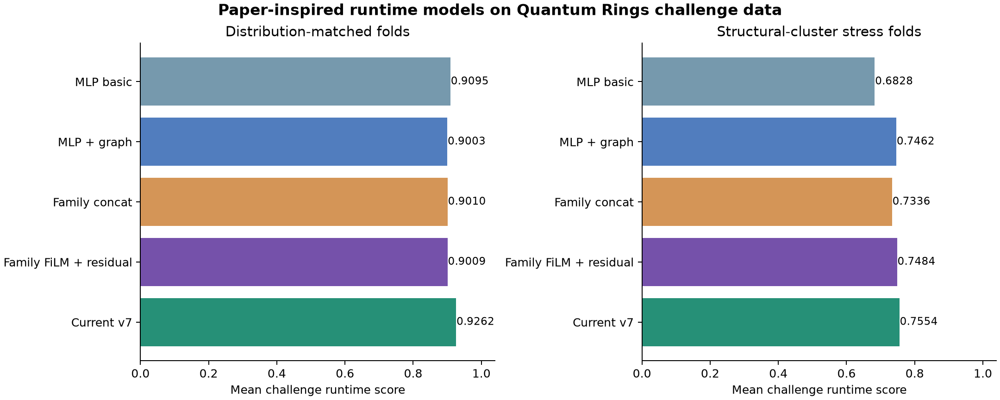
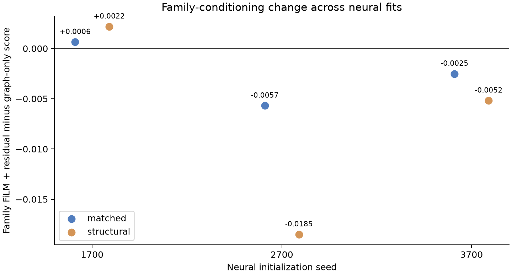

# Runtime-only test of the family-aware residual paper

[Xing et al., *Family-Aware Residual Architecture for Predicting Quantum Circuit Simulation Performance* (2026)](https://arxiv.org/abs/2606.11620) report a runtime $R^2$ of 0.82 on 36 MQT Bench circuits, each run under four CPU/GPU and precision contexts. Their threshold-classification task is outside this test. The original circuit/runtime records, trained weights, and exact fingerprint formulas were not supplied, so the number 0.82 cannot be independently reproduced from this challenge data. This experiment tests whether the paper's **runtime architecture and ablation pattern transfer** to the released Quantum Rings runtime task.

The challenge data have 532 distinct circuits and 1,497 labeled circuit/threshold runs at thresholds 16, 64, and 512; 33 runs timed out. All runs have one opaque simulator backend and single precision. Runtime targets are `log10(seconds)`, with a timeout represented by the observed four-hour cap. We use the challenge's log-runtime score as the primary metric, including its timeout rule. All thresholds of a circuit stay in one held-out fold. We report both distribution-matched and structural-cluster stress folds, then repeat the neural comparison with independent seeds. Each training fold also reserves 15% of its circuits for early stopping.

The implementation uses the paper's 3 basic, 12 gate-count, 4 execution-context, 3 complexity, 2 local, 3 fingerprint, and 5 graph-optimizer feature categories. Because this dataset has only one known context, its context indicators are constant. The 32 paper-category inputs are QASM-derived proxies; an explicit `log2(threshold)` makes 33 inputs for this challenge. For four very large files, the existing bounded parser's fast path lacks some graph/fingerprint fields, so those fields are zero-filled. The family input is the frozen, independent eight-family MQT geometry classifier already available in this repository, rather than the paper's 21-class classifier. Its reference-distance check marks 443 of the 532 challenge circuits outside its 95th-percentile reference range. These adaptations limit any claim about the original paper's dataset or architecture fidelity.

The runtime network follows the reported 64-dimensional family embedding, two-layer SiLU family MLP, shared 64-dimensional SiLU backbone, 0.2 dropout, FiLM scale/shift, zero-initialized additive family residual, and raw-feature shortcut. AdamW uses learning rate 0.005, weight decay 0.001, ten warm-up epochs, cosine decay, batch size 32, norm clipping at 1, and early stopping after 50 epochs without validation improvement. We compare a basic MLP, the same MLP with graph features, one-hot family concatenation, and FiLM plus residual conditioning. No fidelity/threshold head or auxiliary classification loss is used.

| Runtime model | Matched score ↑ | Structural stress score ↑ |
|---|---:|---:|
| Basic MLP | 0.909475 | 0.682842 |
| MLP + graph features | 0.900282 | 0.746211 |
| Family one-hot concatenation | 0.901019 | 0.733641 |
| Family FiLM + residual | 0.900924 | 0.748393 |
| Selected challenge v7 predictor | **0.926153** | **0.755369** |



The family architecture adds **0.000642** matched score over the graph MLP (circuit bootstrap 95% interval **−0.004063 to +0.005105**) and **0.002182** structural score (structural-cluster bootstrap interval **−0.008521 to +0.018661**). Neither interval establishes a gain. Graph features improve structural generalization by 0.063369 over the basic MLP, although its cluster-bootstrap interval includes zero; on matched folds they reduce score by 0.009193. The selected v7 predictor still wins on both fixed splits.

Independent neural initializations weaken the family-gain claim further. Family-minus-graph score differences for seeds 1700, 2700, and 3700 are **+0.000642, −0.005692, −0.002515** on matched folds and **+0.002182, −0.018498, −0.005187** on structural folds. Classifying out-of-reference circuits as `unknown` gives family-model scores 0.894055 matched and 0.727919 structural, below the ordinary family model's 0.900924 and 0.748393. On matched folds, omitting the threshold input reduces its score from 0.900924 to 0.707249. Threshold therefore carries substantial runtime information in this dataset, unlike the paper's reported small threshold-sensitivity effect.



The paper's runtime $R^2$ is not directly comparable: it uses a different simulator/context sample, does not specify every diagnostic convention, and this task has censored timeouts. For transparency, our matched FiLM model has `log10(seconds)` $R^2=0.9292$, but raw-seconds $R^2=-15.46$ even after treating predictions above the cap on timeout rows as the observed cap. A few extremely large out-of-fold predictions dominate raw $R^2$: for `bd32080b.qasm` at threshold 64, the successful run took 6,223 seconds and the model predicted 389,854 seconds. Median relative error is 21.3%. The challenge score and all per-row predictions are preserved in the machine-readable outputs so the result can be checked without relying on one aggregate statistic.

Reproduce from the repository root with `uv`:

```bash
uv sync --locked --extra paper --extra report
uv run --locked --extra paper python research/paper_runtime_replication.py
uv run --locked --extra paper python research/paper_runtime_robustness.py
uv run --locked --extra report python research/plot_paper_runtime_replication.py
uv run --locked --extra paper python -m unittest discover -s research -p 'test_*.py' -q
```

Outputs: [primary results](paper_runtime_replication.json), [out-of-fold predictions](paper_runtime_oof.csv), and [seed/guard/threshold checks](paper_runtime_robustness.json). The implementation is in [paper_runtime_replication.py](paper_runtime_replication.py), with robustness checks in [paper_runtime_robustness.py](paper_runtime_robustness.py). The runtime-only paper model remains an experimental comparison; the selected holdout artifact is unchanged.
