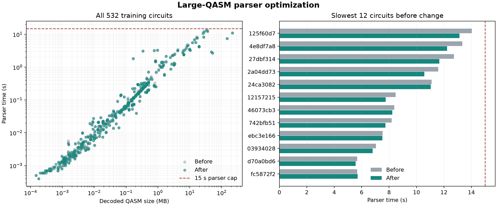

# Large-QASM parser hot-path optimization

The v6 submission artifact is unchanged. The bounded QASM parser now handles
the common one- and two-qubit depth updates directly, avoids sorting a
two-qubit operand pair twice, and uses `INDEX.findall` to extract the same
numeric qubit indices without constructing match objects. This targets the
millions of Python-level gate operations in large generated circuits.



Two sequential runs of the supplied harness on all 532 training circuits
produced these timings (seconds):

| Measure | Before | After |
|---|---:|---:|
| Median parser time | 0.0935 | 0.0922 |
| P95 parser time | 3.2240 | 3.1377 |
| Maximum parser time | **14.0297** | **13.1250** |
| Mean for the 9 circuits above 20 MB | 9.3670 | 8.8857 |
| Circuits above the 15-second cap | 0 | 0 |

The three slowest regular-parser circuits improved from 14.0297 to 13.1250
seconds (33.5 MB), 13.3338 to 12.2272 seconds (36.1 MB), and 12.7349 to
11.6686 seconds (28.0 MB). Of the 532 circuits, 420 had a lower recorded
parser time, 65 a higher time, and the remainder tied at the harness's
four-decimal precision. These are local sequential timings, not a controlled
benchmark across machines, but they consistently increase the margin below
the parser cap on the largest regular-parser files. The four giant files above
the 40 MB fast-path cutoff still use their separate coarse path.

The non-χ-walk feature vector matched the pre-change vector exactly for the
33.5 MB circuit and the cached vectors for the 36.1 and 28.0 MB circuits.
The χ walk uses a wall-clock budget and can process a slightly different
fraction between runs. Across the full harness, the largest old/new
prediction ratio was **1.0062**. All **1,596** predictions remained positive
and finite, with no parse or prediction cap violations. The fitted
training-label score changed only from **0.9878071** to **0.9878087**;
this is an integration check, not a held-out estimate. The fixed-fold model
validation remains **0.92578 matched / 0.75537 structural stress** because
the trained artifact and cached training matrix did not change.

Reproduce:

```bash
uv sync --locked --extra report
uv run --locked python quantathon-harness/run.py \
  --team 'Quantum Rings Research' --circuits training_circuits \
  --out research/training_submission_parser_optimized.csv
uv run --locked python research/plot_parser_optimization.py
uv run --locked python -m unittest discover -s research -p 'test_*.py' -q
```

The paired CSVs are `training_submission_pruned.csv` and
`training_submission_parser_optimized.csv`. A separate candidate to soften
large-circuit timeout routing was rejected after alternate grouped folds
exposed a real-timeout regression; see
[`TIMEOUT_DISAGREEMENT_EVALUATION.md`](TIMEOUT_DISAGREEMENT_EVALUATION.md).
