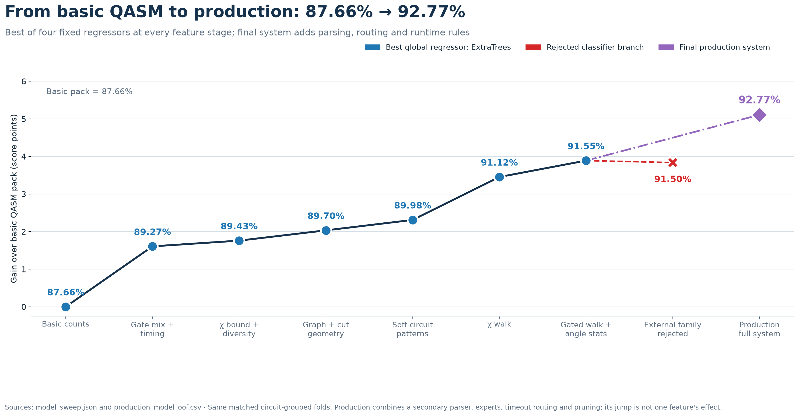

# Agent handoff: from QASM counts to the final runtime model

This is the reproducible handoff for the [continuous presentation figure](presentation_figures/00_feature_progression.png), whose plotted matched-fold score rises from **87.66% to 92.77%**. It explains the complete experimental path, what every stage actually added, which alternatives failed, where every number came from, and how another agent can reconstruct the results from the [fork branch](https://github.com/Meeeee6623/quantumrings-challenge-quantathonv3/tree/codex/quantum-rings-runtime-predictor). The [original challenge repository](https://github.com/Quantum-Rings/quantumrings-challenge-quantathonv3) supplies the task; **clone the fork branch for this experiment's code, caches, model, and figures**. Internal filenames sometimes contain historical version tags; the presentation calls the selected artifact the **final model**.

The chart is one narrative path, but its segments have different evidentiary strength. **Points 1–7** are cumulative feature packs evaluated with the *same* four fixed regressors, 1,497 targets, and five saved matched folds. Every pack was fitted afresh and ExtraTrees was its winner. **Points 8–12** are later, successive implementations, read from their own saved validation reports and final out-of-fold (OOF) predictions. Their differences are progress along the development path, **not isolated causal estimates of the words in the x-axis label**. For a causal comparison of an individual later component, use the paired baseline and treatment inside its own report. None of the scores are hidden-holdout results.



## Task, score, and split before looking at the curve

The input is source QASM (OpenQASM 2 or 3, sometimes compressed) and one simulator setting in `{16, 64, 512}`. The output is a positive runtime prediction in seconds. The released data have **532 circuits**, **1,497 labeled circuit/setting rows**, and **33 explicit timeouts**. There are 1,596 possible rows; 99 unavailable labels are missing, not timeouts. The final harness must still emit all 1,596 rows for the training-circuit directory. Circuit names are scrambled identifiers used for joining and grouping, never fitted predictors. The task imposes separate 15-second limits on feature extraction and prediction.

We follow the executable [official scorer](../quantathon-harness/score.py), not its inaccurate prose description. For successful rows, actual seconds are the measured duration; for timeouts, actual is 14,400 seconds. A prediction is capped at 14,400 **only when scoring a timeout row**. The row score is

```text
actual = 14400 if status == "timeout" else duration_s
effective_prediction = min(prediction, 14400) if timeout else prediction
row_score = max(0, 1 - abs(log10(effective_prediction / actual)) / 2)
reported_score = mean(row_score across all 1497 labeled rows)
```

Thus a 10-fold miss scores 0.5; a 100-fold miss scores zero. A successful 42,993.98-second label stays above 14,400 in scoring. Regressors fit `log10(actual seconds)`, so averaging predictions in log space is natural for this multiplicative error. See [train_runtime.py](train_runtime.py) for the implementation.

The [saved fold table](comparison_folds.csv) is the shared comparison anchor. [Its generator](export_comparison_folds.py) takes seven **label-free** circuit features—`n_qubits`, `ops`, `two_q_ratio`, `nonclifford_ratio`, `conditional`, `custom_definitions`, `qasm_bytes`—applies `log1p(max(0,x))`, standardizes them, and makes 12 KMeans structural clusters (`n_init=10`, seed 17). `StratifiedGroupKFold(5, shuffle=True, random_state=17)` distributes those clusters across the **matched** folds while grouping identical pre-ablation QASM feature signatures, hashed with SHA-1; all settings for a circuit remain together. No setting/threshold-based holdout is used. The separate **structural stress** split uses `GroupKFold(5)` on entire cluster IDs, deliberately testing unfamiliar coarse structure. It is harder and unbalanced; it is a diagnostic, not the distribution target selected by the user. Within each reported OOF fit, estimators, role-specific feature-importance ranks, runtime-reference banks, and template analogues are learned on training folds only. The **choice of feature groups and frozen final schema** reused the released labels across experiments, however, and can make the reported gains optimistic.

### The split in ordinary terms: what is a row, a circuit, a group, and a fold?

The **prediction/score unit is a row**: one circuit at one setting. The **holdout unit is a circuit**: if `example.qasm` has labels at 16, 64, and 512, all three rows are assigned to the same validation fold. A model trained to predict its 512 row therefore cannot already have seen its 16 row. A few distinct scrambled filenames can also yield identical pre-ablation QASM feature signatures; these are held together. There are 531 such signatures for 532 circuits. In a five-fold run, each model is trained five times, each time on four folds and evaluated on the fifth. The 1,497 OOF predictions are concatenated, then the official row scores are averaged. This is **not** a random 80/20 split of rows and **not** a split by simulator setting. Missing rows are excluded from scoring rather than filled as timeouts. The released-label counts are 532 rows at 16, 530 at 64, and 435 at 512.

The twelve KMeans clusters are made once from coarse, runtime-blind descriptions of the 532 circuits. Their numbers `0`–`11` are **arbitrary cluster IDs**, not known algorithm families. Think of them as bins of similar width, operation count, gate mix, conditional use, and source size. Because the clustering uses all **unlabeled** QASM descriptions before splitting, the protocol is transductive on features; it does not consult any held-out runtime. The saved assignments make comparisons reproducible, but they do not simulate learning cluster boundaries from only the training side.

| Validation question | How folds are formed | What the held-out model has seen | Appropriate claim |
|---|---|---|---|
| **Matched / main selection** | `StratifiedGroupKFold` spreads all 12 structural clusters across each of five folds while keeping each circuit/signature together. | Other circuits from the **same broad structural clusters**, but never the test circuit's other settings. | Similar-distribution generalization within the released circuit mixture. This is the **92.77%** number in the chart. |
| **Structural stress / transfer check** | `GroupKFold` assigns **whole structural clusters** to held-out folds. | No training circuits from the withheld clusters in that fold. | Sensitivity to unfamiliar structural regimes. The final score is **76.64%**, and it should never be casually substituted for the expected similar-distribution holdout score. |

The fixed assignments have these sizes. The structural split is very uneven because one KMeans bin contains 225 circuits, and four of its five folds contain multiple smaller bins. Timeout labels are also uneven: 29 of 33 land in structural fold 2. Report the **row-weighted pooled OOF score**, not an unweighted mean of five fold scores, and avoid treating individual structural-fold scores as equally precise.

| Fold | Matched circuits / labeled rows | Matched timeouts | Structural-stress circuits / labeled rows | Withheld cluster IDs | Structural timeouts |
|---:|---:|---:|---:|---|---:|
| 0 | 107 / 301 | 7 | 225 / 651 | 1 | 4 |
| 1 | 106 / 299 | 5 | 73 / 202 | 4, 8, 11 | 0 |
| 2 | 105 / 297 | 10 | 80 / 213 | 3, 5, 7, 9 | 29 |
| 3 | 107 / 300 | 4 | 82 / 225 | 2, 6 | 0 |
| 4 | 107 / 300 | 7 | 72 / 206 | 0, 10 | 0 |

All five matched folds include circuits from all twelve clusters; the structural folds deliberately do not. A presenter can explain this with two sketches: **matched** = take some circuits from every shape bin; **stress** = take an entire shape bin away. The fold table is reused to make feature/model changes paired; a later probe also tried fresh circuit-grouped assignments to check that a tiny gain was not peculiar to these five saved folds. There is still no untouched hidden result in the repo. After choosing the model, the artifact is fitted on all 1,497 available labels for holdout inference; its in-sample training score is not the validation score.

### What the complete predictor actually does

At inference, the harness reads and decompresses a circuit once. A bounded primary scanner, a separate fast structural/DAG/angle scanner, and the angle-aware χ walk turn the **source text** into numeric summaries without running the quantum simulator or using measured runtime. The known setting selects three indicator columns and the relevant walk summaries. A global ExtraTrees runtime regressor and a setting-specific ExtraTrees regressor predict log seconds; their 50/50 log-space blend is a geometric mean in seconds. A setting-specific classifier may route a likely timeout to 14,400 seconds. Only then do the narrow reset/large-work floors, same-setting template analogue rule, and threshold-512 near-basis correction apply. The parser uses bounded/coarse paths to respect the 15-second limits. The [model architecture figure](presentation_figures/08_model_architecture_tree.png) visualizes this flow. Training labels enter only when fitting these estimators/reference banks and when evaluating them, not when parsing an unseen circuit. The exact final predictor consumes the [120-name frozen schema](../quantathon-harness/production_features.json).

## Read the complete figure precisely

The column count in the first seven rows includes the **three categorical setting indicators**. “Gain” is the visible difference from the preceding point, in percentage points (pp). It is not a confidence interval.

| Figure point | Input columns / model path | Matched score | Visible gain | Direct score source |
|---|---:|---:|---:|---|
| Basic counts | 29; winner of four regressors | **87.66%** | — | `model_sweep.json`, `basic` |
| Gate mix + timing | 136; same four-model sweep | **89.27%** | +1.61 pp | `model_sweep.json`, `normal` |
| χ bound + diversity | 160; same sweep | **89.43%** | +0.15 pp | `model_sweep.json`, `chi_diversity` |
| Graph + cut geometry | 214; same sweep | **89.70%** | +0.27 pp | `model_sweep.json`, `geometry` |
| Soft circuit patterns | 232; same sweep | **89.98%** | +0.28 pp | `model_sweep.json`, `soft_patterns` |
| χ walk | 240; same sweep | **91.12%** | +1.14 pp | `model_sweep.json`, `chi_walk` |
| Gated walk + angle stats | 244; same sweep | **91.55%** | +0.44 pp | `model_sweep.json`, `angle_gated` |
| Experts + timeout router | historical merged implementation | **91.97%** | +0.41 pp on chart | `merged_model_validation.json`, `merged` |
| Secondary DAG / angle | historical dual-scanner union | **92.25%** | +0.29 pp on chart | `full_union_model_validation.json`, `full_union` |
| Floors + templates + calibration | successive guarded rules | **92.62%** | +0.36 pp on chart | same report, `near_basis_calibration` |
| Categorical + feature audit | audited categorical fit | **92.69%** | +0.08 pp on chart | `categorical_model_validation.json`, `categorical_v8` |
| Final model, 120 inputs | frozen-schema final OOF | **92.77%** | +0.08 pp on chart | `production_model_oof.csv`, rescored |

The unrounded first seven scores are in [model_sweep.json](presentation_figures/model_sweep.json); the remaining JSON and CSV files are linked in the [reproduction map](#reproduction-map-for-every-presentation-figure). The chart generator is [make_presentation_figures.py](make_presentation_figures.py), specifically `plot_feature_progression()` and `production_oof_scores()`. The generator asserts that the plotted path is increasing; this is a property of the selected historical path, **not** a rule imposed on experiments or predictions.

### Why four models are shown with every feature pack

[sweep_feature_model_tree.py](sweep_feature_model_tree.py) rebuilds each feature matrix from the same cached QASM measurements and runs a five-fold OOF fit for each of four fixed estimators: standardized Ridge (`alpha=30`), histogram gradient boosting (220 iterations, 15 leaves), random forest (180 trees, minimum leaf 2), and ExtraTrees (240 trees, minimum leaf 2, 90% feature subsampling, seed 17). Each model sees the same three one-hot setting columns, target, and folds within a pack. The winning score determines its plotted point. **ExtraTrees won all eight tested packs**, including the rejected external-family pack. This comparison tests ordinary out-of-box model families; we spent most of the research effort on circuit representation. The exact 32 scores and each pack's **ordered full column list** are saved in `model_sweep.json`; consult that file to disambiguate any raw/log counterpart. The first seven plotted packs are cumulative: 29 → 136 → 160 → 214 → 232 → 240 → 244. The eighth adds an external classifier and **falls** to 91.50%, so it appears in the separate model/algorithm figures rather than the accepted progression.

## Feature engineering, in the order shown

### 1. Basic counts: what fits on the page of a QASM program

The 29 columns are 13 raw QASM measurements, their 13 `log1p(max(0,x))` transforms, and `setting_16`, `setting_64`, `setting_512`. The raw fields are `n_qubits`, `active_qubits`, `ops`, `one_q`, `two_q`, `multi_q`, `depth`, `two_depth`, `measurements`, `resets`, `barriers`, `conditional`, and `qasm_bytes`. The primary [QASM scanner](../quantathon-harness/model.py) recognizes declarations and gate statements, counts source operations by arity, accumulates each qubit's dependency depth, and records measurement/reset/control-flow activity and text size. `depth` is the largest per-qubit dependency level; `two_depth` advances only on multi-qubit interactions. The transformed copies compress the many-order-of-magnitude count scales for models that benefit from them. Each setting indicator is exactly 1 if that row uses the named setting, otherwise 0.

Why: width, gate volume, depth, and input size are a minimal estimate of work and parsing overhead. The 87.66% result shows that simple workload size explains much of the released runtime, but not why equal-sized circuits differ.

### 2. Gate mix + timing: distinguish the work, not just its quantity

This stage adds **107 columns** (mostly raw/log pairs) to reach 136. The exact added names are the `normal` minus `basic` arrays in `model_sweep.json`. Their base quantities fall into six concrete groups:

* **Gate composition:** `gate_h`, `gate_x`, `gate_sx`, `gate_s`, `gate_t`, `gate_rx`, `gate_ry`, `gate_rz`, `gate_p`, `gate_u`, `gate_u1`, `gate_u2`, `gate_u3`, `gate_cx`, `gate_cz`, `gate_cp`, `gate_swap`, `gate_rzz`, `gate_ccx`; `clifford`, `nonclifford`, `diagonal`; and `two_q_ratio = two_q/max(1,ops)`, `nonclifford_ratio = nonclifford/max(1,ops)`. Gates are counted when the scanner sees them, with custom-definition summaries handled separately. These distinguish cheaply structured gate streams from strongly mixing ones, without asserting which simulator algorithm was used.
* **Local simplification proxies:** numeric angles are parsed without arbitrary evaluation. `zero_angles` counts parameters equivalent to zero modulo `2π` within `1e-9`; `small_angles` counts nonzero wrapped values below `0.025` rad. Adjacent inverse gates or opposite numeric rotations on the same qubit contribute `cancel_pairs`; adjacent same-axis numeric rotations contribute `rotation_folds`. `effective_ops = max(0, ops - zero_angles - 2*cancel_pairs - rotation_folds)`. This approximates easily removed work; it is not a transpiler trace.
* **Interaction and active-component summaries:** `unique_pairs`, `pair_reuse = two_q/max(1,unique_pairs)`, degree, pair span, connected-component count/size, and `largest_component_frac`. These are obtained from the graph of observed two-qubit operand pairs. They answer whether many gates revisit a few pairs or spread across the register.
* **Temporal work:** the source is divided into eight position windows. `twoq_window_0` through `_7` are each window's share of two-qubit operations; `peak_window_twoq` is the largest share; `late_new_pair_ratio` counts first-seen interaction pairs in the latter half divided by all first-seen pairs; `early_two_q` counts two-qubit gates among the first 256 counted operations. These mark front-loaded versus late spreading work.
* **Custom/source complexity:** `custom_calls`, `custom_definitions`, `custom_depth`, `custom_two_depth`, `unsupported_statements`, and `huge_fast_path` keep parser overhead and approximation mode visible. The custom-depth fields summarize definition bodies; the huge flag marks the deliberate coarse path for exceptional files.
* **Rate and depth normalizers:** `depth_per_qubit`, `mean_degree`, `mean_span`, etc., separate long serial chains from wide, parallel circuits.

Most nonnegative fields also get `log_` companions as `log1p(max(0,x))`; selected ratios and flags do not. [columns_for()](train_runtime.py) defines the exact rule. This group adds **+1.61 pp**, the largest improvement before the χ walk. That is consistent with circuit *type* and timing mattering beyond bytes and gate total.

### 3. χ upper bound + diversity: potential entanglement versus circuit variety

This stage adds **12 base measurements and their 12 log transforms**. The χ fields are `chi_upper_peak`, `chi_upper_mid`, `chi_upper_mean`, `chi_capacity_fraction`, `chi_unsaturated_fraction`, `chi_mid_budget`. For the cut after qubit `k` in an `n`-qubit register, the scanner accumulates a crossing-gate budget `B_k`: a recognized rank-2 two-qubit gate adds one bit; a generic two-qubit gate adds two; a wider gate receives a conservative `2*floor(arity/2)` allowance. It records

```text
U_k = min(k, n-k, max(0, B_k))                 # potential log2 χ upper bound
capacity_k = min(k, n-k)
chi_upper_peak = max_k U_k
chi_upper_mid = U_floor(n/2)
chi_upper_mean = mean_k U_k
chi_capacity_fraction = mean_k (U_k / capacity_k)
chi_unsaturated_fraction = fraction of cuts with U_k < capacity_k
chi_mid_budget = B_floor(n/2), before geometric capping
```

These are **upper potential-rank proxies for the source ordering**, assuming product-state input. They can be loose after cancellations or special angles, and the challenge does not prove that setting 16/64/512 is a literal MPS bond-dimension cap. In particular, the simple upper bound saturates on 447 of the 532 circuits, which limits its discrimination ([χ evaluation](CHI_RANDOMNESS_EVALUATION.md)).

The six diversity fields are `random_gate_entropy`, `random_bigram_entropy`, `random_angle_entropy`, `random_pair_entropy`, `random_window_entropy`, and `randomness_proxy`. For positive category counts `c_i`, the normalized Shannon evenness is `-Σ_i p_i log2(p_i)/log2(K)` (zero for fewer than two positive categories). Categories are gate names, adjacent gate-name pairs, 16 wrapped-angle bins, interacting qubit pairs, and eight time windows. The combined heuristic is

```text
randomness_proxy = 0.22*gate_evenness + 0.22*bigram_evenness
                 + 0.18*angle_evenness + 0.23*pair_evenness
                 + 0.15*window_evenness
```

It measures source-pattern diversity, **not certified quantum randomness**. We also tried a constructed `log2 χ_est = randomness_proxy * log2 χ_upper`, so χ_est approaches the upper bound as diversity approaches one. The later additive effective-χ peak/mean/mid/capacity and χ×randomness interaction columns were **excluded** from the staged sweep because earlier held-out tests did not justify them. They are still computable by the parser; emitted is not the same as fitted. The accepted static bound/diversity stage adds **+0.15 pp**. See [evaluate_chi_randomness.py](evaluate_chi_randomness.py) and [its ablation report](chi_randomness_ablation.json).

### 4. Graph + cut geometry: where interactions land and when pressure rises

This adds **27 base fields plus 27 log transforms** to reach 214 columns. The six `chi_timeline_*` fields recompute cumulative potential cut pressure in each of eight source windows: mean area under peak, mean capacity use, mean middle-cut pressure, the first windows where the middle cut reaches 50% and 90% capacity, and the fraction of two-qubit work after middle-cut saturation. A static final χ cannot distinguish early saturation from late saturation; these can.

Ten `graph_*` fields use the **weighted qubit-interaction graph**: maximum/mean crossing weight in the original register order and in reverse Cuthill–McKee (RCM) order (`graph_cutwidth_*`, `graph_mean_cut_*`); mean RCM pair span; fractional cutwidth reduction `graph_rcm_gain`; degree entropy; edge density; and a min-degree elimination-width estimate with its availability flag. RCM is a cheap order heuristic, and min-degree runs only for graphs within the implementation's size limits (`n≤80`, at most 3,000 distinct pairs). These are properties of the interaction graph, **not** an optimal tensor contraction tree or actual simulator memory. Their purpose is to distinguish a local chain from all-to-all or crossing-heavy geometry with similar gate totals.

The other eleven fields describe dense-vector reference scales, diagonal streaks, active-qubit liveness, and early measurement/reset placement: `dense_log2_bytes = n_qubits+3` for a hypothetical complex64 state vector, the same for the largest interacting component, two 128-GB crossing flags (34-qubit threshold), `diagonal_run_max`, `diagonal_run_frac`, `liveness_peak_window`, `liveness_mean_window`, `liveness_mean_span`, `measurement_early_frac`, and `reset_early_frac`. These are **reference scales**, not a claim that Quantum Rings allocates such a vector. This stage adds **+0.27 pp**. The independent paired [geometry/family ablation](geometry_family_ablation.json) and [explanation](GEOMETRY_FAMILY_EVALUATION.md) also show geometry's value under structural stress.

### 5. Soft circuit patterns: algorithm-like shape without a forced label

Nine 0–1 hand-coded `fingerprint_*` scores and nine `log1p` companions add **18 columns**, bringing the sweep to 232. They are independent strengths, **not probabilities** and not verified algorithm identities. The exact formulas are in `Stats.features()` in [model.py](../quantathon-harness/model.py); the decisive factors are:

| Soft score | Source-QASM factors used | Interpretation, with caveat |
|---|---|---|
| `qft` | controlled-phase share × Hadamard coverage × dyadic-phase bonus | QFT-like phase rotation layout |
| `random_grid` | diversity × two-qubit share × bounded max degree | spatially spread random-like interactions |
| `qaoa` | `rzz`/`cp` cost-gate share × `rx`/`h` mixer share × pair reuse | alternating cost/mixer ingredients; no ordered layer guarantee |
| `arithmetic` | multi-control/multi-qubit share × T-like bonus | reversible arithmetic-like gate mix |
| `variational` | parameterized-rotation share × entangler share | variational ansatz ingredients |
| `ghz` | H coverage × CX coverage × star topology | GHZ-like fanout |
| `graph_state` | H coverage × CZ coverage | graph-state preparation ingredients |
| `grover` | multi-qubit-gate share × H/X share | search/reflection-like signature, not a Grover label |
| `phase_dyadic` | dyadic phase count / phase-gate count | repeated `π/2^j` structure |

The dyadic count specifically checks nonzero `cp`, `cu1`, `p`, or `u1` angles near `π/2^j`, `1≤j≤12`, within `1e-6` of the normalized ratio. All scores use bounded products and denominators `max(1,count)`; see the implementation for exact scaling constants. The full nine-score set adds **+0.28 pp** in the staged sweep. The final 120-input schema keeps raw and transformed `grover`, `phase_dyadic`, `qft`, `random_grid`, and `variational`; it drops fitted QAOA, arithmetic, GHZ, and graph-state scores after later feature selection. A [generated-family classifier probe](ALGORITHM_GEOMETRY_PROBE.md), a [Shor-family probe](SHOR_FAMILY_PROBE.md), and [ordered sequence motifs](SEQUENCE_MOTIF_PROBE.md) are separate experiments, not these soft scores.

### 6. χ walk: price the path, not only the peak

The supplied and extended [χ walk](../quantathon-harness/chi_walk.py) streams operations in circuit order. For every adjacent-qubit cut, it tracks potential `log2 χ` under an uncapped run and under three empirical caps corresponding to settings 16, 64, and 512. Each crossed two-qubit gate can add one bit for known rank-2 controlled/Pauli interactions or two bits for swap-like/unknown gates; each cut is capped by its smaller-side dimension and the selected setting. A one-qubit gate cannot directly increase rank. A conservative computational-basis flag prevents growth for a controlled gate with definite controls or a diagonal gate with fewer than two nonclassical qubits. It tracks shape even when a gate does not grow rank; work is still charged. Custom definitions are unfolded within the bounded walk. This is an **engineering cost proxy**, not a simulation of the state or a proof of the backend's actual χ.

At each log-rank level `k`, `t1[k]` counts single-qubit gates charged at local `χ=2^k`; `t2[k]` sums crossed-link distances of two-qubit gates at that level. The selected priced feature is

```text
chi_walk_cost_overhead = log10(1 + Σ_k t1[k]*(10 + 4^k)
                               + Σ_k t2[k]*(100 + 2^(2.5*k)))
```

The **eight added sweep inputs** are `chi_walk_cost_overhead`, `chi_walk_entangling_frac` (potentially rank-growing two-qubit fraction), `chi_walk_max_logchi` (peak reached on a cut), `chi_walk_sat_frac` (share of two-qubit gates at the cap), `chi_walk_sat_start` (normalized first cap-saturation position), `chi_walk_links_at_cap` (final fraction of capped cuts), `chi_walk_extrapolated` (bounded-time approximation flag), and `chi_walk_available` (detailed walk succeeded). Threshold-specific values are selected for the row's setting. The parser has a 3-second walk budget, reduces it if earlier parsing consumed the working budget, and skips the detailed walk above 40 million decoded QASM characters. In the training set 528 circuits have detailed walk features; four take the coarse path, and ten angle-aware walks were extrapolated after the budget. The sparse flags let the model distinguish missing approximations from a true zero.

This stage adds **+1.14 pp**, the largest physics-informed feature gain. The paired [walk study](CHI_WALK_EVALUATION.md) tests cost exponents/overheads and shows that *shape plus cost* beat cost alone. The presentation's [walk ablation figure](presentation_figures/03_chi_walk_ablation.png) uses that paired study's own baseline, so do not subtract its plotted bars from the continuous chart.

### 7. Gated walk + direct angle statistics

The walk's original basis flag marked a numeric X/Y-like rotation as mixing even when the angle was close to 0 or π. The revised rule applies only to the first **numeric** angle of `RX`, `RY`, `U`, or `U3`: if `abs(remainder(angle, π))≤0.3` radians, a currently classical qubit **keeps** its basis-state flag. Even multiples count as near zero, odd multiples as near π. The gate is still counted and priced; symbolic/unparsed angles remain conservatively mixing; a qubit already nonclassical is never made classical by this test. This is a heuristic approximation to basis preservation, not an exact guarantee of low entanglement for a near-π gate.

In addition to recomputing the previous eight walk fields, the sweep adds **four direct inputs**: `chi_walk_rot_near_zero`, `chi_walk_rot_near_pi`, `chi_walk_rot_near_frac = (near_zero+near_pi)/max(1,parsed_rotations)`, and `chi_walk_rot_mixing_mean = mean |sin(theta)|` across parsed rotations. The new total is 244; these are not four extra static-QASM columns. The matched gain is **+0.44 pp**. An independent [paired rotation ablation](ROTATION_FILTER_EVALUATION.md) supported the matched choice but showed a structural-stress drop (73.52% → 72.79% at that historical stage), which is why we describe the gain as distribution-specific. The final schema keeps near fraction and mixing mean, but not the separate near-zero/near-π counts. Those counts were tested directly; dropping them was a later fitted-feature decision, **not** evidence that the filter itself was removed.

### Rejected side branch: externally predicted algorithm family

The same sweep has an eighth row adding **eight generated-family probabilities plus maximum confidence** from `algorithm_geometry_predictions.json`. It scored **91.50%**, down from the gated walk's **91.55%**, even though ExtraTrees again won the four-model comparison. The external classifier was trained on MQT-generated reference geometries; its 96.9% size-grouped reference accuracy did not establish transfer to these circuits. **443/532 challenge circuits** fell outside its reference-distance range. Earlier paired runtime testing also worsened matched and stress scores. Ordered QAOA/Shor motifs recognized controlled generator examples but were not stable enough on challenge runtime. Therefore the final model uses **soft source-pattern measurements where selected**, not a forced hard algorithm class or Shor detector. No verified challenge-family labels exist.

## Later model and system refinements

The 91.55% → 92.77% half of the figure is a sequence of full implementations. It should be explained with both the **visible chart difference** and the appropriate **within-report control**:

1. **Experts + timeout router (91.97%).** [train_merged_model.py](train_merged_model.py) adds one ExtraTrees runtime expert per known setting (600 trees, leaf 1) and one ExtraTrees timeout classifier per setting (300 balanced trees, leaf 2). The global model is ExtraTrees (240 trees, leaf 2). The global and relevant expert's `log10(seconds)` predictions are averaged 50/50; a classifier probability above the then-used 0.30 cutoff emits 14,400 seconds. Within [merged_model_validation.json](merged_model_validation.json), the paired global baseline is 91.5201% and the merged model is 91.9665% (**+0.4464 pp**). The visible previous sweep point is 91.5548%, so the chart-to-chart +0.4118 pp also includes refitting differences. Each setting keeps its own model because measured threshold response is not reliably monotone.
2. **Secondary DAG/angle scanner (92.25%).** An independent [fast QASM scanner](../quantathon-harness/extended_features.py) adds source shape, parameter-angle distribution, custom-definition expansion proxies, weighted interaction graph, cut crossings, dependency layers, parallelism, and selected SupermarQ-like descriptors. [train_full_union_model.py](train_full_union_model.py) starts with 480 primary/secondary candidate columns; it removes constant/exact duplicates and ranks feature importance **inside each training fold**. The global estimator uses the primary view, while threshold experts and timeout classifiers can use the union; limits are 120/200/80 columns for their respective roles. The final timeout cutoff is 0.35. Its paired [validation](full_union_model_validation.json) compares a primary-only global at **91.5347%** to the full routed union at **92.2546%**. That +0.7199 pp contains **experts plus second scanner**, and is not the isolated contribution of the scanner. The visible +0.2881 pp relative to the previous merged point is the historical implementation difference. Do not claim a standalone DAG-only causal gain.
3. **Guarded residual rules (92.62%).** Within the same full-union report, adding the reset-heavy search floor gives 92.4362%, then the large-work floor 92.4668%, then support-aware exact-template analogues 92.5473%, then near-basis calibration **92.6153%**. The sequential differences relative to the immediately prior treatment are about **+0.1816, +0.0306, +0.0805, +0.0680 pp**. The reset floor triggers at `resets≥10`, `multi_q≥10`, `fingerprint_grover≥0.9`; it finds the nearest same-setting training reference in log operation count, scales capped seconds by the operation ratio, caps at 14,400, and takes a maximum with the existing prediction. The large-work floor sets at least 10 s for `effective_ops≥500,000`, 100 s for `≥1,000,000`. The exact-template bank keys on `(setting,n_qubits,ops,two_q,multi_q)`: fewer than two training references do nothing, two cause a 50/50 log blend with their median, and three or more use the median log-runtime directly. These references and banks are built **from the training side of each fold**. Finally, for setting 512 only, `chi_walk_rot_near_frac≥0.9`, `ops≥1,000`, and an existing prediction in `[1,14,400)` s, the correction halves the prediction. See [runtime_floors.py](../quantathon-harness/runtime_floors.py), [template_analogues.py](../quantathon-harness/template_analogues.py), and [rotation_calibration.py](../quantathon-harness/rotation_calibration.py). The guards target observed misses; they are not general quantum laws.
4. **Categorical setting + feature audit (92.69%).** Earlier models used ordinal `threshold` and `log_threshold`; the new matrix removes those plus the secondary duplicate and uses only three one-hot indicators. Categorical encoding **alone** was slightly worse on matched folds (92.6153% → about 92.6046% in [categorical_setting_probe.json](categorical_setting_probe.json)). The later [feature audit](feature_audit/FINAL_FEATURE_DECISIONS.md) examined fitted importance, grouped feature-versus-runtime plots, redundancy, and paired pruning. The combined categorical/audited model reached **92.6914%** matched and **76.0192%** structural stress in [categorical_model_validation.json](categorical_model_validation.json). Thus the chart point must not be presented as evidence that one-hot encoding alone supplied +0.08 pp. The distinct fitted union had gone from **325 to 241** inputs; even the 241-input stage is historical, not the final frozen schema.
5. **Final 120-input schema (92.77%).** The saved [selection record](../quantathon-harness/production_features.json) describes the candidate screen as the top 84 weighted runtime-importance and top 36 weighted timeout-importance fields from the audited categorical fit, filling the remaining slots by stronger role and retaining all setting indicators. That yielded a frozen ordered 120-name schema; [train_production_model.py](train_production_model.py) uses that schema rather than reselecting it and writes [OOF predictions](production_model_oof.csv). The inputs are **27 raw primary fields, 52 primary log transforms, 8 walk fields, 3 setting indicators, and 30 secondary fields** across all component roles. The final matched score is **0.92773940549**, structural stress **0.766378**. The global/setting-specialist/timeout-classifier architecture and guarded rules remain; the final artifact is [runtime_model.joblib](../quantathon-harness/artifacts/runtime_model.joblib). The one-hot setting indicators are categorical features, not a numeric scale. Two fresh grouped assignments mentioned in the [README](../README.md) favored 120 over 241, but the +0.08 pp fixed-fold difference is small and may contain selection optimism. The final model never uses filenames, hidden labels, external family probabilities, or prior OOF errors as inference features.

### Exactly what is in the 120-input final schema

The JSON schema is the ordered authority; do not use the older 243- or 241-input descriptions as current. The raw primary fields are:

```text
cancel_pairs, chi_timeline_mid_t90, clifford, component_dense_over_128gb,
dense_over_128gb, diagonal_run_frac, diagonal_run_max, effective_ops,
fingerprint_grover, fingerprint_phase_dyadic, fingerprint_qft,
fingerprint_random_grid, fingerprint_variational, gate_cx, gate_x,
graph_degree_entropy, graph_rcm_gain, late_new_pair_ratio, liveness_mean_window,
measurement_early_frac, nonclifford_ratio, one_q, ops, qasm_bytes,
reset_early_frac, resets, twoq_window_7
```

The 52 transformed primary fields are `log1p(max(0,raw_feature))`, named exactly in [production_features.json](../quantathon-harness/production_features.json). They retain volume, angle/simplification, χ-bound/timing, graph/cut, liveness, dense-reference, gate-mix, and soft-pattern signals, often in a compressed scale. An included log column need not have its raw counterpart included, and vice versa; each is a distinct fitted input. The final **eight walk fields** are cost, entangling fraction, peak logχ, saturation fraction, saturation onset, capped-link fraction, near-basis rotation fraction, and mean angle mixing. The final **30 secondary fields** cover seven angle statistics; custom invocation and expanded-gate work; cut-crossing concentration; four DAG/depth/parallelism descriptors; source lines and fast detailed-work units; selected `ccx/t/tdg/x` gate counts and X frequency; four interaction-component/cycle/edge-concentration fields; multi-qubit count/fraction; two SupermarQ-style descriptors; and total operation count. The exact spellings, order, and all 120 fields are in the schema; [extended_features.py](../quantathon-harness/extended_features.py) defines their formulas. For example, its angle Clifford fraction is the share of parsed numeric angles within `1e-7` of a half-integer multiple of π, quarter-turn fraction uses a quarter-integer multiple, `angle_value_entropy` is the Shannon entropy of rounded (`8` decimal places in π units) numeric angles, and `angle_distinct_overflow` marks the 4,096-value distinct-count limit. `dag_layer_utilization = occupied-qubit gate count/(n_qubits*depth)` in its bounded dependency scan; `dag_parallelizable_gate_fraction = max(0,1-depth/gate_count)`. Its graph fields use the qubit-interaction graph; they do not expose a simulator trace.

Some features were **computed and tried but not retained**: the standalone effective-χ interpolation and χ×diversity terms; most raw/log duplicates; the final separate near-0 and near-π counts; QAOA/arithmetic/GHZ/graph-state soft scores as fitted final columns; the external hard-family probabilities; ordered QAOA/Shor motif fields; a broad `pi`-syntax count; unsupported or redundant union graph/depth columns; and an extra neighbor correction that failed on alternate grouped assignments. [RESEARCH_PROCESS_END_TO_END.md](RESEARCH_PROCESS_END_TO_END.md) gives the chronological inventory and [feature_audit/FINAL_FEATURE_DECISIONS.md](feature_audit/FINAL_FEATURE_DECISIONS.md) gives the historical per-column importance and grouped-plot judgments. Do not infer that a field was excluded merely because its marginal plot was flat: correlated features split tree importance, and interactions can matter. Conversely, the selected schema is empirical, not a proof that every retained column will help an unseen distribution.

## The wider experiment, including branches that did not make the chart

1. **Problem audit and first parser.** We read the challenge contract and scorer, checked missing labels and timeouts, built a semantic/bounded QASM scanner, and compared ordinary regressors on log runtime. Naive line counts and QASM2-only declaration matching were inadequate for QASM3, custom gates, and enormous files. The first useful fitted signal was size, gate mix, and depth. [Proposed approach](PROPOSED_APPROACH.md); [baseline training script](train_runtime.py).
2. **Physics-informed static proxies.** We tried a cut-based χ upper bound, normalized gate/angle/pair/window diversity, and a monotone heuristic `χ_est=χ_upper^randomness`. Upper bound and diversity each supplied some information, but high saturation and special-angle/cancellation counterexamples made a forced runtime law unjustified. The effective-χ fields were eventually rejected as fitted features. [χ study](CHI_RANDOMNESS_EVALUATION.md).
3. **Circuit geometry and algorithm hints.** Eight time windows, graph cuts and RCM order, component/dense/liveness references, and soft hand-coded family fingerprints improved matched or stress validation. A geometry-only classifier trained on external generated algorithms had impressive *reference-classification* accuracy but transferred poorly to challenge runtime. Generated Shor/QAOA recognition did not verify challenge algorithms. [Geometry study](GEOMETRY_FAMILY_EVALUATION.md); [classifier](ALGORITHM_GEOMETRY_PROBE.md); [Shor probe](SHOR_FAMILY_PROBE.md); [sequence motifs](SEQUENCE_MOTIF_PROBE.md).
4. **Walk and angle experiments.** We tested multiple work-cost exponents and overheads, walk shape summaries, and then a 0/π filter for rotations. Shape plus cost was the decisive representation gain. Direct angle counts plus gated shape helped matched folds; transfer stress cautioned against a universal claim. [Walk study](CHI_WALK_EVALUATION.md); [rotation study](ROTATION_FILTER_EVALUATION.md).
5. **Independent implementation merger.** A second scanner emphasizing DAG, angle, graph, and custom-definition work, plus setting-specific experts and timeout classification, was merged. We compared the merger on saved folds, then added narrow floors, training-only template analogues, and a near-basis correction. The full-union result is stronger than the early global model, but the chart does not isolate which share came from each merger component. [Merged comparison](MERGED_COMPARISON.md); [edge-case update](EDGE_CASE_UPDATE.md).
6. **Pruning and final checks.** Constant and exact duplicate inputs were removed, then per-fold impurity ranking limited each model role. A feature-by-feature audit used grouped curves and importance to remove redundant candidates; categorical settings and a 120-input frozen schema were selected. A family-aware neural/residual runtime replication did not beat the tree path ([runtime-only paper test](PAPER_RUNTIME_REPLICATION.md)). A soft timeout disagreement override and a structural-neighbor correction were rejected on fresh splits ([headroom](REMAINING_HEADROOM.md), [neighbor probe](STRUCTURAL_NEIGHBOR_PROBE.md)). A final harness run produced 1,596/1,596 predictions with maximum parser 13.1351 s and prediction 0.1372 s on the training library; four >40 MB files stayed within limits. [Holdout readiness](HOLDOUT_READINESS.md). Residual errors remain across several circuit types; [failure analysis](FINAL_FAILURE_MODES.md) is for an earlier fitted artifact and should **not** be quoted as final-case counts.

### Experiments outside the diagram: useful evidence and decisions

The continuous figure intentionally compresses a branching research process. The numbers below come from each branch's **own paired report**, sometimes using an earlier parser or model. Do not string these scores together as another progression. These branches explain why the presentation shows some ideas as rejected or keeps them as diagnostics rather than final fitted inputs.

| Question we tested | Evidence and conclusion | Presenter's use |
|---|---|---|
| Does an effective χ estimate that approaches the cut upper bound as source diversity rises help? | `log2 χ_est = randomness_proxy × log2 χ_upper` has the requested endpoint behavior by construction, but adding its columns to the later geometry model reduced both held-out scores. The upper bound was saturated on most circuits. [χ study](CHI_RANDOMNESS_EVALUATION.md), [geometry study](GEOMETRY_FAMILY_EVALUATION.md). | Explain why χ **potential** and diversity are inputs to the learner rather than a forced runtime equation. |
| Are graph ordering and timeline details useful independently? | On the older paired geometry baseline, timeline plus graph scored 0.89241 matched and 0.71465 structural; the latter exceeded either alone. [Geometry ablation](geometry_family_ablation.json). | Motivate interaction location and when cut pressure occurs; avoid saying a graph-width heuristic is actual contraction width. |
| Can circuit geometry name the algorithm? | An external eight-family MQT classifier reached **96.9%** on generated-family reference tests, but 443/532 challenge circuits were outside its reference range. Adding probabilities reduced runtime score by 0.12 pp matched and 0.40 pp structural in its paired probe. A later staged fit also fell 91.55% → 91.50%. [Classifier probe](ALGORITHM_GEOMETRY_PROBE.md). | Show the rejected branch beside soft QASM fingerprints. Reference-family accuracy is not challenge-runtime evidence. |
| What about QAOA, QPE, Shor, and ordered motifs? | Generated QAOA/Shor motifs were detectable in their own generator tests, but no challenge circuit met the Shor-like threshold, and the full motif view improved an older matched score while worsening stress. QPE/arithmetic probabilities had an approximately zero matched effect with uncertainty spanning zero. [Sequence motifs](SEQUENCE_MOTIF_PROBE.md), [Shor probe](SHOR_FAMILY_PROBE.md). | Say **QAOA-like geometry**, never “this file runs QAOA” without external labels. Shor is a tested hypothesis, not a final detector. |
| Is the χ-walk equation enough without its shape? | Cost-only variants gained roughly 0.53–0.57 pp over their own static baseline; shape alone gained about 0.94 pp; selected shape plus cost gained about 1.13 pp matched and 2.82 pp structural. [Walk ablation](CHI_WALK_EVALUATION.md). | Emphasize early versus late growth and time spent near a cap, not only maximum χ or one total cost. |
| Does the rotation rule transfer to entirely new structural groups? | The paired historical rotation test improved matched score 91.05% → 91.46%, while structural stress fell 73.52% → 72.79%. [Rotation study](ROTATION_FILTER_EVALUATION.md). | Acknowledge the final choice targets a similar-distribution holdout; near-0/π filtering is empirical. |
| Do rare-error rules work when made broad? | A one-reference template copy hurt; requiring two matches helped, and three-reference direct median improved several grouped assignments. The reset and large-work floors were kept narrow. A broad source-`pi` count reduced matched score, while threshold-16 near-basis calibration hurt. [Template study](TEMPLATE_WEIGHT_EVALUATION.md), [edge cases](EDGE_CASE_UPDATE.md), [π syntax](PI_SYNTAX_PROBE.md). | Present rules as guarded fixes to measured error regimes, not blanket circuit-family formulas. |
| Could a forced monotone setting response help? | **270/532** circuits have measured inversions across available settings. Isotonic projection reduced the older matched score from 92.62% to 89.74%. [Headroom study](REMAINING_HEADROOM.md). | Explain why setting is categorical and predictions are not postprocessed into increasing order. |
| Can extra classifier or neighbor postprocessing recover hard cases? | A timeout disagreement softening changed zero fixed matched rows and hurt a real timeout on new folds. A structural nearest-neighbor correction gained about 0.05 pp on fixed folds but failed on at least one of three fresh grouped assignments. [Timeout probe](TIMEOUT_DISAGREEMENT_EVALUATION.md), [neighbor probe](STRUCTURAL_NEIGHBOR_PROBE.md). | Explain that the neighbor search survives as an **inspection tool**, not as a prediction modifier. |
| Would a family-conditioned neural model from the attached paper replace the trees? | A runtime-only family-FiLM/residual replication scored **90.09% matched, 74.84% structural** in the local test versus **92.62% / 75.54%** for the historical tree reference; family effect changed sign across seeds. [Replication](PAPER_RUNTIME_REPLICATION.md). | Different dataset and task context: do not present the paper's reported gain as reproduced on Quantum Rings. |
| How far can pruning go? | Deduplication removed two constants and 22 exact duplicates. Moderate per-role limits 120/200/80 scored 92.58% / 75.54%; aggressive 80/140/60 roughly matched the first score but fell to 74.85% structural at that stage. The later categorical audit reduced 325 fitted inputs to 241; the fixed final schema has 120. [Pruning report](FEATURE_PRUNING_REPORT.md). | Feature engineering improved the model, then pruning made it smaller; feature counts across stages refer to **different fitted architectures**. |

### Current residual picture for a presentation: use the final OOF, not an old miss report

For the **final 120-input model**, rescoring [production_model_oof.csv](production_model_oof.csv) gives **92.7739% matched** and **76.6378% structural stress**. Applying the scorer's timeout cap only on timeout rows, there are **27 matched rows with >10× error, all successful runs**, versus **191** under structural stress. The matched timeout-row mean score is **96.52%** over only 33 rows. These are descriptive checks of the final OOF, not independent validation of rules chosen on released labels. The matched score by setting is **93.29% at 16**, **92.45% at 64**, and **92.54% at 512**. The model has no guarantee of nonmonotonic or monotonic behavior for every individual circuit.

The unusually large-file regime is a good example of how to discuss limits without overstating them. Grouping the final OOF by *decoded QASM text length* from [features.json](features.json) yields:

| Decoded source size | Circuits / labeled rows | Final matched score | Final structural-stress score | Matched >10× misses |
|---|---:|---:|---:|---:|
| <1 million characters | 476 / 1,355 | 93.42% | 77.69% | 23 |
| 1–10 million | 38 / 94 | 86.75% | 68.69% | 4 |
| 10–40 million | 14 / 36 | 88.78% | 64.58% | 0 |
| >40 million; coarse fast path | **4 / 12** | **78.89%** | **56.08%** | **0** |

The final coarse fast path trades some structural detail for the 15-second parser limit. It does **not** mean every giant file fails: the four-circuit matched sample is small, and its error rate cannot be cleanly attributed to the cutoff rather than different circuit structure. The earlier [large-file report](BIG_CIRCUITS_EVALUATION.md) analyzed a **different historical artifact** and found worse stress behavior; use the final OOF table above when making claims about the selected model. The read-only [validation context script](summarize_validation_context.py) reproduces this table, the fold sizes, and current final OOF summaries from tracked files. The final [holdout guide](HOLDOUT_READINESS.md) records 1,596/1,596 emitted predictions and the maximum parser/prediction times. The [inspector](inspect_holdout.py) can surface unusual geometry and nearest *missed* or *close* training circuits for a presenter to illustrate failure hypotheses; it does not change predictions or establish a circuit's true algorithm.

Another informative historical example is a pair of QAOA-like circuits with the same 56-qubit gate/operand skeleton and identical χ-walk tables but different `RX`/`RZZ` angles; their setting-512 measured runtimes differed dramatically. The [angle miss analysis](CHI_WALK_ERROR_ANALYSIS.md) motivated direct angle summaries and illustrates why geometry alone can be insufficient. It is a selected example from an earlier model, **not** a final-OOF error claim or proof of the backend mechanism. Plausible remaining causes include parameter-dependent simplification, source patterns that the bounded parser cannot resolve, small-runtime fixed overhead, and poor extrapolation to withheld structural clusters. These are hypotheses, not verified algorithm-family diagnoses.

### How to turn this handoff into the presentation

Open with the task and **multiplicative scoring**: the model predicts seconds from QASM and one of three settings, and 10× error earns half credit. Then show the two fold cartoons before any performance plot; otherwise 92.77% can be mistaken for training accuracy or the 76.64% transfer test. Use the [four-model heatmap](presentation_figures/01_initial_model_sweep.png) to establish the repeated model sweep, then the [continuous progression](presentation_figures/00_feature_progression.png) as the main narrative. Slow down at χ upper bound/diversity, walk shape/cost, and rotation gating, since those are the distinctive feature-engineering steps. Use the [algorithm-signal comparison](presentation_figures/05_algorithm_signals.png) to explain a rejected attractive idea, then [pruning](presentation_figures/06_final_pruning.png) to show the final 120-input choice. Put the structural stress score, residual/large-file table, and literature distinctions in backup or limitations slides. The [auxiliary slide notes](AUXILIARY_SLIDE_WRITEUPS.md) provide concise speaker wording, while this document supplies the exact definitions and sources.

For every slide, label whether a number is **same-fold feature sweep**, **within-report paired ablation**, **successive historical implementation**, **final OOF**, or **operational timing**. Do not state that each upward segment is a causal feature contribution. Do not put generated-family classification accuracy next to runtime score without naming their different tasks. A useful final sentence is: *gate mix and timing gave the largest initial gain; tracking how potential simulation work evolves through the circuit gave the largest physics-informed gain; the final model combines these descriptions with conventional trees and narrow, validated rules, while transfer to new structural regimes remains the main uncertainty.*

The literature supplied candidate mechanisms, **not** evidence that this backend uses a specific internal simulator. [Vidal on slightly entangled simulation](https://arxiv.org/abs/quant-ph/0301063) motivated χ-sensitive work; [Markov–Shi on tensor-network contraction](https://arxiv.org/abs/quant-ph/0511069) motivated cut/width proxies; [Aaronson–Gottesman on stabilizer circuits](https://arxiv.org/abs/quant-ph/0406196) motivated Clifford mix; [SupermarQ](https://arxiv.org/abs/2202.11045) and [QASMBench](https://arxiv.org/abs/2005.13018) motivated communication/liveness/depth descriptors; the [11 September 2026 transpilation-aware runtime paper](https://arxiv.org/abs/2609.12980) motivated comparing raw with simplified/source-transformed work; and the [family-aware residual paper](https://arxiv.org/abs/2606.11620) motivated an independent runtime-only neural check. The [research process record](RESEARCH_PROCESS_END_TO_END.md) and [literature plan](PROPOSED_APPROACH.md) contain more context. The retained predictors were chosen by local, circuit-grouped runtime tests, not by copying another paper's performance numbers.

## Reproduce from a fresh GitHub clone using `uv`

Use **this fork branch**, because a clone of the Quantum-Rings upstream default branch need not contain the research history. All data required for the presentation are tracked: the 532 compressed circuits, 1,497-row label CSV, `uv.lock`, base/extended/walk feature caches, fold table, validation JSON/OOF files, final 120-column schema, fitted artifact, figure code, and exported PNG/SVG files. These are all *released-label* experiments; no hidden-holdout circuits or runtimes are in the repository. Use a scratch clone for fresh refits, because research scripts deliberately overwrite their corresponding cached reports or artifact.

```bash
git clone --branch codex/quantum-rings-runtime-predictor \
  https://github.com/Meeeee6623/quantumrings-challenge-quantathonv3.git
cd quantumrings-challenge-quantathonv3
uv sync --locked --extra report

# Confirm the supplied results and the final model contract.
uv run --locked python -m unittest discover -s research -p 'test_*.py'
uv run --locked python research/summarize_validation_context.py
uv run --locked python research/sweep_feature_model_tree.py
uv run --locked --extra report python research/make_presentation_figures.py
```

The sweep command above **verifies the matrices and reads cached completed fits** if `model_sweep.json` already exists; its output will say `cached ...`. To actually rerun all **8 packs × 4 regressors × 5 folds**, move that tracked checkpoint aside **in the scratch clone only**, then rerun. Training will take substantially longer than rendering figures. The regenerated report's `seconds` fields depend on hardware; scores should be compared at reasonable floating-point tolerance, not by byte identity.

```bash
mv research/presentation_figures/model_sweep.json \
   research/presentation_figures/model_sweep.saved.json
uv run --locked python research/sweep_feature_model_tree.py
uv run --locked --extra report python research/make_presentation_figures.py
```

For a **from-QASM rebuild**, use this order in a separate scratch clone. The caches already checked in are the more exact way to recreate the historical figures, because some early parser/estimator experiments preceded later code changes. Do not refresh one cache and compare its output against untouched old reports as though the experiment were paired.

```bash
# Primary QASM features, fixed folds, and optional second QASM scan.
uv run --locked python research/train_runtime.py --extract-only
uv run --locked python research/export_comparison_folds.py
uv run --locked python research/extract_extended_features.py

# Static and walk/angle ablations. Some write their own JSON and OOF files.
uv run --locked python research/evaluate_chi_randomness.py
uv run --locked python research/evaluate_geometry_families.py
uv run --locked python research/chi_walk_probe.py --extract
uv run --locked python research/chi_walk_probe.py --evaluate
uv run --locked python research/evaluate_rotation_filter.py --extract
uv run --locked python research/evaluate_rotation_filter.py --evaluate

# The three research-only algorithm branches behind figure 05.
# Their generated reference JSON files are tracked, so evaluation does not
# require MQT Bench. To regenerate those references, see each script header.
uv run --locked python research/algorithm_geometry_probe.py --evaluate
uv run --locked python research/shor_family_probe.py --evaluate
uv run --locked python research/sequence_motif_probe.py --extract
uv run --locked python research/sequence_motif_probe.py --evaluate

# Later paired model reports, in dependency order. Each refit can overwrite
# the model artifact in this scratch clone.
uv run --locked python research/train_merged_model.py
uv run --locked python research/train_full_union_model.py
uv run --locked python research/probe_feature_pruning.py
uv run --locked python research/probe_template_weight.py
uv run --locked python research/probe_categorical_setting.py
uv run --locked python research/probe_feature_audit_prune.py
uv run --locked python research/train_categorical_final_model.py --pruned

# Refit the selected 120-input model and its two OOF prediction columns.
uv run --locked python research/train_production_model.py
uv run --locked python research/write_final_feature_catalog.py
uv run --locked --extra report python research/make_presentation_figures.py
```

The original **ungated** walk cache is [chi_walk_cache.json](chi_walk_cache.json); the **gated** cache is [chi_walk_angle_cache.json](chi_walk_angle_cache.json). `chi_walk_probe.py --extract` refreshes the former with rotation tolerance `-1`; `evaluate_rotation_filter.py --extract` refreshes the latter with tolerance `0.3`. The accepted plot is reproducible **directly from the tracked caches**; a full historical rerun should preserve the original cache snapshots or expect small changes if later parser code differs. The secondary scanner stores `NaN`-like missing values as JSON `null` and restores them for tree fitting. Its coarse mode deliberately approximates costly graph/depth work for huge inputs.

For a direct end-to-end inference check on the released circuit directory, run:

```bash
uv run --locked python quantathon-harness/run.py \
  --team 'Quantum Rings Research' --circuits training_circuits \
  --out training_predictions.csv
uv run --locked python research/validate_submission.py \
  --circuits training_circuits --submission training_predictions.csv
```

That checks coverage, positive finite outputs, and time limits. **Do not use the in-sample training prediction score as the reported 92.77%.** The latter comes from the final [matched OOF column](production_model_oof.csv), where each circuit's row was predicted without its fold in training. For an unseen holdout directory, substitute its path and use [inspect_holdout.py](inspect_holdout.py) to inspect unusual geometry and nearest training analogues without changing predictions; [HOLDOUT_READINESS.md](HOLDOUT_READINESS.md) has commands and output definitions. No hidden-holdout accuracy can be reconstructed without hidden labels.

### Reproduction map for every presentation figure

Run `uv run --locked --extra report python research/make_presentation_figures.py` from the repository root. It reads the checked-in evidence below and writes **nine PNG and nine SVG** figures to [presentation_figures/](presentation_figures/). Matplotlib raster/SVG file bytes can vary with library versions or SVG metadata, even if the values and appearance agree. Inspect numbers and labels, not just image hashes.

| Figure | Main plotted evidence | Script function |
|---|---|---|
| [00 — continuous progression](presentation_figures/00_feature_progression.png) | `model_sweep.json`; `merged_model_validation.json`; `full_union_model_validation.json`; `categorical_model_validation.json`; `production_model_oof.csv` | `plot_feature_progression` |
| [01 — four-model sweep](presentation_figures/01_initial_model_sweep.png) | `model_sweep.json` (all 8 packs, 32 fits) | `plot_initial_model_sweep` |
| [02 — static χ/geometry ablations](presentation_figures/02_static_feature_ablations.png) | `chi_randomness_ablation.json`; `geometry_family_ablation.json` | `plot_foundations` |
| [03 — χ-walk variants](presentation_figures/03_chi_walk_ablation.png) | `chi_walk_probe.json` | `plot_chi_walk` |
| [04 — rotation filter](presentation_figures/04_angle_gating.png) | `rotation_filter_probe.json` | `plot_angle_gating` |
| [05 — algorithm signals](presentation_figures/05_algorithm_signals.png) | `geometry_family_ablation.json`; `algorithm_geometry_probe.json`; `sequence_motif_probe.json`; `shor_family_probe.json` | `plot_algorithm_signals` |
| [06 — pruning](presentation_figures/06_final_pruning.png) | `full_union_model_validation.json`; `categorical_model_validation.json`; `production_features.json`; `production_model_oof.csv` | `plot_pruning` |
| [07 — feature experiment tree](presentation_figures/07_feature_experiment_tree.png) | staged sweep and historical ablations, labeled in plotting code | `plot_feature_tree` |
| [08 — model architecture tree](presentation_figures/08_model_architecture_tree.png) | model definitions and validation stages, labeled in plotting code | `plot_model_tree` |

The other exploratory plots and their generators remain in [research/](./), especially the [feature-audit grouped curves](feature_audit/FINAL_FEATURE_DECISIONS.md), [feature-pruning figure](feature_pruning.png), [merged comparison](merged_model_comparison.png), [big-circuit evaluation](BIG_CIRCUITS_EVALUATION.md), and [miss analysis](FINAL_FAILURE_MODES.md). These were produced at different historical stages; do not collage their raw scores into the continuous figure without identifying their own baseline and folds.

## Checks for a receiving agent

* Treat `production_features.json` and the fitted artifact as the **final** schema, not older “current” language in historical handoffs. The schema has exactly **120 unique names**: 27 primary raw + 52 primary log + 8 walk + 3 categorical setting + 30 secondary.
* Use the saved `comparison_folds.csv` for matched comparisons; keep every setting of a circuit together. For a genuinely new candidate, also inspect structural stress and preferably fresh grouped assignments. Fit feature selection and analogue/reference banks inside each training fold.
* Cite the continuous chart's first seven points from the same-fold four-model sweep. For the later five points, quote the **within-report paired baseline** when attributing a component. Categorical setting alone did not improve matched score.
* Call χ fields *upper-bound/work proxies*, family fields *soft source-pattern scores*, and graph width *interaction-graph heuristics*. Avoid asserting measured entanglement, a verified QAOA/Shor label, or access to Quantum Rings' internal simulator trace.
* Keep `uv.lock`, the tracked caches/reports, and the plotting script together when handing off. Refit scripts overwrite outputs; work in a scratch clone, then compare scores and `git diff` before accepting a refreshed artifact. The user asked for a similar-distribution holdout, while the lower structural-stress score remains an explicit transfer-risk warning.
