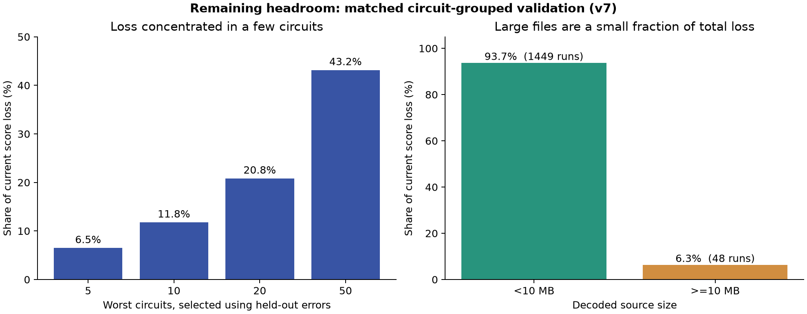

# Remaining score headroom after v7

The selected v7 predictor scores **0.926153** on 1,497 fixed,
circuit-grouped, distribution-matched out-of-fold runs. Thus the current
challenge-score loss is **0.073847**. This is a diagnostic on released labels,
not an estimate of improvement achievable on the hidden set.



The 10 worst circuits account for **11.8%** of the current loss; even a perfect
correction of all their runs would add only **0.00870** score points. The 50
worst account for **43.2%** of loss, giving a retrospective perfect-correction
ceiling of **+0.03187**. Those circuits are identified *using* their held-out
errors, so this is not an implementable selection rule. There are still 28
runs with greater than 10× error, but the loss is too distributed for a single
hand-picked case to produce a large gain.

Decoded QASM files at least 10 MB have the lower segment score (**0.85468**),
but their 48 runs account for only **6.3%** of all remaining loss. Perfectly
fixing that entire size bin would add at most **0.00466** to the overall score.
Sub-second actual runtimes comprise 501 runs and **37.6%** of loss. Successful
runs account for **98.9%** of loss, while the 33 timeouts account for 1.1%.
These partitions overlap and should not be added.

The evidence suggests no obvious *large, low-risk* gain from another timeout
rule, large-file floor, or circuit-family label. The optional QAOA/Shor motif
features and the external geometry classifier have already been tested and
did not improve both matched and structural holdouts consistently
([motif probe](SEQUENCE_MOTIF_PROBE.md),
[geometry probe](ALGORITHM_GEOMETRY_PROBE.md)). A material further gain is more
likely to require a different representation or estimator, tested on several
new circuit-grouped assignments. Candidate signals include local gate-order
patterns tied to simulator contraction, repeated parameter blocks, and a
model of small-runtime overhead; none is validated yet. The structural-stress
score remains **0.75537**, so transfer to unfamiliar circuit families is the
larger uncertainty.

One simple postprocessing idea fails: 270 of 532 circuits have measured
runtime inversions across their available thresholds. Projecting each
circuit's matched-OOF log predictions onto a nondecreasing sequence with
equal-weight isotonic regression lowers score from **0.92615 to 0.89738**.
Threshold behavior should therefore remain learned from the data.

Reproduce the diagnostic and graph with:

```bash
uv run --locked python research/analyze_remaining_headroom.py
```

The numeric output is in `remaining_headroom.json`. The code applies the
challenge's row loss exactly: `min(1, abs(log10(predicted / actual)) / 2)`.
