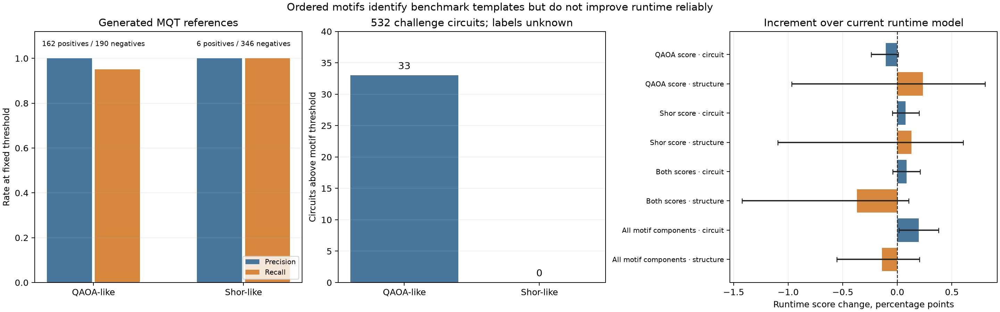

# Ordered Shor-like and QAOA-like motifs: recognition versus runtime value

**Result:** Ordered gate motifs identify the tested MQT Bench QAOA and Shor templates, including QAOA compiled to U/CX gates and Shor after gate decomposition. On the unlabeled Quantum Rings challenge, 33 circuits look QAOA-like and none passes the Shor-like threshold. Adding the motif features does **not** improve runtime prediction consistently across circuit-grouped and structural-cluster holdouts. The fitted submission artifact is unchanged.



## Detectors

[QAOA](https://arxiv.org/abs/1411.4028) alternates cost and mixer operations. The [MQT Bench Max-Cut generator](https://mqt.readthedocs.io/projects/bench/en/latest/_modules/mqt/bench/benchmarks/qaoa.html) implements that pattern with ZZ rotations followed by RX rotations. The new optional extractor follows **each qubit's causal gate order** rather than assuming the whole circuit file lists complete layers in order: a compiler can commute independent gates and interleave layers globally. It recognizes a native `rzz` cost operation or a decomposed `cx`–Z-rotation–`cx` sandwich, then counts cost-to-RX cycles and repeated cost edges. It also recognizes RX and H expressed as common three-angle U gates.

The Shor-like detector looks for H preparation on a phase register, a very large middle interaction volume, and late controlled-phase structure among those initially prepared qubits. The controlled-phase tail can be native `cp` operations or decomposed CX–Z-rotation–CX sandwiches. This targets the phase-estimation, modular-exponentiation, inverse-QFT ordering shown in the [MQT Shor source](https://mqt.readthedocs.io/projects/bench/en/latest/_modules/mqt/bench/benchmarks/shor.html). It uses no benchmark name, QASM filename, comment, or runtime label. Both detectors describe **circuit structure**, not algorithmic intent: another ansatz can have QAOA's same alternating operators, and another order-finding problem can share Shor's structure.

The implementation is optional: `RuntimeModel.featurize(qasm, include_sequence=True)` returns 13 motif fields; ordinary harness calls keep the existing feature set. A two-layer QAOA fixture yields the same motif score before and after decomposition. On a 602,934-byte decomposed Shor QASM example, the parser reproduces the direct circuit's score of 1.0 with zero unsupported statements.

## Generated-reference checks

We generated 162 QAOA examples (widths 4–32, one to three repetitions, three graph seeds, native and U/CX forms), 184 non-QAOA examples from 11 other MQT families, and six Shor circuits factoring different integers at 14–42 qubits. The 352 rows include both compilation forms of the same QAOA instances, so they are **not independent samples**. The thresholds were fixed before scoring the full generated set, but the motif design was informed by inspecting this generator family. These numbers measure template recognition within MQT Bench, not out-of-source algorithm accuracy.

| Fixed-threshold motif | Detected positives | False positives among tested negatives | Main miss |
|---|---:|---:|---|
| QAOA-like, score ≥0.45 | 154/162 | 0/190 | Eight sparse one-layer circuits |
| Shor-like, score ≥0.50 | 6/6 | 0/346 | No miss in these six variants |

QAOA recall is 46/54 for one layer and 54/54 for each of two and three layers; native and U/CX forms have the same 77/81 detection count. All six generated Shor scores are 1.0. A simple related QPE rule based on early H, late phase gates, and low arithmetic density performs markedly worse: ROC AUC **0.611** in native circuits and **0.792** in U/CX circuits. QPE cannot be inferred robustly from that sequence cue alone.

## Challenge transfer and runtime

The challenge has no algorithm labels. We extracted motifs from all 532 circuits, with four oversized circuits using the existing fast path and therefore receiving zero optional motif features. **33/532** score at least 0.45 on the QAOA-like detector; **0/532** score at least 0.50 on the Shor-like detector (maximum 0.167). These are provisional structural matches, not claims about the source algorithm.

The new fields were appended to the unchanged 231-column runtime baseline, and the same five circuit-grouped folds and five structural-cluster folds were used across all 1,497 labeled circuit/threshold rows. Each row's score follows the challenge metric. Circuit intervals resample circuits; structural intervals resample the **12 held-out clusters**, because circuits within a structural cluster are not independent.

| Added feature view | Circuit score change | Structural score change |
|---|---:|---:|
| QAOA score alone | −0.00107 | +0.00235 |
| Shor score alone | +0.00075 | +0.00131 |
| Both scores | +0.00084 | −0.00371 |
| All QAOA components | +0.00024 | +0.00462 |
| All Shor components | +0.00093 | −0.00401 |
| All motif components | **+0.00196** | **−0.00140** |

For the full component set, the paired circuit-bootstrap 95% interval is **[+0.00014, +0.00377]**, but the structural-cluster interval is **[−0.00554, +0.00203]**. The QAOA-component structural gain is concentrated and its cluster interval **[−0.00470, +0.00933]** includes zero. Among the 93 labeled rows belonging to the 33 QAOA-like circuits, the full component set changes structural score by **−0.03663**; its aggregate circuit-holdout gain comes from other circuits. Six views were explored, so the best ordinary-fold result should not be treated as a confirmatory discovery.

These motifs are computationally cheap and interpretable, but the evidence does not justify adding them to the fitted submission model. In particular, no challenge circuit has a strong Shor-like match, so the challenge runtime labels cannot validate Shor-specific predictive value. The current `runtime_model.joblib` is unchanged.

## Reproduce

From the official challenge repository root:

```sh
uv run --with 'mqt-bench==2.3.0' python research/sequence_motif_probe.py --generate
uv run --locked python research/sequence_motif_probe.py --extract
uv run --locked python research/sequence_motif_probe.py --evaluate
uv run --locked --extra report python research/plot_sequence_motif_probe.py
uv run --locked python -m unittest discover -s research -p 'test_*.py' -q
```

The generated references are in `sequence_motif_reference.json`; challenge motif fields are in `sequence_motif_features.json`; paired out-of-fold predictions are in `sequence_motif_oof.csv`; and full metrics, including cluster intervals, are in `sequence_motif_probe.json`.
