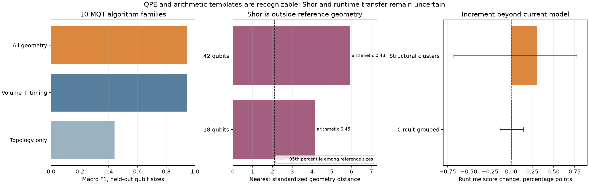

# Shor, phase estimation, and arithmetic in the geometry recognizer

**Result:** QPE and arithmetic are recognizable as *MQT Bench generator families*, but the two tested Shor circuits do not fall within that reference distribution. Adding QPE and arithmetic family probabilities to the current runtime model produces no convincing improvement across both validation schemes. The submission artifact remains unchanged.



## What the extension tested

The [MQT Bench 2.3.0 catalog](https://mqt.readthedocs.io/projects/bench/en/v2.3.0/benchmark_selection.html) distinguishes Shor's factoring algorithm (`shor`) from Shor's nine-qubit error-correcting code (`shors_nine_qubit_code`). Here “Shor” means the factoring algorithm. Its implementation applies Hadamards to a phase register, modular exponentiation, and an inverse QFT; [the Shor benchmark source](https://mqt.readthedocs.io/projects/bench/en/latest/_modules/mqt/bench/benchmarks/shor.html) shows that modular exponentiation is built from repeated controlled modular multiplications and Fourier-space adders. Those nested stages suggest useful circuit motifs, but their full-circuit geometry can differ substantially from standalone QPE or adder benchmarks.

We added MQT Bench `qpeexact` and `qpeinexact` under one **QPE** label, plus `modular_adder`, `multiplier`, `draper_qft_adder`, and `rg_qft_multiplier` under one **arithmetic** label. They were generated at requested widths 4–64 where supported and reduced to the same 25 geometry/timing inputs as the earlier eight-family recognizer. The reference set contains 256 generated circuits, deduplicated to 196 distinct family/width geometries. The classifier never sees the benchmark name, gate names, angles, filenames, or challenge runtimes. Five-fold evaluation holds out qubit sizes.

| Reference classifier | Macro F1 on held-out sizes |
|---|---:|
| Full geometry and timing | **0.947** |
| Volume and timing, without most topology fields | 0.943 |
| Topology alone | 0.441 |

The QPE class F1 is **0.973** and arithmetic F1 is **0.979**. Most recognition comes from interaction volume and timing rather than unique graph topology. Exact and inexact QPE have *identical* extracted geometry at 7 of the 13 tested widths; at the other widths their generated gate counts and graphs differ slightly. Thus a geometry-only model can recognize the QPE template but cannot reliably identify whether the encoded phase is exactly representable.

MQT Bench 2.3.0 exposes only four fixed Shor sizes (18, 42, 58, 74 qubits). We processed the 18- and 42-qubit instances as **out-of-family probes**, not as supervised Shor training examples. They have 31,069 and 683,545 top-level operations, respectively. The larger two were omitted because their circuit expansion is very large. Both tested Shor circuits saturate this extractor's cut-pressure capacity proxy, but that proxy is an *upper bound* on potential bond dimension; saturation does not establish actual Schmidt rank or simulation cost.

| Shor probe | Nearest known family | Maximum class score | Distance to nearest reference |
|---|---|---:|---:|
| 18 qubits | Arithmetic | 0.445 | 4.16 |
| 42 qubits | Arithmetic | 0.433 | 5.93 |

The 95th-percentile reference distance across different held-out sizes is **2.10**, so both probes are outside the calibrated comparison range. The “arithmetic” score is a forced nearest-class assignment, **not** a Shor detector. Even though Shor contains phase estimation and modular arithmetic, an aggregate whole-circuit geometry vector does not expose the sequence of those components reliably.

## Does it improve challenge runtime prediction?

We fitted the expanded ten-family recognizer on external MQT references and appended its family probabilities and confidence to the existing 231-column runtime model. The same 1,497 labeled challenge rows, five circuit-grouped folds, and five structural-cluster folds were used for the baseline and augmented ExtraTrees regressors. The baseline predictions came from the saved earlier out-of-fold evaluation; the extension uses no challenge runtime labels in the family classifier.

| Holdout | Current score | With QPE/arithmetic probabilities | Change | Appropriate paired 95% interval |
|---|---:|---:|---:|---:|
| Circuit-grouped | 0.89702 | 0.89712 | +0.00011 | [−0.00133, +0.00148], resampling circuits |
| Structural clusters | 0.70705 | 0.71010 | +0.00305 | [−0.00679, +0.00775], resampling clusters |

The structural point estimate is positive, but only **6 of 12** held-out clusters improve. One cluster contains 651 of the 1,497 rows and contributes much of the aggregate gain. A circuit-level bootstrap would give an overly narrow positive interval for this split because circuits in the same structural cluster are not independent; resampling clusters includes zero. The ordinary circuit holdout is essentially unchanged. We therefore have insufficient evidence to promote this research-only recognizer into the submission artifact.

Challenge-family guesses remain unverified: **449/532** circuits lie beyond the reference-distance cutoff, and only **92/532** get a maximum family score at least 0.7. Even on generated data, family probabilities are deterministic transformations of geometry features already present in the runtime model. Their possible value is a helpful inductive bias, not new circuit information. A next experiment that could genuinely target Shor would detect **ordered subcircuit motifs**—a phase-estimation register, repeated controlled modular multiplication/addition, then inverse QFT—and validate them against independently generated Shor-like and non-Shor arithmetic circuits at held-out widths and compiler settings. This aggregate-geometry experiment does not establish that such a detector would improve challenge runtime accuracy.

## Reproduce

From the official challenge repository root:

```sh
uv run --with 'mqt-bench==2.3.0' python research/shor_family_probe.py --generate
uv run --locked python research/shor_family_probe.py --evaluate
uv run --locked --extra report python research/plot_shor_family_probe.py
```

The generated circuits' features and Shor probes are in `shor_family_reference.json`; held-out and runtime metrics are in `shor_family_probe.json`. `shor_family_guesses.csv` contains provisional nearest-family predictions, and `shor_family_oof.csv` contains paired out-of-fold runtime predictions. The submission model does not load any of these files.
