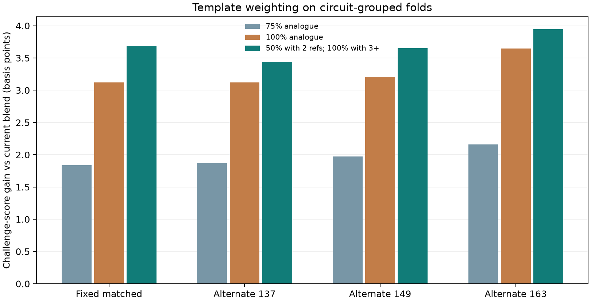

# Support-aware structural analogues (selected v7)

The v6 predictor blended its continuous runtime estimate 50/50 in log space
with the median runtime of training circuits sharing the same qubit,
operation, two-qubit, and multi-qubit counts. It required at least two
same-threshold references. An audit of its 584 eligible matched-fold rows
found that direct use of the analogue improved groups with three or four
references but slightly hurt groups with only two. The selected v7 rule keeps
the 50/50 blend for **two** references and uses the training-reference median
for **three or more**. Circuit names and family labels remain absent from the
signature and fitted artifact.



| Circuit-grouped split | Previous 50/50 score | Direct analogue score | Selected support-aware score | Eligible rows |
|---|---:|---:|---:|---:|
| Fixed matched | 0.925784 | 0.926096 | **0.926153** | 584 |
| Alternate seed 137 | 0.925799 | 0.926112 | **0.926143** | 592 |
| Alternate seed 149 | 0.923875 | 0.924195 | **0.924240** | 584 |
| Alternate seed 163 | 0.922011 | 0.922375 | **0.922405** | 580 |

On the fixed matched folds, 125 eligible rows had two references, 246 had
three, and 213 had four. The selected rule adds **0.000368** to mean challenge
score relative to v6; the circuit-bootstrap 95% interval is
**[+0.000189, +0.000576]**. The alternate assignments improve by
0.000344–0.000394. No structural-stress row had two references outside its
held-out structural cluster, so its score stays **0.755369**. These are
repeated model-selection checks on released labels, not hidden-holdout
results.

The analogue bank is constructed from **training folds only** during
validation. The fitted bank stores count signatures and log runtimes, not
filenames. A single reference never overrides the model; this guard was
important in the earlier analogue probe. The fixed-fold reference log-runtime
spread never exceeded 0.42 (roughly a 2.6× factor), so variance filtering
would discard some helpful groups.

The supplied harness completed all **532** training circuits and wrote all
**1,596** requested predictions. Every value is finite and positive, with no
parse or prediction cap violations. Parse median/p95/max were
**0.0888/3.0631/13.3033 seconds**; prediction median/p95/max were
**0.0262/0.0304/0.0935 seconds**. The fitted training-label score was
**0.98746**. That score checks integration only and is not a held-out
estimate.

Reproduce:

```bash
uv sync --locked --extra report
uv run --locked python research/probe_template_weight.py
uv run --locked python research/plot_template_weight.py
uv run --locked python research/train_full_union_model.py
uv run --locked python -m unittest discover -s research -p 'test_*.py' -q
uv run --locked python quantathon-harness/run.py \
  --team 'Quantum Rings Research' --circuits training_circuits \
  --out research/training_submission_template_v7.csv
uv run --locked python quantathon-harness/score.py \
  --pred research/training_submission_template_v7.csv --labels runtime-data.csv
```

Detailed metrics are in `template_weight_probe.json` and
`full_union_model_validation.json`; the latter contains the selected v7 OOF
predictions and exact feature schema. The full-harness output is
`training_submission_template_v7.csv`.
