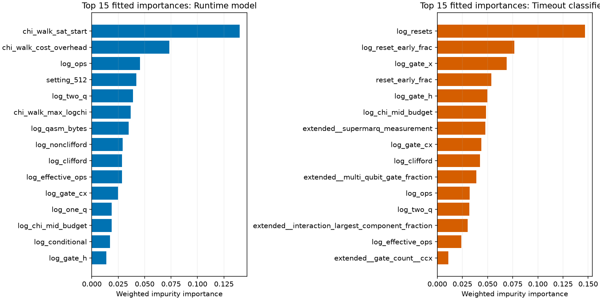
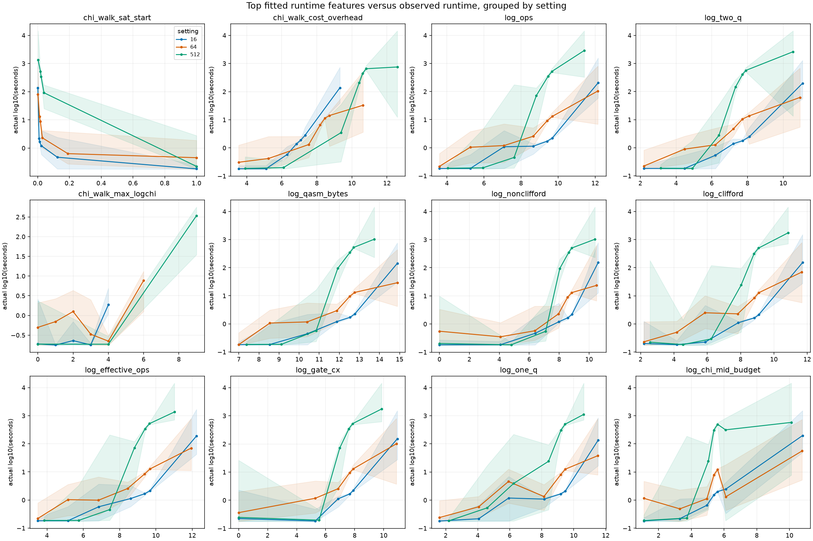

# Final feature decisions and grouped runtime plots

The release model treats the simulator setting as the three categories **16, 64, and 512**. It uses three one-hot fields in the global model; the specialists and timeout classifiers are routed by setting. Numeric `threshold` and `log_threshold` were removed. The table below makes one decision for every input referenced by the previous v7 artifact, plus the three new setting indicators: **241 keep, 87 drop**. All 241 keeps are in the fitted v8 artifact. The prior v7 model had 325 selected inputs; its plot gallery covers those 325 one by one. The category plot covers the three new indicators. Other parser outputs never selected by v7 are outside this fitted-input audit.

Of the 87 final drops, **78** were near-perfect rank duplicates with a stronger retained counterpart, **4** had tiny fitted importance and weak grouped trends, **2** were ordinal encodings replaced by categories, and **3** passed the prescreen but were not selected in the final fit.

| Circuit-grouped score ↑ | Previous v7 | Full categorical | Categorical + audit pruning |
|---|---:|---:|---:|
| matched | 0.926153 | 0.926046 | **0.926914** |
| structural | 0.755369 | 0.754255 | **0.760192** |

The first full-categorical comparison changed score by −0.00011 matched and −0.00111 structural relative to v7, within paired uncertainty. Removing the audit candidates then improved both fixed splits. The pruned-vs-full paired score differences were +0.000868 matched (95% circuit bootstrap interval [-0.0007780344250499087, 0.0024561523737222065]) and +0.005937 structural (cluster bootstrap interval [7.818732789232987e-05, 0.021495399699756345]). The screening decisions used all released labels before this ablation, so these validation gains can be optimistic; they are not hidden-holdout results.

**How to read the table.** Fitted impurity importance is weighted 50/50 between global and setting runtime regressors; timeout importance averages setting-specific classifiers. The ρ values are Spearman correlations between feature and observed log10 seconds **inside** each setting. Each linked plot shows within-setting binned median runtime with interquartile shading. A feature with a flat marginal curve can still matter through interactions; near-perfectly ranked raw/log pairs divide tree importance. The v7 importances and curves drove the drop proposals, while v8 importances describe the final kept model.

| # | Feature | Decision | v7 runtime / timeout imp. | v8 runtime / timeout imp. | ρ 16 / 64 / 512 | Reason |
|---:|---|---|---:|---:|---|---|
| 1 | `active_qubits` | [drop](./grouped_curves_01.png) | 0.0006851 / 0 | 0 / 0 | 0.4356 / 0.5268 / 0.3624 | Near-perfect rank duplicate of log_dense_log2_bytes (|rho|=1.000) with lower fitted importance. |
| 2 | `barriers` | [drop](./grouped_curves_01.png) | 0.0007782 / 0.0001071 | 0 / 0 | -0.2919 / -0.2068 / -0.5096 | Near-perfect rank duplicate of log_barriers (|rho|=1.000) with lower fitted importance. |
| 3 | `cancel_pairs` | [keep](./grouped_curves_01.png) | 0.002325 / 1.349e-05 | 0.002548 / 0.0004563 | 0.4208 / 0.08272 / 0.1875 | Retained after categorical encoding and grouped ablation; has nonzero final fitted importance. |
| 4 | `chi_mid_budget` | [drop](./grouped_curves_01.png) | 0.000966 / 0.0009321 | 0 / 0 | 0.6614 / 0.4905 / 0.5535 | Near-perfect rank duplicate of log_chi_mid_budget (|rho|=1.000) with lower fitted importance. |
| 5 | `chi_timeline_mid_auc` | [drop](./grouped_curves_01.png) | 0.001144 / 0 | 0 / 0 | 0.5523 / 0.4744 / 0.5792 | Near-perfect rank duplicate of log_chi_timeline_mid_auc (|rho|=1.000) with lower fitted importance. |
| 6 | `chi_timeline_mid_t50` | [keep](./grouped_curves_01.png) | 0 / 0.0008796 | 0.0008626 / 0.001323 | -0.4059 / -0.3559 / -0.4505 | Retained after categorical encoding and grouped ablation; has nonzero final fitted importance. |
| 7 | `chi_timeline_mid_t90` | [keep](./grouped_curves_01.png) | 0.0002803 / 0.001208 | 0.0009504 / 0.001833 | -0.4582 / -0.3942 / -0.4839 | Retained after categorical encoding and grouped ablation; has nonzero final fitted importance. |
| 8 | `chi_timeline_peak_auc` | [drop](./grouped_curves_01.png) | 0.0009974 / 0 | 0 / 0 | 0.5644 / 0.4731 / 0.5721 | Near-perfect rank duplicate of log_chi_timeline_peak_auc (|rho|=1.000) with lower fitted importance. |
| 9 | `chi_timeline_post_mid_sat_twoq` | [keep](./grouped_curves_01.png) | 0.0002761 / 0 | 0.001126 / 0.0001086 | 0.4233 / 0.3252 / 0.4581 | Retained after categorical encoding and grouped ablation; has nonzero final fitted importance. |
| 10 | `chi_upper_mean` | [drop](./grouped_curves_01.png) | 4.569e-05 / 0 | 0 / 0 | 0.5721 / 0.4673 / 0.5652 | Near-perfect rank duplicate of log_chi_upper_peak (|rho|=0.998) with lower fitted importance. |
| 11 | `chi_upper_mid` | [drop](./grouped_curves_01.png) | 4.445e-05 / 0 | 0 / 0 | 0.5626 / 0.4505 / 0.5676 | Near-perfect rank duplicate of log_chi_upper_mid (|rho|=1.000) with lower fitted importance. |
| 12 | `chi_upper_peak` | [drop](./grouped_curves_01.png) | 0.000473 / 0 | 0 / 0 | 0.577 / 0.4614 / 0.5675 | Near-perfect rank duplicate of log_chi_upper_peak (|rho|=1.000) with lower fitted importance. |
| 13 | `clifford` | [keep](./grouped_curves_01.png) | 0.00243 / 0.001262 | 0.002779 / 0.001788 | 0.6595 / 0.6766 / 0.7036 | Retained after categorical encoding and grouped ablation; has nonzero final fitted importance. |
| 14 | `component_dense_over_128gb` | [keep](./grouped_curves_01.png) | 0.001972 / 0 | 0.003137 / 0 | 0.4483 / 0.5267 / 0.5635 | Retained after categorical encoding and grouped ablation; has nonzero final fitted importance. |
| 15 | `conditional` | [drop](./grouped_curves_01.png) | 0.001692 / 0 | 0 / 0 | 0.1479 / 0.07946 / -0.06856 | Near-perfect rank duplicate of log_conditional (|rho|=1.000) with lower fitted importance. |
| 16 | `dense_log2_bytes` | [drop](./grouped_curves_01.png) | 0.0008453 / 0 | 0 / 0 | 0.4351 / 0.5262 / 0.3624 | Near-perfect rank duplicate of log_dense_log2_bytes (|rho|=1.000) with lower fitted importance. |
| 17 | `dense_over_128gb` | [keep](./grouped_curves_02.png) | 0.005156 / 0 | 0.006337 / 0 | 0.4587 / 0.5835 / 0.5214 | Retained after categorical encoding and grouped ablation; has nonzero final fitted importance. |
| 18 | `depth` | [drop](./grouped_curves_02.png) | 0.0006939 / 0 | 0 / 0 | 0.5968 / 0.4971 / 0.572 | Near-perfect rank duplicate of log_depth (|rho|=1.000) with lower fitted importance. |
| 19 | `depth_per_qubit` | [keep](./grouped_curves_02.png) | 0.000186 / 0 | 0.0008863 / 1.346e-05 | 0.4053 / 0.226 / 0.3286 | Retained after categorical encoding and grouped ablation; has nonzero final fitted importance. |
| 20 | `diagonal` | [drop](./grouped_curves_02.png) | 0.001101 / 2.545e-08 | 0 / 0 | 0.7541 / 0.5882 / 0.7213 | Near-perfect rank duplicate of log_diagonal (|rho|=1.000) with lower fitted importance. |
| 21 | `diagonal_run_frac` | [keep](./grouped_curves_02.png) | 0.003949 / 0.001364 | 0.004003 / 0.002834 | 0.03463 / -0.2006 / -0.01501 | Retained after categorical encoding and grouped ablation; has nonzero final fitted importance. |
| 22 | `diagonal_run_max` | [keep](./grouped_curves_02.png) | 0.002198 / 0 | 0.001824 / 0.0002869 | 0.5354 / 0.3011 / 0.5589 | Retained after categorical encoding and grouped ablation; has nonzero final fitted importance. |
| 23 | `effective_ops` | [keep](./grouped_curves_02.png) | 0.002151 / 0.00163 | 0.002436 / 0.003766 | 0.7237 / 0.7075 / 0.7898 | Retained after categorical encoding and grouped ablation; has nonzero final fitted importance. |
| 24 | `fingerprint_arithmetic` | [drop](./grouped_curves_02.png) | 0.001243 / 8.031e-05 | 0 / 0 | -0.1691 / -0.1632 / -0.2776 | Near-perfect rank duplicate of log_fingerprint_arithmetic (|rho|=1.000) with lower fitted importance. |
| 25 | `fingerprint_ghz` | [drop](./grouped_curves_02.png) | 0.0001641 / 0 | 0 / 0 | 0.0784 / -0.1584 / -0.1684 | Near-perfect rank duplicate of log_fingerprint_ghz (|rho|=1.000) with lower fitted importance. |
| 26 | `fingerprint_grover` | [keep](./grouped_curves_02.png) | 0.001797 / 0.001158 | 0.002178 / 0 | -0.07748 / -0.09384 / -0.1531 | Retained after categorical encoding and grouped ablation; has nonzero final fitted importance. |
| 27 | `fingerprint_phase_dyadic` | [keep](./grouped_curves_02.png) | 0.002583 / 0 | 0.002533 / 0 | 0.01734 / -0.1784 / -0.2373 | Retained after categorical encoding and grouped ablation; has nonzero final fitted importance. |
| 28 | `fingerprint_qaoa` | [keep](./grouped_curves_02.png) | 0.0001858 / 0 | 0.0006077 / 0.0006279 | 0.1618 / -0.009896 / -0.04472 | Retained after categorical encoding and grouped ablation; has nonzero final fitted importance. |
| 29 | `fingerprint_qft` | [keep](./grouped_curves_02.png) | 0.003615 / 0.002161 | 0.003421 / 0.002132 | 0.02912 / -0.1463 / -0.2133 | Retained after categorical encoding and grouped ablation; has nonzero final fitted importance. |
| 30 | `fingerprint_random_grid` | [keep](./grouped_curves_02.png) | 0.003357 / 0.008788 | 0.003328 / 0.005185 | -0.2092 / -0.0156 / 0.06883 | Retained after categorical encoding and grouped ablation; has nonzero final fitted importance. |
| 31 | `fingerprint_variational` | [keep](./grouped_curves_02.png) | 0.00575 / 0.003345 | 0.005094 / 0.002212 | 0.1683 / 0.126 / 0.2347 | Retained after categorical encoding and grouped ablation; has nonzero final fitted importance. |
| 32 | `gate_ccx` | [drop](./grouped_curves_02.png) | 0 / 4.83e-18 | 0 / 0 | -0.1069 / -0.1302 / -0.247 | Near-perfect rank duplicate of log_gate_ccx (|rho|=1.000) with lower fitted importance. |
| 33 | `gate_cp` | [keep](./grouped_curves_03.png) | 9.174e-05 / 0 | 8.3e-05 / 8.051e-05 | 0.09146 / -0.06405 / -0.1467 | Retained after categorical encoding and grouped ablation; has nonzero final fitted importance. |
| 34 | `gate_cx` | [keep](./grouped_curves_03.png) | 0.002 / 0.001332 | 0.002025 / 0.002226 | 0.5843 / 0.5975 / 0.6525 | Retained after categorical encoding and grouped ablation; has nonzero final fitted importance. |
| 35 | `gate_h` | [drop](./grouped_curves_03.png) | 0.001009 / 3.997e-05 | 0 / 0 | 0.2982 / -0.008138 / -0.1259 | Near-perfect rank duplicate of log_gate_h (|rho|=1.000) with lower fitted importance. |
| 36 | `gate_rx` | [drop](./grouped_curves_03.png) | 0.0006875 / 0 | 0 / 0 | 0.4783 / 0.4315 / 0.6829 | Near-perfect rank duplicate of log_gate_rx (|rho|=1.000) with lower fitted importance. |
| 37 | `gate_ry` | [keep](./grouped_curves_03.png) | 0.0002799 / 0 | 0.0009441 / 0 | 0.07816 / 0.4172 / 0.4769 | Retained after categorical encoding and grouped ablation; has nonzero final fitted importance. |
| 38 | `gate_rz` | [drop](./grouped_curves_03.png) | 0 / 0.0001071 | 0 / 0 | 0.5423 / 0.4915 / 0.6921 | Near-perfect rank duplicate of log_gate_rz (|rho|=1.000) with lower fitted importance. |
| 39 | `gate_rzz` | [drop](./grouped_curves_03.png) | 0.0004586 / 0 | 0 / 0 | 0.2662 / 0.1687 / 0.2809 | Near-perfect rank duplicate of log_gate_rzz (|rho|=1.000) with lower fitted importance. |
| 40 | `gate_swap` | [drop](./grouped_curves_03.png) | 5.685e-05 / 0 | 0 / 0 | 0.06094 / -0.09319 / -0.1021 | Tiny fitted importance and no clear within-setting runtime trend in the grouped curves. |
| 41 | `gate_sx` | [drop](./grouped_curves_03.png) | 0.0001724 / 0 | 0 / 0 | 0.1466 / 0.4363 / 0.5265 | Near-perfect rank duplicate of extended__gate_count__sxdg (|rho|=0.995) with lower fitted importance. |
| 42 | `gate_t` | [drop](./grouped_curves_03.png) | 0 / 0.0008607 | 0 / 0 | 0.06719 / 0.02472 / -0.004835 | Near-perfect rank duplicate of log_gate_t (|rho|=1.000) with lower fitted importance. |
| 43 | `gate_u3` | [drop](./grouped_curves_03.png) | 0.0001891 / 0 | 0 / 0 | 0.0854 / 0.4169 / 0.4867 | Near-perfect rank duplicate of log_gate_u3 (|rho|=1.000) with lower fitted importance. |
| 44 | `gate_x` | [keep](./grouped_curves_03.png) | 0.002167 / 0.002813 | 0.001952 / 0.00736 | -0.007639 / -0.1284 / -0.2226 | Retained after categorical encoding and grouped ablation; has nonzero final fitted importance. |
| 45 | `graph_cutwidth_original` | [drop](./grouped_curves_03.png) | 0.00146 / 0 | 0 / 0 | 0.6864 / 0.4407 / 0.5566 | Near-perfect rank duplicate of log_graph_cutwidth_original (|rho|=1.000) with lower fitted importance. |
| 46 | `graph_cutwidth_rcm` | [drop](./grouped_curves_03.png) | 0.001037 / 0.0006811 | 0 / 0 | 0.6934 / 0.4817 / 0.6032 | Near-perfect rank duplicate of log_graph_cutwidth_rcm (|rho|=1.000) with lower fitted importance. |
| 47 | `graph_degree_entropy` | [keep](./grouped_curves_03.png) | 0.005454 / 2.687e-05 | 0.005794 / 4.47e-05 | 0.04764 / 0.1996 / 0.06615 | Retained after categorical encoding and grouped ablation; has nonzero final fitted importance. |
| 48 | `graph_density` | [keep](./grouped_curves_03.png) | 0.001171 / 0 | 0.001292 / 0 | 0.09585 / -0.2427 / -0.07403 | Retained after categorical encoding and grouped ablation; has nonzero final fitted importance. |
| 49 | `graph_mean_cut_original` | [drop](./grouped_curves_04.png) | 0.0008582 / 3.543e-05 | 0 / 0 | 0.7261 / 0.473 / 0.6382 | Near-perfect rank duplicate of log_graph_mean_cut_original (|rho|=1.000) with lower fitted importance. |
| 50 | `graph_mean_cut_rcm` | [drop](./grouped_curves_04.png) | 0.0001332 / 5.089e-08 | 0 / 0 | 0.7073 / 0.5051 / 0.6414 | Near-perfect rank duplicate of log_graph_mean_cut_rcm (|rho|=1.000) with lower fitted importance. |
| 51 | `graph_mindegree_width` | [keep](./grouped_curves_04.png) | 0.0002813 / 0 | 0.0009515 / 0 | 0.288 / 0.1167 / 0.391 | Retained after categorical encoding and grouped ablation; has nonzero final fitted importance. |
| 52 | `graph_rcm_gain` | [keep](./grouped_curves_04.png) | 0.002557 / 8.94e-05 | 0.002016 / 0.0003332 | -0.08203 / -0.4242 / -0.4999 | Retained after categorical encoding and grouped ablation; has nonzero final fitted importance. |
| 53 | `graph_span_rcm` | [drop](./grouped_curves_04.png) | 0 / 0.0001969 | 0 / 0 | 0.5084 / 0.2853 / 0.4274 | Near-perfect rank duplicate of log_graph_span_rcm (|rho|=1.000) with lower fitted importance. |
| 54 | `largest_component_frac` | [keep](./grouped_curves_04.png) | 0.0001124 / 1.344e-05 | 0.0007815 / 1.339e-05 | 0.1628 / 0.1738 / 0.3215 | Retained after categorical encoding and grouped ablation; has nonzero final fitted importance. |
| 55 | `late_new_pair_ratio` | [keep](./grouped_curves_04.png) | 0.001344 / 0.001786 | 0.001185 / 0.002718 | 0.01059 / -0.2364 / -0.1973 | Retained after categorical encoding and grouped ablation; has nonzero final fitted importance. |
| 56 | `liveness_mean_span` | [drop](./grouped_curves_04.png) | 9.684e-05 / 2.677e-05 | 0 / 0 | 0.3474 / 0.457 / 0.5445 | Near-perfect rank duplicate of log_liveness_mean_span (|rho|=1.000) with lower fitted importance. |
| 57 | `liveness_mean_window` | [keep](./grouped_curves_04.png) | 0.004217 / 0 | 0.005119 / 0 | 0.5016 / 0.6307 / 0.5229 | Retained after categorical encoding and grouped ablation; has nonzero final fitted importance. |
| 58 | `liveness_peak_window` | [drop](./grouped_curves_04.png) | 0.001089 / 0 | 0 / 0 | 0.4806 / 0.5198 / 0.3931 | Near-perfect rank duplicate of log_liveness_peak_window (|rho|=1.000) with lower fitted importance. |
| 59 | `max_degree` | [drop](./grouped_curves_04.png) | 0 / 5.089e-08 | 0 / 0 | 0.2795 / 0.01321 / -0.0297 | Near-perfect rank duplicate of log_max_degree (|rho|=1.000) with lower fitted importance. |
| 60 | `mean_degree` | [drop](./grouped_curves_04.png) | 0 / 8.961e-06 | 0 / 0 | 0.4467 / 0.1845 / 0.2728 | Near-perfect rank duplicate of log_mean_degree (|rho|=1.000) with lower fitted importance. |
| 61 | `measurement_early_frac` | [keep](./grouped_curves_04.png) | 0.00248 / 0 | 0.002859 / 0 | -0.06012 / 0.009725 / -0.1635 | Retained after categorical encoding and grouped ablation; has nonzero final fitted importance. |
| 62 | `measurements` | [drop](./grouped_curves_04.png) | 0.00195 / 0 | 0 / 0 | -0.2755 / -0.1854 / -0.5145 | Near-perfect rank duplicate of log_measurements (|rho|=1.000) with lower fitted importance. |
| 63 | `multi_q` | [drop](./grouped_curves_04.png) | 0 / 0.0004711 | 0 / 0 | -0.137 / -0.1314 / -0.2483 | Near-perfect rank duplicate of log_multi_q (|rho|=1.000) with lower fitted importance. |
| 64 | `n_qubits` | [drop](./grouped_curves_04.png) | 0.0008183 / 0 | 0 / 0 | 0.4351 / 0.5262 / 0.3624 | Near-perfect rank duplicate of log_dense_log2_bytes (|rho|=1.000) with lower fitted importance. |
| 65 | `nonclifford` | [drop](./grouped_curves_05.png) | 0.001916 / 0 | 0 / 0 | 0.7255 / 0.6797 / 0.7432 | Near-perfect rank duplicate of log_nonclifford (|rho|=1.000) with lower fitted importance. |
| 66 | `nonclifford_ratio` | [keep](./grouped_curves_05.png) | 0.002253 / 0.0005787 | 0.002174 / 0.000713 | -0.02777 / -0.005403 / -0.01854 | Retained after categorical encoding and grouped ablation; has nonzero final fitted importance. |
| 67 | `one_q` | [keep](./grouped_curves_05.png) | 0.002092 / 0.001814 | 0.002244 / 0.00279 | 0.6948 / 0.6988 / 0.754 | Retained after categorical encoding and grouped ablation; has nonzero final fitted importance. |
| 68 | `ops` | [keep](./grouped_curves_05.png) | 0.00248 / 0.002209 | 0.00344 / 0.003795 | 0.7684 / 0.7329 / 0.7883 | Retained after categorical encoding and grouped ablation; has nonzero final fitted importance. |
| 69 | `pair_reuse` | [drop](./grouped_curves_05.png) | 0.0001352 / 0.0004557 | 0 / 0 | 0.4379 / 0.439 / 0.4515 | Near-perfect rank duplicate of log_pair_reuse (|rho|=1.000) with lower fitted importance. |
| 70 | `peak_window_twoq` | [keep](./grouped_curves_05.png) | 0 / 0.0006001 | 0.0008304 / 0.0006567 | -0.5092 / -0.4947 / -0.6206 | Retained after categorical encoding and grouped ablation; has nonzero final fitted importance. |
| 71 | `qasm_bytes` | [keep](./grouped_curves_05.png) | 0.003152 / 0.0005754 | 0.004071 / 0.0007508 | 0.7916 / 0.7068 / 0.7903 | Retained after categorical encoding and grouped ablation; has nonzero final fitted importance. |
| 72 | `random_angle_entropy` | [drop](./grouped_curves_05.png) | 0.0001902 / 0.0007679 | 0 / 0 | 0.1622 / 0.1599 / 0.2892 | Near-perfect rank duplicate of log_random_angle_entropy (|rho|=1.000) with lower fitted importance. |
| 73 | `random_bigram_entropy` | [drop](./grouped_curves_05.png) | 0.001133 / 0 | 0 / 0 | -0.2 / -0.03975 / 0.0135 | Near-perfect rank duplicate of log_random_bigram_entropy (|rho|=1.000) with lower fitted importance. |
| 74 | `random_gate_entropy` | [drop](./grouped_curves_05.png) | 6.854e-05 / 6.261e-05 | 0 / 0 | -0.1246 / 0.07867 / 0.1265 | Near-perfect rank duplicate of log_random_gate_entropy (|rho|=1.000) with lower fitted importance. |
| 75 | `random_pair_entropy` | [drop](./grouped_curves_05.png) | 0.0001402 / 0 | 0 / 0 | -0.1148 / 0.1113 / 0.09626 | Near-perfect rank duplicate of log_random_pair_entropy (|rho|=0.998) with lower fitted importance. |
| 76 | `random_window_entropy` | [keep](./grouped_curves_05.png) | 0.0004168 / 0 | 0.0003789 / 0 | 0.3055 / 0.3908 / 0.4996 | Retained after categorical encoding and grouped ablation; has nonzero final fitted importance. |
| 77 | `randomness_proxy` | [drop](./grouped_curves_05.png) | 0.0004093 / 0 | 0 / 0 | 0.06654 / 0.2575 / 0.3474 | Near-perfect rank duplicate of log_randomness_proxy (|rho|=1.000) with lower fitted importance. |
| 78 | `reset_early_frac` | [keep](./grouped_curves_05.png) | 0.002772 / 0.07046 | 0.00239 / 0.0539 | 0.195 / 0.1936 / — | Retained after categorical encoding and grouped ablation; has nonzero final fitted importance. |
| 79 | `resets` | [keep](./grouped_curves_05.png) | 0.0004133 / 0.01295 | 0.0007853 / 0.008252 | 0.195 / 0.1937 / — | Retained after categorical encoding and grouped ablation; has nonzero final fitted importance. |
| 80 | `rotation_folds` | [drop](./grouped_curves_05.png) | 0.0002087 / 0 | 0 / 0 | 0.3991 / 0.05014 / 0.2133 | Near-perfect rank duplicate of log_rotation_folds (|rho|=1.000) with lower fitted importance. |
| 81 | `small_angles` | [drop](./grouped_curves_06.png) | 0.000385 / 2.256e-05 | 0 / 0 | 0.5587 / 0.4029 / 0.5172 | Near-perfect rank duplicate of log_small_angles (|rho|=1.000) with lower fitted importance. |
| 82 | `two_depth` | [drop](./grouped_curves_06.png) | 0.001014 / 0 | 0 / 0 | 0.5443 / 0.4395 / 0.431 | Near-perfect rank duplicate of log_two_depth (|rho|=1.000) with lower fitted importance. |
| 83 | `two_q` | [drop](./grouped_curves_06.png) | 0.001873 / 0 | 0 / 0 | 0.7772 / 0.6602 / 0.7721 | Near-perfect rank duplicate of log_two_q (|rho|=1.000) with lower fitted importance. |
| 84 | `two_q_ratio` | [keep](./grouped_curves_06.png) | 0.0008616 / 3.579e-05 | 0.001027 / 4.473e-05 | -0.03009 / -0.2119 / -0.2291 | Retained after categorical encoding and grouped ablation; has nonzero final fitted importance. |
| 85 | `twoq_window_2` | [keep](./grouped_curves_06.png) | 0.0001378 / 0 | 0.0003963 / 0 | -0.01288 / -0.1113 / 0.0291 | Retained after categorical encoding and grouped ablation; has nonzero final fitted importance. |
| 86 | `twoq_window_3` | [drop](./grouped_curves_06.png) | 0 / 2.011e-16 | 0 / 0 | -0.03568 / -0.24 / -0.1122 | Near-perfect rank duplicate of log_twoq_window_3 (|rho|=1.000) with lower fitted importance. |
| 87 | `twoq_window_4` | [drop](./grouped_curves_06.png) | 6.83e-05 / 0 | 0 / 0 | 0.1178 / 0.003029 / 0.1975 | Near-perfect rank duplicate of log_twoq_window_4 (|rho|=1.000) with lower fitted importance. |
| 88 | `twoq_window_7` | [keep](./grouped_curves_06.png) | 0.002137 / 0 | 0.001965 / 1.018e-07 | 0.4446 / 0.4336 / 0.5501 | Retained after categorical encoding and grouped ablation; has nonzero final fitted importance. |
| 89 | `unique_pairs` | [drop](./grouped_curves_06.png) | 0.0001339 / 0 | 0 / 0 | 0.5631 / 0.4105 / 0.4488 | Near-perfect rank duplicate of log_unique_pairs (|rho|=1.000) with lower fitted importance. |
| 90 | `zero_angles` | [drop](./grouped_curves_06.png) | 5.42e-05 / 0.0004003 | 0 / 0 | 0.3858 / -0.04048 / 0.01301 | Near-perfect rank duplicate of log_zero_angles (|rho|=1.000) with lower fitted importance. |
| 91 | `log_active_qubits` | [drop](./grouped_curves_06.png) | 0.001018 / 0 | 0 / 0 | 0.4356 / 0.5268 / 0.3624 | Near-perfect rank duplicate of log_dense_log2_bytes (|rho|=1.000) with lower fitted importance. |
| 92 | `log_barriers` | [keep](./grouped_curves_06.png) | 0.001447 / 6.693e-05 | 0.00212 / 0.0001606 | -0.2919 / -0.2068 / -0.5096 | Retained after categorical encoding and grouped ablation; has nonzero final fitted importance. |
| 93 | `log_cancel_pairs` | [keep](./grouped_curves_06.png) | 0.01168 / 0.0001071 | 0.01219 / 0.0001339 | 0.4208 / 0.08272 / 0.1875 | Retained after categorical encoding and grouped ablation; has nonzero final fitted importance. |
| 94 | `log_chi_mid_budget` | [keep](./grouped_curves_06.png) | 0.01934 / 0.04375 | 0.01862 / 0.04855 | 0.6614 / 0.4905 / 0.5535 | Retained after categorical encoding and grouped ablation; has nonzero final fitted importance. |
| 95 | `log_chi_timeline_mid_auc` | [keep](./grouped_curves_06.png) | 0.001498 / 0 | 0.001287 / 0 | 0.5523 / 0.4744 / 0.5792 | Retained after categorical encoding and grouped ablation; has nonzero final fitted importance. |
| 96 | `log_chi_timeline_mid_t50` | [drop](./grouped_curves_06.png) | 0 / 0.0006349 | 0 / 0 | -0.4059 / -0.3559 / -0.4505 | Near-perfect rank duplicate of chi_timeline_mid_t50 (|rho|=1.000) with lower fitted importance. |
| 97 | `log_chi_timeline_mid_t90` | [drop](./grouped_curves_07.png) | 0.0002492 / 0.001016 | 0 / 0 | -0.4582 / -0.3942 / -0.4839 | Near-perfect rank duplicate of chi_timeline_mid_t90 (|rho|=1.000) with lower fitted importance. |
| 98 | `log_chi_timeline_peak_auc` | [keep](./grouped_curves_07.png) | 0.001566 / 2.652e-16 | 0.00209 / 0 | 0.5644 / 0.4731 / 0.5721 | Retained after categorical encoding and grouped ablation; has nonzero final fitted importance. |
| 99 | `log_chi_timeline_post_mid_sat_twoq` | [drop](./grouped_curves_07.png) | 0.000242 / 0 | 0 / 0 | 0.4233 / 0.3252 / 0.4581 | Near-perfect rank duplicate of chi_timeline_post_mid_sat_twoq (|rho|=1.000) with lower fitted importance. |
| 100 | `log_chi_upper_mean` | [drop](./grouped_curves_07.png) | 0.001381 / 0 | 0 / 0 | 0.5721 / 0.4673 / 0.5652 | Near-perfect rank duplicate of log_chi_upper_peak (|rho|=0.998) with lower fitted importance. |
| 101 | `log_chi_upper_mid` | [keep](./grouped_curves_07.png) | 0.001335 / 0 | 0.001156 / 3.606e-05 | 0.5626 / 0.4505 / 0.5676 | Retained after categorical encoding and grouped ablation; has nonzero final fitted importance. |
| 102 | `log_chi_upper_peak` | [keep](./grouped_curves_07.png) | 0.001579 / 0 | 0.001934 / 5.473e-05 | 0.577 / 0.4614 / 0.5675 | Retained after categorical encoding and grouped ablation; has nonzero final fitted importance. |
| 103 | `log_clifford` | [keep](./grouped_curves_07.png) | 0.0352 / 0.02357 | 0.02872 / 0.04251 | 0.6595 / 0.6766 / 0.7036 | Retained after categorical encoding and grouped ablation; has nonzero final fitted importance. |
| 104 | `log_component_dense_log2_bytes` | [drop](./grouped_curves_07.png) | 0.0003402 / 4.016e-05 | 0 / 0 | 0.4456 / 0.4578 / 0.4562 | Near-perfect rank duplicate of log_largest_component (|rho|=1.000) with lower fitted importance. |
| 105 | `log_component_dense_over_128gb` | [drop](./grouped_curves_07.png) | 0.001544 / 0 | 0 / 0 | 0.4483 / 0.5267 / 0.5635 | Near-perfect rank duplicate of component_dense_over_128gb (|rho|=1.000) with lower fitted importance. |
| 106 | `log_conditional` | [keep](./grouped_curves_07.png) | 0.01592 / 0 | 0.01728 / 0 | 0.1479 / 0.07946 / -0.06856 | Retained after categorical encoding and grouped ablation; has nonzero final fitted importance. |
| 107 | `log_custom_calls` | [keep](./grouped_curves_07.png) | 0 / 0.0007076 | 0 / 0.000187 | -0.1157 / -0.1525 / -0.2345 | Retained after categorical encoding and grouped ablation; has nonzero final fitted importance. |
| 108 | `log_custom_definitions` | [keep](./grouped_curves_07.png) | 0 / 0.0009486 | 0.0001098 / 0.000681 | -0.1103 / -0.155 / -0.2378 | Retained after categorical encoding and grouped ablation; has nonzero final fitted importance. |
| 109 | `log_dense_log2_bytes` | [keep](./grouped_curves_07.png) | 0.002411 / 0 | 0.002571 / 0 | 0.4351 / 0.5262 / 0.3624 | Retained after categorical encoding and grouped ablation; has nonzero final fitted importance. |
| 110 | `log_dense_over_128gb` | [keep](./grouped_curves_07.png) | 0.005992 / 0 | 0.007314 / 0 | 0.4587 / 0.5835 / 0.5214 | Retained after categorical encoding and grouped ablation; has nonzero final fitted importance. |
| 111 | `log_depth` | [keep](./grouped_curves_07.png) | 0.0008638 / 0 | 0.001417 / 0 | 0.5968 / 0.4971 / 0.572 | Retained after categorical encoding and grouped ablation; has nonzero final fitted importance. |
| 112 | `log_diagonal` | [keep](./grouped_curves_07.png) | 0.01105 / 0.002992 | 0.0101 / 0.002809 | 0.7541 / 0.5882 / 0.7213 | Retained after categorical encoding and grouped ablation; has nonzero final fitted importance. |
| 113 | `log_diagonal_run_frac` | [keep](./grouped_curves_08.png) | 0.004041 / 0.001441 | 0.004395 / 0.001572 | 0.03463 / -0.2006 / -0.01501 | Retained after categorical encoding and grouped ablation; has nonzero final fitted importance. |
| 114 | `log_diagonal_run_max` | [keep](./grouped_curves_08.png) | 0.005128 / 0.001831 | 0.00436 / 0.001614 | 0.5354 / 0.3011 / 0.5589 | Retained after categorical encoding and grouped ablation; has nonzero final fitted importance. |
| 115 | `log_effective_ops` | [keep](./grouped_curves_08.png) | 0.03226 / 0.02501 | 0.02854 / 0.02406 | 0.7237 / 0.7075 / 0.7898 | Retained after categorical encoding and grouped ablation; has nonzero final fitted importance. |
| 116 | `log_fingerprint_arithmetic` | [keep](./grouped_curves_08.png) | 0.00135 / 5.354e-05 | 0.001573 / 9.37e-05 | -0.1691 / -0.1632 / -0.2776 | Retained after categorical encoding and grouped ablation; has nonzero final fitted importance. |
| 117 | `log_fingerprint_ghz` | [keep](./grouped_curves_08.png) | 0.001105 / 4.458e-05 | 0.00115 / 1.339e-05 | 0.0784 / -0.1584 / -0.1684 | Retained after categorical encoding and grouped ablation; has nonzero final fitted importance. |
| 118 | `log_fingerprint_grover` | [keep](./grouped_curves_08.png) | 0.001597 / 0.001162 | 0.001652 / 0.002325 | -0.07748 / -0.09384 / -0.1531 | Retained after categorical encoding and grouped ablation; has nonzero final fitted importance. |
| 119 | `log_fingerprint_phase_dyadic` | [keep](./grouped_curves_08.png) | 0.002706 / 0 | 0.003157 / 0 | 0.01734 / -0.1784 / -0.2373 | Retained after categorical encoding and grouped ablation; has nonzero final fitted importance. |
| 120 | `log_fingerprint_qaoa` | [drop](./grouped_curves_08.png) | 0.0001679 / 0 | 0 / 0 | 0.1618 / -0.009896 / -0.04472 | Near-perfect rank duplicate of fingerprint_qaoa (|rho|=1.000) with lower fitted importance. |
| 121 | `log_fingerprint_qft` | [keep](./grouped_curves_08.png) | 0.004272 / 0.002047 | 0.004431 / 0.002125 | 0.02913 / -0.1463 / -0.2133 | Retained after categorical encoding and grouped ablation; has nonzero final fitted importance. |
| 122 | `log_fingerprint_random_grid` | [keep](./grouped_curves_08.png) | 0.003799 / 0.007597 | 0.004131 / 0.007602 | -0.2092 / -0.0156 / 0.06883 | Retained after categorical encoding and grouped ablation; has nonzero final fitted importance. |
| 123 | `log_fingerprint_variational` | [keep](./grouped_curves_08.png) | 0.005512 / 0.003381 | 0.005479 / 0.004166 | 0.1683 / 0.126 / 0.2347 | Retained after categorical encoding and grouped ablation; has nonzero final fitted importance. |
| 124 | `log_gate_ccx` | [keep](./grouped_curves_08.png) | 0.0002222 / 0.003267 | 0.0002846 / 0.004785 | -0.1069 / -0.1302 / -0.247 | Retained after categorical encoding and grouped ablation; has nonzero final fitted importance. |
| 125 | `log_gate_cp` | [drop](./grouped_curves_08.png) | 4.633e-05 / 0 | 0 / 0 | 0.09146 / -0.06405 / -0.1467 | Near-perfect rank duplicate of gate_cp (|rho|=1.000) with lower fitted importance. |
| 126 | `log_gate_cx` | [keep](./grouped_curves_08.png) | 0.02585 / 0.04209 | 0.02474 / 0.04385 | 0.5843 / 0.5975 / 0.6525 | Retained after categorical encoding and grouped ablation; has nonzero final fitted importance. |
| 127 | `log_gate_cz` | [drop](./grouped_curves_08.png) | 4.978e-05 / 0 | 0 / 0 | -0.1293 / -0.05132 / -0.1203 | Passed the initial audit but was not selected in any final runtime or timeout estimator. |
| 128 | `log_gate_h` | [keep](./grouped_curves_08.png) | 0.01149 / 0.04988 | 0.01381 / 0.04983 | 0.2982 / -0.008138 / -0.1259 | Retained after categorical encoding and grouped ablation; has nonzero final fitted importance. |
| 129 | `log_gate_p` | [keep](./grouped_curves_09.png) | 8.357e-05 / 0 | 8.017e-05 / 0 | 0.1372 / 0.03895 / 0.005248 | Retained after categorical encoding and grouped ablation; has nonzero final fitted importance. |
| 130 | `log_gate_rx` | [keep](./grouped_curves_09.png) | 0.0001241 / 0.0009803 | 0.001106 / 0.001212 | 0.4783 / 0.4315 / 0.6829 | Retained after categorical encoding and grouped ablation; has nonzero final fitted importance. |
| 131 | `log_gate_rz` | [keep](./grouped_curves_09.png) | 0.002208 / 8.031e-05 | 0.002826 / 0.0001753 | 0.5423 / 0.4915 / 0.6921 | Retained after categorical encoding and grouped ablation; has nonzero final fitted importance. |
| 132 | `log_gate_rzz` | [keep](./grouped_curves_09.png) | 0.00158 / 0 | 0.001718 / 0 | 0.2662 / 0.1687 / 0.2809 | Retained after categorical encoding and grouped ablation; has nonzero final fitted importance. |
| 133 | `log_gate_s` | [keep](./grouped_curves_09.png) | 0.0003193 / 1.339e-05 | 0.0009445 / 4.016e-05 | 0.3168 / 0.553 / 0.584 | Retained after categorical encoding and grouped ablation; has nonzero final fitted importance. |
| 134 | `log_gate_t` | [keep](./grouped_curves_09.png) | 0.0009559 / 8.031e-05 | 0.001119 / 0.0002008 | 0.06719 / 0.02472 / -0.004835 | Retained after categorical encoding and grouped ablation; has nonzero final fitted importance. |
| 135 | `log_gate_u1` | [keep](./grouped_curves_09.png) | 0 / 0.001346 | 0 / 0.0006419 | 0.04224 / -0.01214 / -0.05681 | Retained after categorical encoding and grouped ablation; has nonzero final fitted importance. |
| 136 | `log_gate_u2` | [keep](./grouped_curves_09.png) | 0.0002513 / 0 | 0.0006967 / 0.0004631 | 0.1589 / 0.4123 / 0.4843 | Retained after categorical encoding and grouped ablation; has nonzero final fitted importance. |
| 137 | `log_gate_u3` | [keep](./grouped_curves_09.png) | 0.0004291 / 0 | 0.0008572 / 0.0002147 | 0.0854 / 0.4169 / 0.4867 | Retained after categorical encoding and grouped ablation; has nonzero final fitted importance. |
| 138 | `log_gate_x` | [keep](./grouped_curves_09.png) | 0.005124 / 0.07462 | 0.004415 / 0.0689 | -0.007639 / -0.1284 / -0.2226 | Retained after categorical encoding and grouped ablation; has nonzero final fitted importance. |
| 139 | `log_graph_cutwidth_original` | [keep](./grouped_curves_09.png) | 0.008568 / 0.005547 | 0.008932 / 0.006319 | 0.6864 / 0.4407 / 0.5566 | Retained after categorical encoding and grouped ablation; has nonzero final fitted importance. |
| 140 | `log_graph_cutwidth_rcm` | [keep](./grouped_curves_09.png) | 0.004662 / 0.004713 | 0.004324 / 0.004631 | 0.6934 / 0.4817 / 0.6032 | Retained after categorical encoding and grouped ablation; has nonzero final fitted importance. |
| 141 | `log_graph_degree_entropy` | [keep](./grouped_curves_09.png) | 0.005029 / 0 | 0.005173 / 1.788e-05 | 0.04975 / 0.2023 / 0.06974 | Retained after categorical encoding and grouped ablation; has nonzero final fitted importance. |
| 142 | `log_graph_density` | [drop](./grouped_curves_09.png) | 0.000953 / 0 | 0 / 0 | 0.09585 / -0.2427 / -0.07403 | Near-perfect rank duplicate of graph_density (|rho|=1.000) with lower fitted importance. |
| 143 | `log_graph_mean_cut_original` | [keep](./grouped_curves_09.png) | 0.004321 / 2.714e-05 | 0.006413 / 0.0001227 | 0.7261 / 0.473 / 0.6382 | Retained after categorical encoding and grouped ablation; has nonzero final fitted importance. |
| 144 | `log_graph_mean_cut_rcm` | [keep](./grouped_curves_09.png) | 0.002574 / 0 | 0.0023 / 0 | 0.7073 / 0.5051 / 0.6414 | Retained after categorical encoding and grouped ablation; has nonzero final fitted importance. |
| 145 | `log_graph_mindegree_available` | [keep](./grouped_curves_10.png) | 0.0002352 / 0 | 0.0008966 / 0 | -0.1188 / -0.156 / 0.05305 | Retained after categorical encoding and grouped ablation; has nonzero final fitted importance. |
| 146 | `log_graph_mindegree_width` | [drop](./grouped_curves_10.png) | 0.0002345 / 0 | 0 / 0 | 0.288 / 0.1167 / 0.391 | Near-perfect rank duplicate of graph_mindegree_width (|rho|=1.000) with lower fitted importance. |
| 147 | `log_graph_rcm_gain` | [keep](./grouped_curves_10.png) | 0.002387 / 4.47e-05 | 0.002295 / 8.046e-05 | 0.08381 / -0.2784 / -0.2283 | Retained after categorical encoding and grouped ablation; has nonzero final fitted importance. |
| 148 | `log_graph_span_rcm` | [keep](./grouped_curves_10.png) | 0.0009765 / 0.0009881 | 0.001254 / 0.001211 | 0.5084 / 0.2853 / 0.4274 | Retained after categorical encoding and grouped ablation; has nonzero final fitted importance. |
| 149 | `log_largest_component` | [keep](./grouped_curves_10.png) | 0.0008253 / 2.235e-05 | 0.001454 / 6.695e-05 | 0.4456 / 0.4578 / 0.4562 | Retained after categorical encoding and grouped ablation; has nonzero final fitted importance. |
| 150 | `log_late_new_pair_ratio` | [keep](./grouped_curves_10.png) | 0.0004265 / 0.002403 | 0.001063 / 0.002466 | 0.01059 / -0.2364 / -0.1973 | Retained after categorical encoding and grouped ablation; has nonzero final fitted importance. |
| 151 | `log_liveness_mean_span` | [keep](./grouped_curves_10.png) | 0.0001396 / 0.0001272 | 0.0001529 / 0.0001032 | 0.3474 / 0.457 / 0.5445 | Retained after categorical encoding and grouped ablation; has nonzero final fitted importance. |
| 152 | `log_liveness_mean_window` | [keep](./grouped_curves_10.png) | 0.008909 / 0 | 0.008606 / 0 | 0.5016 / 0.6307 / 0.5229 | Retained after categorical encoding and grouped ablation; has nonzero final fitted importance. |
| 153 | `log_liveness_peak_window` | [keep](./grouped_curves_10.png) | 0.001677 / 0 | 0.002106 / 0 | 0.4806 / 0.5198 / 0.3931 | Retained after categorical encoding and grouped ablation; has nonzero final fitted importance. |
| 154 | `log_max_degree` | [keep](./grouped_curves_10.png) | 0.001941 / 0 | 0.001877 / 0.000414 | 0.2795 / 0.01321 / -0.0297 | Retained after categorical encoding and grouped ablation; has nonzero final fitted importance. |
| 155 | `log_max_span` | [keep](./grouped_curves_10.png) | 0.0003726 / 0 | 0.0009121 / 0 | 0.4991 / 0.2236 / 0.2987 | Retained after categorical encoding and grouped ablation; has nonzero final fitted importance. |
| 156 | `log_mean_degree` | [keep](./grouped_curves_10.png) | 0.001882 / 0 | 0.002482 / 0.001084 | 0.4467 / 0.1845 / 0.2728 | Retained after categorical encoding and grouped ablation; has nonzero final fitted importance. |
| 157 | `log_measurement_early_frac` | [keep](./grouped_curves_10.png) | 0.002517 / 0 | 0.002781 / 0 | -0.06012 / 0.009725 / -0.1635 | Retained after categorical encoding and grouped ablation; has nonzero final fitted importance. |
| 158 | `log_measurements` | [keep](./grouped_curves_10.png) | 0.003678 / 0 | 0.004498 / 0 | -0.2755 / -0.1854 / -0.5145 | Retained after categorical encoding and grouped ablation; has nonzero final fitted importance. |
| 159 | `log_multi_q` | [keep](./grouped_curves_10.png) | 0.0002201 / 0.003237 | 0.0002053 / 0.005434 | -0.137 / -0.1314 / -0.2483 | Retained after categorical encoding and grouped ablation; has nonzero final fitted importance. |
| 160 | `log_n_qubits` | [keep](./grouped_curves_10.png) | 0.002277 / 0 | 0.002975 / 0 | 0.4351 / 0.5262 / 0.3624 | Retained after categorical encoding and grouped ablation; has nonzero final fitted importance. |
| 161 | `log_nonclifford` | [keep](./grouped_curves_11.png) | 0.02396 / 0.008254 | 0.02904 / 0.01062 | 0.7255 / 0.6797 / 0.7432 | Retained after categorical encoding and grouped ablation; has nonzero final fitted importance. |
| 162 | `log_one_q` | [keep](./grouped_curves_11.png) | 0.01882 / 0.01265 | 0.0189 / 0.008115 | 0.6948 / 0.6988 / 0.754 | Retained after categorical encoding and grouped ablation; has nonzero final fitted importance. |
| 163 | `log_ops` | [keep](./grouped_curves_11.png) | 0.04927 / 0.03982 | 0.04549 / 0.03232 | 0.7684 / 0.7329 / 0.7883 | Retained after categorical encoding and grouped ablation; has nonzero final fitted importance. |
| 164 | `log_pair_reuse` | [keep](./grouped_curves_11.png) | 0.0004396 / 0.009891 | 0.0008677 / 0.00782 | 0.4379 / 0.439 / 0.4515 | Retained after categorical encoding and grouped ablation; has nonzero final fitted importance. |
| 165 | `log_peak_window_twoq` | [drop](./grouped_curves_11.png) | 0.0001636 / 0 | 0 / 0 | -0.5092 / -0.4947 / -0.6206 | Near-perfect rank duplicate of peak_window_twoq (|rho|=1.000) with lower fitted importance. |
| 166 | `log_qasm_bytes` | [keep](./grouped_curves_11.png) | 0.03336 / 0.01627 | 0.03492 / 0.009534 | 0.7916 / 0.7068 / 0.7903 | Retained after categorical encoding and grouped ablation; has nonzero final fitted importance. |
| 167 | `log_random_angle_entropy` | [keep](./grouped_curves_11.png) | 0.00102 / 0.0005031 | 0.001185 / 0.0007343 | 0.1622 / 0.1599 / 0.2892 | Retained after categorical encoding and grouped ablation; has nonzero final fitted importance. |
| 168 | `log_random_bigram_entropy` | [keep](./grouped_curves_11.png) | 0.001209 / 0 | 0.001283 / 0 | -0.2 / -0.03975 / 0.0135 | Retained after categorical encoding and grouped ablation; has nonzero final fitted importance. |
| 169 | `log_random_gate_entropy` | [keep](./grouped_curves_11.png) | 0.0001223 / 8.046e-05 | 0.0007851 / 2.682e-05 | -0.1246 / 0.07867 / 0.1265 | Retained after categorical encoding and grouped ablation; has nonzero final fitted importance. |
| 170 | `log_random_pair_entropy` | [keep](./grouped_curves_11.png) | 0.0003446 / 0 | 0.001063 / 0 | -0.1057 / 0.1195 / 0.1041 | Retained after categorical encoding and grouped ablation; has nonzero final fitted importance. |
| 171 | `log_random_window_entropy` | [drop](./grouped_curves_11.png) | 0.0002923 / 0 | 0 / 0 | 0.3055 / 0.3908 / 0.4996 | Near-perfect rank duplicate of random_window_entropy (|rho|=1.000) with lower fitted importance. |
| 172 | `log_randomness_proxy` | [keep](./grouped_curves_11.png) | 0.0004784 / 3.25e-05 | 0.001216 / 0 | 0.06654 / 0.2575 / 0.3474 | Retained after categorical encoding and grouped ablation; has nonzero final fitted importance. |
| 173 | `log_reset_early_frac` | [keep](./grouped_curves_11.png) | 0.002412 / 0.0616 | 0.00289 / 0.07677 | 0.195 / 0.1936 / — | Retained after categorical encoding and grouped ablation; has nonzero final fitted importance. |
| 174 | `log_resets` | [keep](./grouped_curves_11.png) | 0.002056 / 0.1528 | 0.002453 / 0.1469 | 0.195 / 0.1937 / — | Retained after categorical encoding and grouped ablation; has nonzero final fitted importance. |
| 175 | `log_rotation_folds` | [keep](./grouped_curves_11.png) | 0.001669 / 0 | 0.001649 / 0.0003635 | 0.3991 / 0.05014 / 0.2133 | Retained after categorical encoding and grouped ablation; has nonzero final fitted importance. |
| 176 | `log_small_angles` | [keep](./grouped_curves_11.png) | 0.001541 / 0 | 0.001882 / 0 | 0.5587 / 0.4029 / 0.5172 | Retained after categorical encoding and grouped ablation; has nonzero final fitted importance. |
| 177 | `log_two_depth` | [keep](./grouped_curves_12.png) | 0.001636 / 0 | 0.001625 / 0 | 0.5443 / 0.4395 / 0.431 | Retained after categorical encoding and grouped ablation; has nonzero final fitted importance. |
| 178 | `log_two_q` | [keep](./grouped_curves_12.png) | 0.03245 / 0.03143 | 0.03894 / 0.03194 | 0.7772 / 0.6602 / 0.7721 | Retained after categorical encoding and grouped ablation; has nonzero final fitted importance. |
| 179 | `log_twoq_window_2` | [drop](./grouped_curves_12.png) | 0.0001061 / 0 | 0 / 0 | -0.01288 / -0.1113 / 0.0291 | Near-perfect rank duplicate of twoq_window_2 (|rho|=1.000) with lower fitted importance. |
| 180 | `log_twoq_window_3` | [keep](./grouped_curves_12.png) | 0.0002941 / 0 | 0.0003726 / 8.94e-06 | -0.03568 / -0.24 / -0.1122 | Retained after categorical encoding and grouped ablation; has nonzero final fitted importance. |
| 181 | `log_twoq_window_4` | [keep](./grouped_curves_12.png) | 6.867e-05 / 2.545e-08 | 0.0008823 / 0.0002385 | 0.1178 / 0.003029 / 0.1975 | Retained after categorical encoding and grouped ablation; has nonzero final fitted importance. |
| 182 | `log_twoq_window_6` | [keep](./grouped_curves_12.png) | 0 / 0.0001922 | 0.001233 / 0 | 0.3372 / 0.1877 / 0.3102 | Retained after categorical encoding and grouped ablation; has nonzero final fitted importance. |
| 183 | `log_twoq_window_7` | [drop](./grouped_curves_12.png) | 0.001821 / 0 | 0 / 0 | 0.4446 / 0.4336 / 0.5501 | Near-perfect rank duplicate of twoq_window_7 (|rho|=1.000) with lower fitted importance. |
| 184 | `log_unique_pairs` | [keep](./grouped_curves_12.png) | 0.001439 / 0.00188 | 0.001489 / 0.002348 | 0.5631 / 0.4105 / 0.4488 | Retained after categorical encoding and grouped ablation; has nonzero final fitted importance. |
| 185 | `log_zero_angles` | [keep](./grouped_curves_12.png) | 0.005021 / 0.0008028 | 0.004601 / 0.001138 | 0.3858 / -0.04048 / 0.01301 | Retained after categorical encoding and grouped ablation; has nonzero final fitted importance. |
| 186 | `threshold` | [drop](./grouped_curves_12.png) | 0.03342 / 0 | 0 / 0 | — / — / — | Replaced by categorical one-hot setting; the ordinal encoding adds an unjustified distance. |
| 187 | `log_threshold` | [drop](./grouped_curves_12.png) | 0.01989 / 0 | 0 / 0 | — / — / — | Replaced by categorical one-hot setting; the ordinal encoding adds an unjustified distance. |
| 188 | `chi_walk_cost_overhead` | [keep](./grouped_curves_12.png) | 0.07584 / 0.004211 | 0.07336 / 0.005936 | 0.7529 / 0.5983 / 0.7339 | Retained after categorical encoding and grouped ablation; has nonzero final fitted importance. |
| 189 | `chi_walk_entangling_frac` | [keep](./grouped_curves_12.png) | 0.005022 / 0 | 0.004714 / 0 | 0.07935 / 0.3441 / 0.446 | Retained after categorical encoding and grouped ablation; has nonzero final fitted importance. |
| 190 | `chi_walk_max_logchi` | [keep](./grouped_curves_12.png) | 0.03627 / 0 | 0.03675 / 0 | 0.4249 / 0.412 / 0.6561 | Retained after categorical encoding and grouped ablation; has nonzero final fitted importance. |
| 191 | `chi_walk_sat_frac` | [keep](./grouped_curves_12.png) | 0.01031 / 0 | 0.01142 / 0 | 0.7187 / 0.5448 / 0.7154 | Retained after categorical encoding and grouped ablation; has nonzero final fitted importance. |
| 192 | `chi_walk_sat_start` | [keep](./grouped_curves_12.png) | 0.1368 / 0.009441 | 0.1399 / 0.008819 | -0.7254 / -0.7077 / -0.8476 | Retained after categorical encoding and grouped ablation; has nonzero final fitted importance. |
| 193 | `chi_walk_links_at_cap` | [keep](./grouped_curves_13.png) | 0.004212 / 0 | 0.0041 / 3.617e-05 | 0.5959 / 0.5312 / 0.6823 | Retained after categorical encoding and grouped ablation; has nonzero final fitted importance. |
| 194 | `chi_walk_extrapolated` | [drop](./grouped_curves_13.png) | 0 / 8.987e-06 | 0 / 0 | 0.2297 / 0.2055 / 0.2085 | Passed the initial audit but was not selected in any final runtime or timeout estimator. |
| 195 | `chi_walk_available` | [keep](./grouped_curves_13.png) | 0 / 0.0001783 | 0 / 0.001148 | -0.1445 / -0.1408 / -0.1551 | Retained after categorical encoding and grouped ablation; has nonzero final fitted importance. |
| 196 | `chi_walk_rot_near_zero` | [keep](./grouped_curves_13.png) | 0.0005436 / 0.0002268 | 0.001111 / 0 | 0.4256 / 0.4196 / 0.6068 | Retained after categorical encoding and grouped ablation; has nonzero final fitted importance. |
| 197 | `chi_walk_rot_near_frac` | [keep](./grouped_curves_13.png) | 0.004679 / 0 | 0.005354 / 0.0002287 | 0.2017 / 0.1888 / 0.2992 | Retained after categorical encoding and grouped ablation; has nonzero final fitted importance. |
| 198 | `chi_walk_rot_mixing_mean` | [keep](./grouped_curves_13.png) | 0.004043 / 0.003158 | 0.003632 / 0.002764 | 0.1447 / 0.3216 / 0.3558 | Retained after categorical encoding and grouped ablation; has nonzero final fitted importance. |
| 199 | `extended__angle_abs_over_pi_max` | [keep](./grouped_curves_13.png) | 0.0001207 / 9.37e-05 | 0.0003832 / 6.693e-05 | 0.3279 / 0.3547 / 0.4697 | Retained after categorical encoding and grouped ablation; has nonzero final fitted importance. |
| 200 | `extended__angle_abs_over_pi_mean` | [keep](./grouped_curves_13.png) | 0.000346 / 0 | 0.0003775 / 1.339e-05 | 0.315 / 0.1928 / 0.3279 | Retained after categorical encoding and grouped ablation; has nonzero final fitted importance. |
| 201 | `extended__angle_abs_over_pi_std` | [keep](./grouped_curves_13.png) | 7.257e-05 / 0 | 0.0001044 / 5.285e-05 | 0.2732 / 0.2774 / 0.3842 | Retained after categorical encoding and grouped ablation; has nonzero final fitted importance. |
| 202 | `extended__angle_clifford_fraction` | [keep](./grouped_curves_13.png) | 0.003958 / 0.000299 | 0.003145 / 0 | 0.2867 / 0.2511 / 0.2968 | Retained after categorical encoding and grouped ablation; has nonzero final fitted importance. |
| 203 | `extended__angle_distinct_count` | [keep](./grouped_curves_13.png) | 0.00126 / 0.01012 | 0.001424 / 0.008784 | 0.4184 / 0.5477 / 0.6149 | Retained after categorical encoding and grouped ablation; has nonzero final fitted importance. |
| 204 | `extended__angle_distinct_overflow` | [keep](./grouped_curves_13.png) | 0.000189 / 0.005937 | 0 / 0.003387 | 0.1385 / 0.1567 / 0.1712 | Retained after categorical encoding and grouped ablation; has nonzero final fitted importance. |
| 205 | `extended__angle_expression_count` | [keep](./grouped_curves_13.png) | 0.001517 / 0.0001877 | 0.001701 / 0.0006859 | 0.6116 / 0.6025 / 0.7147 | Retained after categorical encoding and grouped ablation; has nonzero final fitted importance. |
| 206 | `extended__angle_generic_fraction` | [keep](./grouped_curves_13.png) | 0.003018 / 0.003879 | 0.003175 / 0.002958 | 0.1836 / 0.08777 / 0.1514 | Retained after categorical encoding and grouped ablation; has nonzero final fitted importance. |
| 207 | `extended__angle_mod_two_pi_distance_mean` | [keep](./grouped_curves_13.png) | 0.0006289 / 5.28e-05 | 0.0006385 / 8.977e-05 | 0.1242 / 0.2763 / 0.2432 | Retained after categorical encoding and grouped ablation; has nonzero final fitted importance. |
| 208 | `extended__angle_negative_fraction` | [keep](./grouped_curves_13.png) | 0.0008093 / 1.339e-05 | 0.0009608 / 5.354e-05 | -0.1401 / -0.179 / -0.356 | Retained after categorical encoding and grouped ablation; has nonzero final fitted importance. |
| 209 | `extended__angle_numeric_count` | [drop](./grouped_curves_14.png) | 0.001109 / 6.238e-05 | 0 / 0 | 0.6168 / 0.602 / 0.7152 | Near-perfect rank duplicate of extended__angle_expression_count (|rho|=1.000) with lower fitted importance. |
| 210 | `extended__angle_numeric_fraction` | [keep](./grouped_curves_14.png) | 0.0007404 / 2.677e-05 | 0.0007496 / 5.354e-05 | 0.2739 / -0.004302 / 0.02804 | Retained after categorical encoding and grouped ablation; has nonzero final fitted importance. |
| 211 | `extended__angle_quarter_turn_fraction` | [keep](./grouped_curves_14.png) | 0.007895 / 0.001328 | 0.007383 / 0.0008181 | 0.215 / 0.2024 / 0.2232 | Retained after categorical encoding and grouped ablation; has nonzero final fitted importance. |
| 212 | `extended__angle_symbolic_count` | [keep](./grouped_curves_14.png) | 0.0001942 / 0 | 0.0004703 / 0 | 0.1986 / 0.5142 / 0.6016 | Retained after categorical encoding and grouped ablation; has nonzero final fitted importance. |
| 213 | `extended__angle_t_like_fraction` | [keep](./grouped_curves_14.png) | 0.0006323 / 0.0006405 | 0.0008055 / 0.0008969 | 0.1017 / 0.1424 / 0.183 | Retained after categorical encoding and grouped ablation; has nonzero final fitted importance. |
| 214 | `extended__angle_value_entropy` | [keep](./grouped_curves_14.png) | 0.0006245 / 0.002106 | 0.0006077 / 0.001694 | 0.2664 / 0.3895 / 0.3958 | Retained after categorical encoding and grouped ablation; has nonzero final fitted importance. |
| 215 | `extended__angle_value_entropy_normalized` | [keep](./grouped_curves_14.png) | 0.0006998 / 4.016e-05 | 0.0006598 / 1.325e-16 | -0.0775 / -0.1524 / -0.2149 | Retained after categorical encoding and grouped ablation; has nonzero final fitted importance. |
| 216 | `extended__angle_zero_mod_two_pi_fraction` | [keep](./grouped_curves_14.png) | 0.0004365 / 0.001588 | 0.0003897 / 0.001218 | 0.328 / 0.3661 / 0.3493 | Retained after categorical encoding and grouped ablation; has nonzero final fitted importance. |
| 217 | `extended__approx_treewidth` | [keep](./grouped_curves_14.png) | 0.0004539 / 0.0003768 | 0.0005544 / 0.0008215 | 0.4192 / 0.1766 / 0.4005 | Retained after categorical encoding and grouped ablation; has nonzero final fitted importance. |
| 218 | `extended__barrier_count` | [drop](./grouped_curves_14.png) | 0.0002469 / 0.0002008 | 0 / 0 | -0.2922 / -0.2082 / -0.5096 | Near-perfect rank duplicate of log_barriers (|rho|=1.000) with lower fitted importance. |
| 219 | `extended__circuit_depth` | [keep](./grouped_curves_14.png) | 0.0002005 / 0.002075 | 0.0003664 / 0.001273 | 0.654 / 0.5385 / 0.6105 | Retained after categorical encoding and grouped ablation; has nonzero final fitted importance. |
| 220 | `extended__classical_register_count` | [keep](./grouped_curves_14.png) | 0.0003569 / 0.0001291 | 0.0005249 / 0.0001071 | -0.366 / -0.3282 / -0.6029 | Retained after categorical encoding and grouped ablation; has nonzero final fitted importance. |
| 221 | `extended__coarse_unclassified_semicolon_count` | [keep](./grouped_curves_14.png) | 0 / 7.466e-05 | 0.0001199 / 0 | 0.3401 / 0.2997 / 0.2586 | Retained after categorical encoding and grouped ablation; has nonzero final fitted importance. |
| 222 | `extended__custom_expanded_gate_count_proxy` | [keep](./grouped_curves_14.png) | 0.001693 / 0.004516 | 0.001244 / 0.00642 | 0.7661 / 0.7309 / 0.7871 | Retained after categorical encoding and grouped ablation; has nonzero final fitted importance. |
| 223 | `extended__custom_expanded_parameter_count_proxy` | [keep](./grouped_curves_14.png) | 0.0005717 / 4.016e-05 | 0.0005458 / 0.0001071 | 0.6427 / 0.6241 / 0.7432 | Retained after categorical encoding and grouped ablation; has nonzero final fitted importance. |
| 224 | `extended__custom_expanded_two_qubit_fraction` | [keep](./grouped_curves_14.png) | 0.0003867 / 0.001498 | 0.0003899 / 0.001413 | -0.03317 / -0.1937 / -0.2094 | Retained after categorical encoding and grouped ablation; has nonzero final fitted importance. |
| 225 | `extended__custom_expanded_two_qubit_gate_count_proxy` | [keep](./grouped_curves_15.png) | 0.001191 / 0.001607 | 0.00129 / 0.001122 | 0.7402 / 0.6463 / 0.7354 | Retained after categorical encoding and grouped ablation; has nonzero final fitted importance. |
| 226 | `extended__custom_gate_invocation_count` | [keep](./grouped_curves_15.png) | 0.0006623 / 0.004604 | 0.0008041 / 0.004963 | -0.1283 / -0.1692 / -0.2452 | Retained after categorical encoding and grouped ablation; has nonzero final fitted importance. |
| 227 | `extended__cut_crossings_active_fraction` | [keep](./grouped_curves_15.png) | 0.0001411 / 0 | 0.0001992 / 0 | -0.02611 / 0.0662 / 0.1282 | Retained after categorical encoding and grouped ablation; has nonzero final fitted importance. |
| 228 | `extended__cut_crossings_max` | [keep](./grouped_curves_15.png) | 0.0004519 / 0 | 0.0009638 / 0 | 0.502 / 0.2948 / 0.51 | Retained after categorical encoding and grouped ablation; has nonzero final fitted importance. |
| 229 | `extended__cut_crossings_max_fraction` | [keep](./grouped_curves_15.png) | 0.001928 / 2.65e-16 | 0.001926 / 7.152e-05 | -0.09432 / -0.4327 / -0.3108 | Retained after categorical encoding and grouped ablation; has nonzero final fitted importance. |
| 230 | `extended__cut_crossings_mean` | [keep](./grouped_curves_15.png) | 0.0004853 / 0 | 0.0004732 / 0 | 0.5065 / 0.3231 / 0.5231 | Retained after categorical encoding and grouped ablation; has nonzero final fitted importance. |
| 231 | `extended__cut_crossings_std` | [keep](./grouped_curves_15.png) | 0.0008964 / 0 | 0.000644 / 0 | 0.5214 / 0.2965 / 0.5201 | Retained after categorical encoding and grouped ablation; has nonzero final fitted importance. |
| 232 | `extended__dag_density` | [keep](./grouped_curves_15.png) | 0.001221 / 0 | 0.001503 / 0 | -0.7182 / -0.7371 / -0.7689 | Retained after categorical encoding and grouped ablation; has nonzero final fitted importance. |
| 233 | `extended__dag_dependency_edge_count` | [keep](./grouped_curves_15.png) | 0.001714 / 0.0001826 | 0.001228 / 0.0006957 | 0.5344 / 0.5144 / 0.6388 | Retained after categorical encoding and grouped ablation; has nonzero final fitted importance. |
| 234 | `extended__dag_layer_utilization` | [keep](./grouped_curves_15.png) | 0.001609 / 0.001184 | 0.001801 / 0.0003845 | 0.3072 / 0.4133 / 0.6642 | Retained after categorical encoding and grouped ablation; has nonzero final fitted importance. |
| 235 | `extended__dag_max_layer_width` | [keep](./grouped_curves_15.png) | 0.001006 / 3.576e-05 | 0.001015 / 2.682e-05 | 0.3637 / 0.3776 / 0.4162 | Retained after categorical encoding and grouped ablation; has nonzero final fitted importance. |
| 236 | `extended__dag_mean_layer_width` | [keep](./grouped_curves_15.png) | 0.00233 / 0.0001747 | 0.002516 / 1.788e-05 | 0.2177 / 0.4642 / 0.5688 | Retained after categorical encoding and grouped ablation; has nonzero final fitted importance. |
| 237 | `extended__dag_node_count` | [keep](./grouped_curves_15.png) | 0.0009719 / 0.001556 | 0.001488 / 0.001437 | 0.7459 / 0.7341 / 0.7926 | Retained after categorical encoding and grouped ablation; has nonzero final fitted importance. |
| 238 | `extended__dag_parallelizable_gate_fraction` | [keep](./grouped_curves_15.png) | 0.006978 / 0 | 0.006666 / 0.0006082 | 0.5024 / 0.6693 / 0.7548 | Retained after categorical encoding and grouped ablation; has nonzero final fitted importance. |
| 239 | `extended__dag_width_depth_ratio` | [keep](./grouped_curves_15.png) | 0 / 0.0003554 | 7.696e-05 / 0 | -0.3156 / -0.1812 / -0.172 | Retained after categorical encoding and grouped ablation; has nonzero final fitted importance. |
| 240 | `extended__depth_per_gate` | [keep](./grouped_curves_15.png) | 0.004568 / 0 | 0.004857 / 0 | -0.5088 / -0.6769 / -0.7514 | Retained after categorical encoding and grouped ablation; has nonzero final fitted importance. |
| 241 | `extended__fast_detail_mode` | [drop](./grouped_curves_16.png) | 0 / 9.268e-06 | 0 / 0 | -0.3405 / -0.3012 / -0.2601 | Near-perfect rank duplicate of extended__coarse_unclassified_semicolon_count (|rho|=1.000) with lower fitted importance. |
| 242 | `extended__fast_detailed_work_units` | [keep](./grouped_curves_16.png) | 0.001285 / 0 | 0.002526 / 6.579e-05 | 0.6503 / 0.7371 / 0.5837 | Retained after categorical encoding and grouped ablation; has nonzero final fitted importance. |
| 243 | `extended__fast_sampled_operation_count` | [keep](./grouped_curves_16.png) | 0.0006887 / 8.246e-05 | 0.001163 / 0 | 0.505 / 0.5199 / 0.6241 | Retained after categorical encoding and grouped ablation; has nonzero final fitted importance. |
| 244 | `extended__gate_count__ccx` | [keep](./grouped_curves_16.png) | 0.0003892 / 0.01197 | 0.000533 / 0.01112 | 0.01895 / -0.0297 / -0.08258 | Retained after categorical encoding and grouped ablation; has nonzero final fitted importance. |
| 245 | `extended__gate_count__cswap` | [drop](./grouped_curves_16.png) | 9.477e-05 / 0 | 0 / 0 | -0.05897 / 0.01008 / 0.04403 | Tiny fitted importance and no clear within-setting runtime trend in the grouped curves. |
| 246 | `extended__gate_count__cu1` | [keep](./grouped_curves_16.png) | 0.0002476 / 0 | 0.0002809 / 0 | 0.07056 / 0.02385 / 0.0961 | Retained after categorical encoding and grouped ablation; has nonzero final fitted importance. |
| 247 | `extended__gate_count__cx` | [keep](./grouped_curves_16.png) | 0.0002477 / 0 | 7.291e-05 / 0 | 0.4927 / 0.5205 / 0.5807 | Retained after categorical encoding and grouped ablation; has nonzero final fitted importance. |
| 248 | `extended__gate_count__h` | [keep](./grouped_curves_16.png) | 0.001156 / 0 | 0.001178 / 0.0001344 | 0.3545 / 0.0103 / -0.03857 | Retained after categorical encoding and grouped ablation; has nonzero final fitted importance. |
| 249 | `extended__gate_count__other` | [drop](./grouped_curves_16.png) | 0 / 3.081e-17 | 0 / 0 | -0.1427 / -0.2269 / -0.2582 | Passed the initial audit but was not selected in any final runtime or timeout estimator. |
| 250 | `extended__gate_count__ry` | [drop](./grouped_curves_16.png) | 0.0002559 / 0 | 0 / 0 | 0.07586 / 0.4152 / 0.4738 | Near-perfect rank duplicate of gate_ry (|rho|=1.000) with lower fitted importance. |
| 251 | `extended__gate_count__rz` | [keep](./grouped_curves_16.png) | 0 / 8.031e-05 | 0 / 0.0002126 | 0.4792 / 0.4411 / 0.6385 | Retained after categorical encoding and grouped ablation; has nonzero final fitted importance. |
| 252 | `extended__gate_count__rzz` | [keep](./grouped_curves_16.png) | 0.000718 / 0 | 0.00075 / 0 | 0.2756 / 0.1895 / 0.2974 | Retained after categorical encoding and grouped ablation; has nonzero final fitted importance. |
| 253 | `extended__gate_count__s` | [keep](./grouped_curves_16.png) | 0.0003541 / 0 | 0.0004226 / 0 | 0.3262 / 0.5699 / 0.6222 | Retained after categorical encoding and grouped ablation; has nonzero final fitted importance. |
| 254 | `extended__gate_count__sxdg` | [keep](./grouped_curves_16.png) | 0.000201 / 0 | 0.0003317 / 0 | 0.1474 / 0.4391 / 0.5257 | Retained after categorical encoding and grouped ablation; has nonzero final fitted importance. |
| 255 | `extended__gate_count__t` | [keep](./grouped_curves_16.png) | 0 / 0.004828 | 2.448e-05 / 0.003751 | 0.1263 / 0.09326 / 0.08653 | Retained after categorical encoding and grouped ablation; has nonzero final fitted importance. |
| 256 | `extended__gate_count__tdg` | [keep](./grouped_curves_16.png) | 0 / 0.005123 | 0 / 0.003022 | 0.09625 / 0.05749 / -0.01116 | Retained after categorical encoding and grouped ablation; has nonzero final fitted importance. |
| 257 | `extended__gate_count__u2` | [keep](./grouped_curves_17.png) | 0 / 0.001183 | 0 / 0.001395 | 0.1755 / 0.427 / 0.5029 | Retained after categorical encoding and grouped ablation; has nonzero final fitted importance. |
| 258 | `extended__gate_count__x` | [keep](./grouped_curves_17.png) | 0.002212 / 0.001416 | 0.002544 / 0.0004641 | 0.02797 / -0.09557 / -0.1791 | Retained after categorical encoding and grouped ablation; has nonzero final fitted importance. |
| 259 | `extended__gate_count__z` | [keep](./grouped_curves_17.png) | 0.0007569 / 0 | 0.0008146 / 8.94e-06 | 0.109 / 0.08587 / 0.03525 | Retained after categorical encoding and grouped ablation; has nonzero final fitted importance. |
| 260 | `extended__gate_freq__ccx` | [drop](./grouped_curves_17.png) | 0.001855 / 0 | 0 / 0 | 0.003219 / -0.0453 / -0.09346 | Near-perfect rank duplicate of extended__gate_count__ccx (|rho|=0.998) with lower fitted importance. |
| 261 | `extended__gate_freq__cp` | [keep](./grouped_curves_17.png) | 0.0001154 / 0 | 0.0001226 / 0 | 0.07522 / -0.07082 / -0.1311 | Retained after categorical encoding and grouped ablation; has nonzero final fitted importance. |
| 262 | `extended__gate_freq__cx` | [keep](./grouped_curves_17.png) | 0.0003173 / 1.793e-05 | 0.0003449 / 3.576e-05 | 0.06497 / 0.07834 / 0.08769 | Retained after categorical encoding and grouped ablation; has nonzero final fitted importance. |
| 263 | `extended__gate_freq__h` | [keep](./grouped_curves_17.png) | 0.0009518 / 8.046e-05 | 0.0008719 / 2.682e-05 | 0.09742 / -0.1513 / -0.1481 | Retained after categorical encoding and grouped ablation; has nonzero final fitted importance. |
| 264 | `extended__gate_freq__p` | [drop](./grouped_curves_17.png) | 0.0001076 / 0 | 0 / 0 | 0.1021 / 0.03737 / -0.02325 | Tiny fitted importance and no clear within-setting runtime trend in the grouped curves. |
| 265 | `extended__gate_freq__rccx` | [drop](./grouped_curves_17.png) | 0 / 0.0001298 | 0 / 0 | 0.01187 / 0.01707 / -0.002244 | Tiny fitted importance and no clear within-setting runtime trend in the grouped curves. |
| 266 | `extended__gate_freq__rx` | [keep](./grouped_curves_17.png) | 0.0003103 / 0 | 0.0003805 / 0.000318 | 0.4104 / 0.3048 / 0.6276 | Retained after categorical encoding and grouped ablation; has nonzero final fitted importance. |
| 267 | `extended__gate_freq__rz` | [keep](./grouped_curves_17.png) | 0.0008293 / 3.982e-16 | 0.0005445 / 2.677e-05 | 0.3337 / 0.2406 / 0.4805 | Retained after categorical encoding and grouped ablation; has nonzero final fitted importance. |
| 268 | `extended__gate_freq__rzz` | [drop](./grouped_curves_17.png) | 5.069e-05 / 0 | 0 / 0 | 0.264 / 0.1737 / 0.2853 | Near-perfect rank duplicate of extended__gate_count__rzz (|rho|=0.997) with lower fitted importance. |
| 269 | `extended__gate_freq__s` | [keep](./grouped_curves_17.png) | 0 / 6.693e-05 | 0.000142 / 5.354e-05 | 0.2558 / 0.4883 / 0.5437 | Retained after categorical encoding and grouped ablation; has nonzero final fitted importance. |
| 270 | `extended__gate_freq__sdg` | [keep](./grouped_curves_17.png) | 0.0005663 / 8.031e-05 | 0.0003255 / 5.357e-05 | 0.3921 / 0.2819 / 0.2959 | Retained after categorical encoding and grouped ablation; has nonzero final fitted importance. |
| 271 | `extended__gate_freq__swap` | [keep](./grouped_curves_17.png) | 0.0002117 / 0 | 0.0001349 / 0 | 0.02332 / -0.1184 / -0.1296 | Retained after categorical encoding and grouped ablation; has nonzero final fitted importance. |
| 272 | `extended__gate_freq__t` | [drop](./grouped_curves_17.png) | 0 / 4.016e-05 | 0 / 0 | 0.11 / 0.07523 / 0.0765 | Near-perfect rank duplicate of extended__gate_count__t (|rho|=0.998) with lower fitted importance. |
| 273 | `extended__gate_freq__tdg` | [drop](./grouped_curves_18.png) | 0 / 1.339e-05 | 0 / 0 | 0.0877 / 0.04776 / -0.01466 | Near-perfect rank duplicate of extended__gate_count__tdg (|rho|=0.999) with lower fitted importance. |
| 274 | `extended__gate_freq__x` | [keep](./grouped_curves_18.png) | 0.002063 / 0.007157 | 0.00227 / 0.003279 | 0.0007703 / -0.1215 / -0.1976 | Retained after categorical encoding and grouped ablation; has nonzero final fitted importance. |
| 275 | `extended__gate_freq__z` | [drop](./grouped_curves_18.png) | 0.0005143 / 4.47e-05 | 0 / 0 | 0.1062 / 0.08232 / 0.03295 | Near-perfect rank duplicate of extended__gate_count__z (|rho|=1.000) with lower fitted importance. |
| 276 | `extended__gate_type_distinct_count` | [keep](./grouped_curves_18.png) | 0 / 4.016e-05 | 0.0001688 / 0.0001874 | 0.2428 / 0.3279 / 0.3437 | Retained after categorical encoding and grouped ablation; has nonzero final fitted importance. |
| 277 | `extended__gates_per_qubit` | [keep](./grouped_curves_18.png) | 0.0004338 / 0 | 0.0005577 / 7.626e-05 | 0.661 / 0.5954 / 0.7279 | Retained after categorical encoding and grouped ablation; has nonzero final fitted importance. |
| 278 | `extended__interaction_assortativity` | [keep](./grouped_curves_18.png) | 0.0009894 / 0.0001793 | 0.001025 / 2.677e-05 | 0.02194 / 0.3794 / 0.2668 | Retained after categorical encoding and grouped ablation; has nonzero final fitted importance. |
| 279 | `extended__interaction_clustering_coefficient` | [keep](./grouped_curves_18.png) | 0.0005897 / 0 | 0.0006906 / 0.001003 | 0.1965 / -0.1807 / -0.1235 | Retained after categorical encoding and grouped ablation; has nonzero final fitted importance. |
| 280 | `extended__interaction_connected_components` | [keep](./grouped_curves_18.png) | 0.0001236 / 0.003316 | 0.0001688 / 0.001654 | 0.001572 / -0.07063 / -0.1869 | Retained after categorical encoding and grouped ablation; has nonzero final fitted importance. |
| 281 | `extended__interaction_cycle_rank_fraction` | [keep](./grouped_curves_18.png) | 0.0009282 / 0.002834 | 0.0009093 / 0.004597 | 0.44 / 0.1772 / 0.3724 | Retained after categorical encoding and grouped ablation; has nonzero final fitted importance. |
| 282 | `extended__interaction_diameter` | [keep](./grouped_curves_18.png) | 0.001125 / 2.148e-05 | 0.00123 / 0.000526 | -0.09511 / 0.2554 / 0.2075 | Retained after categorical encoding and grouped ablation; has nonzero final fitted importance. |
| 283 | `extended__interaction_distinct_pair_count` | [keep](./grouped_curves_18.png) | 0.0004839 / 3.579e-05 | 0.0005623 / 0.0002135 | 0.3853 / 0.3006 / 0.3554 | Retained after categorical encoding and grouped ablation; has nonzero final fitted importance. |
| 284 | `extended__interaction_distinct_pair_fraction` | [keep](./grouped_curves_18.png) | 0.0002399 / 0 | 0.000463 / 0 | -0.01026 / -0.2754 / -0.1156 | Retained after categorical encoding and grouped ablation; has nonzero final fitted importance. |
| 285 | `extended__interaction_edge_weight_max` | [keep](./grouped_curves_18.png) | 0 / 0.0008456 | 0.0002054 / 0.0008953 | 0.3123 / 0.1849 / 0.3906 | Retained after categorical encoding and grouped ablation; has nonzero final fitted importance. |
| 286 | `extended__interaction_edge_weight_mean` | [keep](./grouped_curves_18.png) | 0.0002597 / 0.0002331 | 0.0003275 / 0.0002191 | 0.2802 / 0.2963 / 0.4351 | Retained after categorical encoding and grouped ablation; has nonzero final fitted importance. |
| 287 | `extended__interaction_edge_weight_std` | [keep](./grouped_curves_18.png) | 0.0002173 / 0 | 0.0001887 / 0 | 0.2864 / 0.1325 / 0.2692 | Retained after categorical encoding and grouped ablation; has nonzero final fitted importance. |
| 288 | `extended__interaction_entropy` | [keep](./grouped_curves_18.png) | 0.0008155 / 0.0003537 | 0.0009949 / 0.0006019 | 0.3536 / 0.3895 / 0.3747 | Retained after categorical encoding and grouped ablation; has nonzero final fitted importance. |
| 289 | `extended__interaction_entropy_normalized` | [keep](./grouped_curves_19.png) | 0.0004708 / 0 | 0.000591 / 8.966e-06 | -0.1486 / 0.09936 / 0.07163 | Retained after categorical encoding and grouped ablation; has nonzero final fitted importance. |
| 290 | `extended__interaction_largest_component_fraction` | [keep](./grouped_curves_19.png) | 0.0002746 / 0.03293 | 0.0002703 / 0.03012 | -0.006506 / 0.06779 / 0.178 | Retained after categorical encoding and grouped ablation; has nonzero final fitted importance. |
| 291 | `extended__interaction_max_edge_weight_fraction` | [keep](./grouped_curves_19.png) | 0.001681 / 0.002127 | 0.002135 / 0.002243 | -0.427 / -0.5323 / -0.4576 | Retained after categorical encoding and grouped ablation; has nonzero final fitted importance. |
| 292 | `extended__interaction_max_weighted_degree` | [keep](./grouped_curves_19.png) | 6.714e-05 / 0 | 0.0001809 / 0 | 0.4158 / 0.256 / 0.4321 | Retained after categorical encoding and grouped ablation; has nonzero final fitted importance. |
| 293 | `extended__interaction_mean_degree` | [keep](./grouped_curves_19.png) | 0.0002434 / 0 | 0.0002858 / 4.939e-05 | 0.3939 / 0.1754 / 0.3533 | Retained after categorical encoding and grouped ablation; has nonzero final fitted importance. |
| 294 | `extended__interaction_mean_weighted_degree` | [keep](./grouped_curves_19.png) | 0.0001851 / 0 | 0.0003994 / 0.0003915 | 0.4511 / 0.3893 / 0.5541 | Retained after categorical encoding and grouped ablation; has nonzero final fitted importance. |
| 295 | `extended__interaction_nontrivial_components` | [keep](./grouped_curves_19.png) | 0.0001469 / 8.966e-06 | 0.0002912 / 8.966e-06 | -0.09695 / -0.07663 / -0.09284 | Retained after categorical encoding and grouped ablation; has nonzero final fitted importance. |
| 296 | `extended__interaction_spectral_radius` | [keep](./grouped_curves_19.png) | 0.0001821 / 0 | 0.0001591 / 0 | 0.4658 / 0.3143 / 0.5305 | Retained after categorical encoding and grouped ablation; has nonzero final fitted importance. |
| 297 | `extended__interaction_total_count` | [keep](./grouped_curves_19.png) | 0.001231 / 0 | 0.001503 / 0 | 0.5078 / 0.4449 / 0.6015 | Retained after categorical encoding and grouped ablation; has nonzero final fitted importance. |
| 298 | `extended__multi_qubit_gate_count` | [keep](./grouped_curves_19.png) | 0 / 0.006938 | 0.0002255 / 0.01012 | -0.1333 / -0.1905 / -0.2837 | Retained after categorical encoding and grouped ablation; has nonzero final fitted importance. |
| 299 | `extended__multi_qubit_gate_fraction` | [keep](./grouped_curves_19.png) | 0.0001218 / 0.04641 | 0.0003383 / 0.039 | -0.17 / -0.2241 / -0.3074 | Retained after categorical encoding and grouped ablation; has nonzero final fitted importance. |
| 300 | `extended__num_clbits` | [drop](./grouped_curves_19.png) | 0.000794 / 0 | 0 / 0 | -0.2774 / -0.1854 / -0.5178 | Near-perfect rank duplicate of log_measurements (|rho|=0.999) with lower fitted importance. |
| 301 | `extended__parameter_count` | [keep](./grouped_curves_19.png) | 0.0008868 / 6.693e-05 | 0.0008616 / 0.0001071 | 0.6154 / 0.62 / 0.7339 | Retained after categorical encoding and grouped ablation; has nonzero final fitted importance. |
| 302 | `extended__parameterized_gate_count` | [keep](./grouped_curves_19.png) | 0.0009195 / 0.0002779 | 0.001067 / 0.0001071 | 0.6531 / 0.6051 / 0.7402 | Retained after categorical encoding and grouped ablation; has nonzero final fitted importance. |
| 303 | `extended__qasm_version_3` | [keep](./grouped_curves_19.png) | 6.243e-05 / 0 | 0.0001319 / 0 | -0.1886 / -0.1846 / -0.5006 | Retained after categorical encoding and grouped ablation; has nonzero final fitted importance. |
| 304 | `extended__quantum_register_count` | [keep](./grouped_curves_19.png) | 0.001304 / 0.0007224 | 0.001413 / 0.0007954 | 0.2493 / -0.1849 / -0.1021 | Retained after categorical encoding and grouped ablation; has nonzero final fitted importance. |
| 305 | `extended__single_qubit_gate_count` | [keep](./grouped_curves_20.png) | 0.00038 / 0.001013 | 0.0005025 / 0.001563 | 0.6226 / 0.6515 / 0.7116 | Retained after categorical encoding and grouped ablation; has nonzero final fitted importance. |
| 306 | `extended__source_chars_per_line` | [keep](./grouped_curves_20.png) | 0.001529 / 0 | 0.001347 / 0 | 0.1333 / -0.0007452 / 0.02175 | Retained after categorical encoding and grouped ablation; has nonzero final fitted importance. |
| 307 | `extended__source_conditional_count` | [drop](./grouped_curves_20.png) | 0.0005747 / 0 | 0 / 0 | 0.1479 / 0.07946 / -0.06856 | Near-perfect rank duplicate of log_conditional (|rho|=1.000) with lower fitted importance. |
| 308 | `extended__source_lines` | [keep](./grouped_curves_20.png) | 0.0012 / 0 | 0.001596 / 4.981e-05 | 0.7728 / 0.7388 / 0.7805 | Retained after categorical encoding and grouped ablation; has nonzero final fitted importance. |
| 309 | `extended__source_pi_token_count` | [keep](./grouped_curves_20.png) | 0.0002335 / 0 | 0.0004339 / 0 | 0.5544 / 0.5187 / 0.6877 | Retained after categorical encoding and grouped ablation; has nonzero final fitted importance. |
| 310 | `extended__source_semicolon_count` | [drop](./grouped_curves_20.png) | 0.0008398 / 5.843e-05 | 0 / 0 | 0.7639 / 0.7299 / 0.7862 | Near-perfect rank duplicate of extended__source_lines (|rho|=0.995) with lower fitted importance. |
| 311 | `extended__structural_gate_entropy_normalized` | [keep](./grouped_curves_20.png) | 0.0001538 / 5.367e-05 | 0.0003453 / 9.821e-05 | -0.05667 / 0.1281 / 0.1701 | Retained after categorical encoding and grouped ablation; has nonzero final fitted importance. |
| 312 | `extended__structural_mean_gate_width` | [keep](./grouped_curves_20.png) | 0.0001964 / 0.0006125 | 0.0003139 / 0.0006571 | -0.06105 / -0.1894 / -0.1981 | Retained after categorical encoding and grouped ablation; has nonzero final fitted importance. |
| 313 | `extended__supermarq_critical_depth` | [keep](./grouped_curves_20.png) | 0.003395 / 0.002503 | 0.003504 / 0.004047 | -0.4809 / -0.5465 / -0.6665 | Retained after categorical encoding and grouped ablation; has nonzero final fitted importance. |
| 314 | `extended__supermarq_entanglement_ratio` | [keep](./grouped_curves_20.png) | 0 / 0.000534 | 0.000204 / 0.000557 | 0.06131 / -0.08 / -0.04474 | Retained after categorical encoding and grouped ablation; has nonzero final fitted importance. |
| 315 | `extended__supermarq_liveness` | [keep](./grouped_curves_20.png) | 0.0003807 / 0 | 0.0005614 / 0 | 0.2789 / 0.2663 / 0.4881 | Retained after categorical encoding and grouped ablation; has nonzero final fitted importance. |
| 316 | `extended__supermarq_measurement` | [keep](./grouped_curves_20.png) | 0.0009113 / 0.03604 | 0.0008069 / 0.04763 | 0.195 / 0.1936 / — | Retained after categorical encoding and grouped ablation; has nonzero final fitted importance. |
| 317 | `extended__supermarq_parallelism` | [keep](./grouped_curves_20.png) | 0.0009048 / 0 | 0.0008022 / 0 | 0.3198 / 0.4912 / 0.6657 | Retained after categorical encoding and grouped ablation; has nonzero final fitted importance. |
| 318 | `extended__total_gate_count` | [drop](./grouped_curves_20.png) | 0.001177 / 0.0003427 | 0 / 0 | 0.7444 / 0.7264 / 0.7942 | Near-perfect rank duplicate of extended__total_operation_count (|rho|=0.998) with lower fitted importance. |
| 319 | `extended__total_operation_count` | [keep](./grouped_curves_20.png) | 0.001294 / 0.001609 | 0.001401 / 0.002128 | 0.7464 / 0.734 / 0.7926 | Retained after categorical encoding and grouped ablation; has nonzero final fitted importance. |
| 320 | `extended__treewidth_min_degree` | [drop](./grouped_curves_20.png) | 0.0002895 / 0 | 0 / 0 | 0.4195 / 0.173 / 0.4017 | Near-perfect rank duplicate of extended__approx_treewidth (|rho|=0.999) with lower fitted importance. |
| 321 | `extended__treewidth_min_fill` | [keep](./grouped_curves_21.png) | 0.001102 / 0 | 0.001157 / 2.545e-08 | 0.4381 / 0.2362 / 0.3856 | Retained after categorical encoding and grouped ablation; has nonzero final fitted importance. |
| 322 | `extended__two_qubit_angle_abs_over_pi_mean` | [keep](./grouped_curves_21.png) | 0.001084 / 0 | 0.001539 / 0 | 0.1689 / -0.01308 / -0.02038 | Retained after categorical encoding and grouped ablation; has nonzero final fitted importance. |
| 323 | `extended__two_qubit_angle_clifford_fraction` | [keep](./grouped_curves_21.png) | 9.308e-05 / 0.0003331 | 7.791e-05 / 0.0001027 | 0.1166 / -0.07829 / -0.1516 | Retained after categorical encoding and grouped ablation; has nonzero final fitted importance. |
| 324 | `extended__two_qubit_angle_numeric_count` | [keep](./grouped_curves_21.png) | 0.0004219 / 0 | 0.0005946 / 1.821e-05 | 0.2237 / 0.01393 / 0.02471 | Retained after categorical encoding and grouped ablation; has nonzero final fitted importance. |
| 325 | `extended__two_qubit_gate_count` | [keep](./grouped_curves_21.png) | 0.001389 / 0.0006314 | 0.001551 / 0.001008 | 0.7156 / 0.6273 / 0.7511 | Retained after categorical encoding and grouped ablation; has nonzero final fitted importance. |
| 326 | `setting_16` | [keep](./setting_vs_runtime.png) | — / — | 0.002869 / 0 | — / — / — | One-hot category used by the global model; specialists and timeout classifiers are selected by the category. |
| 327 | `setting_64` | [keep](./setting_vs_runtime.png) | — / — | 0.01014 / 0 | — / — / — | One-hot category used by the global model; specialists and timeout classifiers are selected by the category. |
| 328 | `setting_512` | [keep](./setting_vs_runtime.png) | — / — | 0.04205 / 0 | — / — / — | One-hot category used by the global model; specialists and timeout classifiers are selected by the category. |
